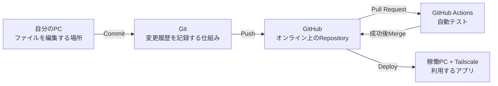
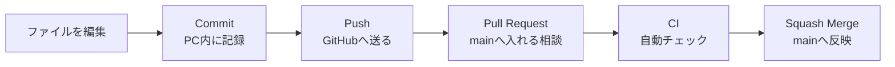
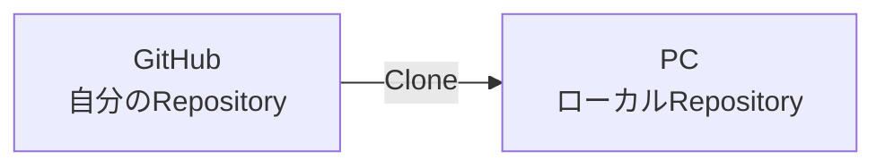
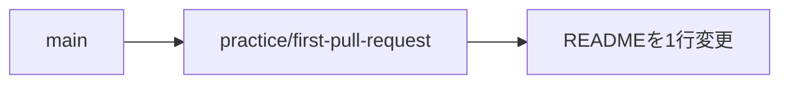
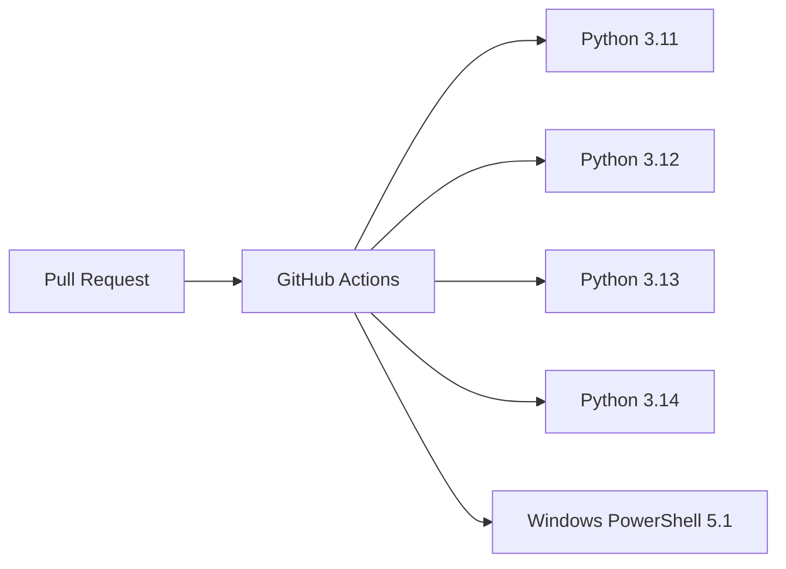
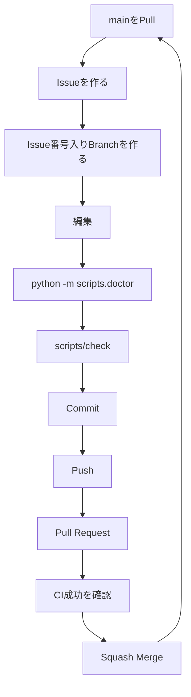
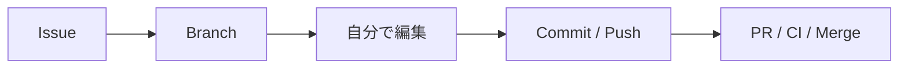
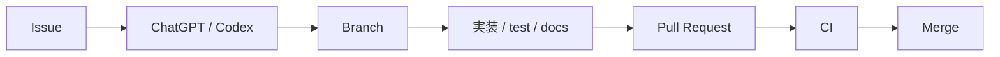
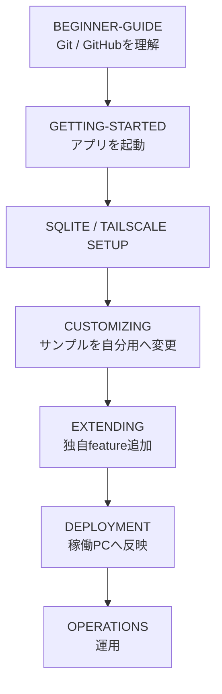

# Beginner Guide

このガイドは、**Git / GitHubをほとんど使ったことがない人が、このテンプレートから自分のWebアプリを作り始めるための説明書**です。

最初からGitコマンドを覚える必要はありません。基本操作は **GitHub Desktop** を使い、必要なところだけGit / GitHubの意味を理解して進めます。

このガイドを1回通したあとに [GETTING-STARTED.md](GETTING-STARTED.md) へ進むことをおすすめします。

---

## 1. まず全体像を理解する

Webアプリ開発では、似た名前のものがいくつも出てきます。最初は次の関係だけ覚えれば十分です。



### 自分のPC

実際にソースコードを編集する場所です。

### Git

「いつ、何を変更したか」を記録する仕組みです。

### GitHub

Gitの履歴をオンライン上に保存し、Pull RequestやCIを使って安全に変更を管理するサービスです。

### GitHub Actions / CI

GitHubへPushした変更を自動でチェックします。このテンプレートではPython 3.11〜3.14、Ruff、pytest + Coverage、Windows PowerShell 5.1などを確認します。

### 稼働PC + Tailscale

実際にアプリを動かす場所です。GitHubとは役割が違います。

---

## 2. 最初に覚えるGit / GitHub用語

| 用語 | 初心者向けの意味 |
| --- | --- |
| Repository | アプリのファイルと変更履歴をまとめて保存する箱 |
| Use this template | テンプレートから自分専用の新しいRepositoryを作る |
| Clone | GitHub上のRepositoryを自分のPCへコピーする |
| main | 安定した完成版を置く基本Branch |
| Branch | mainを壊さず変更するための作業場所 |
| Commit | PC上で「ここまでの変更」を履歴として記録する |
| Push | PC上のCommitをGitHubへ送る |
| Fetch | GitHub側に新しい変更がないか確認する |
| Pull | GitHub側の変更をPCへ取り込む |
| Pull Request / PR | Branchの変更をmainへ入れてよいか確認する仕組み |
| CI | ソースを自動チェックする仕組み |
| Merge | 確認済みのBranchをmainへ取り込む |
| Squash Merge | Branch内のCommitを1つにまとめてmainへ取り込む |
| Conflict | 同じ場所を別々に変更して自動統合できない状態 |

特に次の違いを覚えておくと迷いにくくなります。



**CommitしただけではGitHubは更新されません。Pushまで必要です。**

---

## 3. 新しいアプリ用Repositoryを作る

新しいアプリを作るときは、このテンプレート本体を直接編集しません。

GitHubでこのRepositoryを開き、**Use this template** から自分用Repositoryを作成します。

例:

```text
元のテンプレート
python-sqlite-tailscale-webapp-template

        ↓ Use this template

自分のアプリ
fire-department-tools
```

Repository名はあとで見ても用途が分かる名前にします。

### Public / Private

- 公開してよいサンプルやOSS: Public
- 個人情報、社内情報、秘密情報を扱うアプリ: Privateを検討

**Public Repositoryへ秘密鍵、パスワード、実データをCommitしてはいけません。**

---

## 4. GitHub DesktopでCloneする

GitHub Desktopを開きます。

1. `File`
2. `Clone repository...`
3. GitHub.comタブから自分のRepositoryを選ぶ
4. 保存先 `Local path` を確認
5. `Clone`

これでGitHub上のRepositoryがPCへコピーされます。



以降、普段編集するのは**PC側のファイル**です。

---

## 5. アプリ開発の前にGitを1回練習する

いきなり大きな機能を作らず、最初にREADMEを1行だけ変更して一連の流れを経験します。

### 5-1. mainを最新にする

GitHub DesktopでRepositoryを選びます。

1. Current branchが `main` になっていることを確認
2. `Fetch origin`
3. `Pull origin` が表示された場合は実行

### 5-2. 練習用Branchを作る

GitHub Desktop上部の `Current branch` → `New branch`。

例:

```text
practice/first-pull-request
```

Branchはmainから分かれた作業場所です。



### 5-3. READMEを1行変更する

たとえばREADMEの末尾へ一時的に次の1行を追加します。

```text
GitHub練習用の変更です。
```

保存するとGitHub Desktop左側の `Changes` に変更ファイルが表示されます。

### 5-4. Commitする

GitHub Desktop左下のSummaryへ、たとえば次を入力します。

```text
GitHub操作の練習
```

`Commit to practice/first-pull-request` を押します。

この時点では**PC内に履歴が記録されただけ**です。

### 5-5. Pushする

`Push origin` を押します。

これでGitHub上にもBranchとCommitが送られます。


### 5-6. Pull Requestを作る

GitHub Desktopの `Create Pull Request` を押すとブラウザでGitHubが開きます。

確認するもの:

- base: `main`
- compare: `practice/first-pull-request`
- 変更内容がREADMEだけになっている

PRを作成します。

### 5-7. CIを確認する

PRを作るとGitHub Actionsが動きます。

このテンプレートでは次の5つがRequired Checkです。

```text
test (3.11)
test (3.12)
test (3.13)
test (3.14)
windows-powershell-51
```



赤い `×` がある場合はMergeしません。

### 5-8. Squash Mergeする

CI成功後、GitHubのPR画面で `Squash and merge` を実行します。

これで変更がmainへ入ります。

### 5-9. PCのmainを最新にする

GitHub Desktopへ戻ります。

1. `Current branch` → `main`
2. `Fetch origin`
3. `Pull origin`

これでPC側のmainにもMerge済み変更が入ります。

ここまでできれば、通常のGit開発フローを1回経験したことになります。

練習用に追加したREADMEの1行は、次のBranchで削除して同じ流れをもう一度練習しても構いません。

---

## 6. 普段の開発はこの流れだけ覚える



例:

```text
Issue #12: 在庫検索を追加する
Branch: feat/12-inventory-search
```

このテンプレートでは**mainを直接変更せず、Issue → Branch → PR → CI → Squash Merge**を基本にします。

---

## 7. Issueは「これから何を変えるか」のメモ

Issueは不具合だけではなく、新機能や改善にも使います。

初心者でも次の4点を書けば十分です。

```text
タイトル:
在庫検索を追加する

目的:
商品名から在庫を検索できるようにする。

変更内容:
- 検索入力欄
- 検索処理
- テスト

完了条件:
検索して対象商品だけ表示され、CIが成功する。
```

Issueを先に作ると、Branch名、PR、ChatGPT/Codexへの依頼内容が揃いやすくなります。

---

## 8. 自分で編集する場合とChatGPT / Codexへ依頼する場合

### 自分で編集する



GitHub Desktopを使えば、普段Gitコマンドを入力しなくても進められます。

### ChatGPT / Codexへ依頼する



依頼例:

```text
このRepositoryは python-sqlite-tailscale-webapp-template から作成しました。
Issue #12「在庫検索を追加する」を対応してください。

mainへ直接Commitせず、Issue番号入りBranchを作成してください。
実装だけでなく必要なテストとドキュメントも更新してください。
python -m scripts.doctor と scripts/check を確認し、Pull Request → CI成功まで進めてください。
```

AIへ依頼した場合でも、PRの変更ファイルとCI結果は確認します。

---

## 9. GitHub Desktopでよく使うボタン

| 表示 | 何をするボタンか |
| --- | --- |
| Current repository | 操作するRepositoryを切り替える |
| Current branch | main / 作業Branchを切り替える |
| Fetch origin | GitHub側の更新有無を確認 |
| Pull origin | GitHub側の更新をPCへ取り込む |
| Changes | まだCommitしていない変更を見る |
| History | Commit履歴を見る |
| Commit to ... | PC内へ変更履歴を記録 |
| Push origin | CommitをGitHubへ送る |
| Create Pull Request | GitHubでPRを作る |

「今どのRepositoryか」「今どのBranchか」は、編集前に毎回確認する習慣をつけると事故を減らせます。

---

## 10. 困ったとき

### CommitしたのにGitHubに変更がない

CommitはPC内の履歴です。

**`Push origin` を実行してください。**

### GitHubでは新しいのにPCが古い

GitHub Desktopで:

1. `Fetch origin`
2. `Pull origin`

を実行します。

### mainで編集してしまった

まだCommitしていなければ、GitHub Desktopで**変更を保持したまま新しいBranchを作れる場合があります**。

慌ててmainへCommit / Pushせず、まずChangesを確認してください。

すでにmainへCommitしてしまった場合は、さらに操作する前に状況を確認します。Rulesetが有効ならmainへの直接Pushは通常ブロックされます。

### CIが赤い

Mergeしません。

PRの `Checks` または失敗したGitHub Actions Jobを開き、最初に失敗したStepを確認します。

AIへ依頼する場合:

```text
PR #12 のCIが失敗しています。
失敗したJobとログを確認し、原因を修正してCI成功まで進めてください。
```

### Conflictと表示された

同じ場所をmainとBranchの両方で変更しています。

内容を確認せず無理にMergeしないでください。初心者のうちは、どのファイルがConflictしているか確認してからChatGPT/Codexまたは経験者へ相談する方が安全です。

### Branchがたくさん増えた

Merge済みBranchは削除して構いません。mainの履歴は消えません。

### Repositoryを間違えた

GitHub Desktop左上の `Current repository` を確認します。似た名前のテスト用Repositoryと本番Repositoryを扱う場合は特に注意します。

---

## 11. やってはいけないこと

- mainへ直接Pushする
- CIが失敗したままMergeする
- `.env` の実値をCommitする
- SQLiteの実データやbackupをCommitする
- 秘密鍵やパスワードをCommitする
- よく分からないままForce Pushする
- Conflictを内容確認せず解消する
- Flask / Waitressを理由なく `0.0.0.0` へ変更する
- テンプレート本体へ自分の案件固有機能を追加する

Gitで迷ったときは、**削除・Force Push・Resetなどの強い操作を先に試さない**のが安全です。

---

## 12. このテンプレートで最初にやること

Gitの練習が終わったら、次の順で進めます。



### 初めて使う

- [BEGINNER-GUIDE.md](BEGINNER-GUIDE.md) - 今読んでいる資料
- [GETTING-STARTED.md](GETTING-STARTED.md) - Clone後のセットアップと初回起動

### 自分のアプリへ変える

- [docs/CUSTOMIZING.md](docs/CUSTOMIZING.md)
- [docs/EXTENDING.md](docs/EXTENDING.md)

### 技術を理解する

- [docs/ARCHITECTURE.md](docs/ARCHITECTURE.md)
- [docs/SQLITE-SETUP.md](docs/SQLITE-SETUP.md)
- [docs/TAILSCALE-SETUP.md](docs/TAILSCALE-SETUP.md)
- [docs/AUTH-CRUD.md](docs/AUTH-CRUD.md)
- [docs/SECURITY.md](docs/SECURITY.md)

### GitHubを安全に設定する

- [docs/GITHUB-SETUP.md](docs/GITHUB-SETUP.md)

### 開発・反映・運用する

- [docs/DEVELOPMENT.md](docs/DEVELOPMENT.md)
- [docs/DEPLOYMENT.md](docs/DEPLOYMENT.md)
- [docs/OPERATIONS.md](docs/OPERATIONS.md)

---

## 13. 最後に覚えるのはこの1本だけ

```text
Issue
  ↓
Branch
  ↓
編集
  ↓
Commit
  ↓
Push
  ↓
Pull Request
  ↓
CI
  ↓
Squash Merge
  ↓
mainをPull
```

この流れを守れば、mainを壊しにくく、失敗しても作業Branchの中で修正できます。
