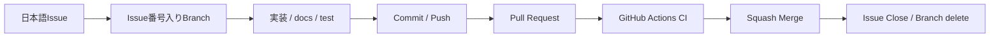
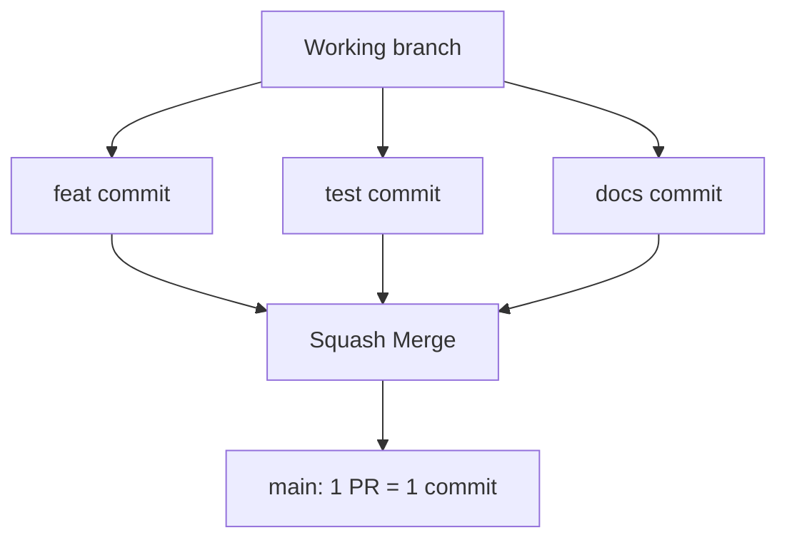

# コントリビューションガイド

このテンプレートへの改善提案・バグ修正・共通基盤の改善を歓迎します。

## 必須ルール

変更の大小にかかわらず、次のルールを守ります。

1. **mainへの直接Commit / Pushは禁止します。**
2. **mainへ取り込む変更単位ごとにIssueを作成します。**
3. **Issueのタイトル・本文は日本語で記載します。**
4. Issueに対応する作業ブランチを作成します。
5. **ブランチ名にはIssue番号を含めます。**
6. 作業ブランチで変更・テスト・Commit / Pushします。
7. **必ずPull Requestを作成します。**
8. PR本文からIssueを `Closes #番号` で関連付けます。
9. CI成功と差分を確認してからmainへ取り込みます。
10. **mainへの取り込みは原則Squash Mergeとします。**
11. Merge後は対応IssueをCloseし、作業ブランチを削除します。
12. READMEや関連docsへの影響がある場合は同じPRで最新化します。

READMEの誤字、コメント、軽微な文言変更、ドキュメントだけの変更も例外ではありません。



## Issue

Issueは変更理由と完了条件を残す作業票です。原則として **1 Issue = 1 PR** とします。

本文では最低限、次を明確にします。

- 目的
- 対応内容
- 影響範囲
- 完了条件

## ブランチ命名規則

```text
feat/12-inventory-search
fix/18-user-isolation
docs/23-update-readme
refactor/31-item-service
test/42-add-auth-tests
chore/70-update-dependencies
```

## Pull Request

PR作成時は `.github/pull_request_template.md` を利用し、対応Issue、変更内容、テスト、影響範囲、DB・設定・セキュリティ影響、ドキュメント更新状況を記載します。

```text
Closes #123
```

## Squash Merge

作業ブランチに複数Commitがあっても、mainへはPR単位の1Commitとして取り込みます。



## Merge前チェック

- 対応する日本語Issueがある
- ブランチ名にIssue番号が含まれている
- PRとIssueが関連付いている
- mainへの直接Commitではない
- 意図しないファイル変更がない
- `.env` / `data/` / SQLite実データ / 秘密情報が含まれていない
- 必要なテストが追加・更新されている
- CIが成功している
- 認証・認可を弱めていない
- 他利用者のデータへアクセスできる変更になっていない
- `0.0.0.0` へのbind変更がない
- CSRF / セキュリティヘッダーを壊していない
- DB変更時は既存データへの影響を確認した
- README / docsが最新になっている
- Squash Mergeを選択している

## テスト

Windows:

```powershell
.\.venv\Scripts\python.exe -m pytest
```

macOS / Linux:

```bash
.venv/bin/python -m pytest
```

共通基盤を変更した場合は、localhost制約、利用者識別、利用者間データ分離、CSRF、セキュリティヘッダーも確認します。

## CI成功報告

CI成功をもって作業完了と報告する場合、最低限次を併記します。

- 修正ソース一覧
- 修正ドキュメント一覧
- 修正または追加したテスト一覧
- CI結果

## Gitへ登録してはいけないもの

```text
.env
data/
SQLiteデータベースファイル
生成された秘密鍵
個人・組織固有のtailnet情報
その他の秘密情報
```

## テンプレート本体へ追加するもの

このリポジトリは、誰でも自分用アプリへ流用できる小さな共通テンプレートであることを重視します。

テンプレート本体へ追加するのは、複数のローカルWebアプリで再利用価値があるものを基本とします。

- 共通の安全策
- 開発・CI改善
- セットアップ改善
- 汎用的なサンプル
- ドキュメント改善

特定会社・特定業務だけで必要な機能は、このテンプレートから作成した各アプリ側で実装します。

## 関連ドキュメント

- [GETTING-STARTED.md](GETTING-STARTED.md) - 初めて利用する手順
- [docs/CUSTOMIZING.md](docs/CUSTOMIZING.md) - 独自アプリへの置き換え
- [docs/DEVELOPMENT.md](docs/DEVELOPMENT.md) - Issue / Branch / PR / CI
- [docs/DEPLOYMENT.md](docs/DEPLOYMENT.md) - 稼働PCへの反映
- [docs/GITHUB-SETUP.md](docs/GITHUB-SETUP.md) - main保護・Ruleset
- [docs/ARCHITECTURE.md](docs/ARCHITECTURE.md) - 構成
- [docs/SECURITY.md](docs/SECURITY.md) - セキュリティ
