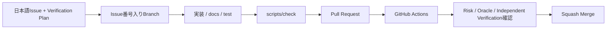

# コントリビューションガイド

このテンプレートへの改善提案・バグ修正・共通基盤の改善を歓迎します。

## 必須ルール

1. **mainへの直接Commit / Pushは禁止します。**
2. **mainへ取り込む変更単位ごとに日本語Issueを作成します。**
3. Issueに対応するIssue番号入り作業ブランチを作成します。
4. 作業ブランチで変更・テスト・Commit / Pushします。
5. **必ずPull Requestを作成します。**
6. PR本文からIssueを関連付けます。
7. 品質チェック、CI、差分を確認してからmainへ取り込みます。
8. **原則Squash Merge**とします。
9. README / docsへの影響は同じPRで最新化します。
10. **CIがGreenであることだけを品質保証とせず、Issue / PRのVerification PlanでRiskと正しい状態を先に定義します。**



## Issue

原則 **1 Issue = 1 PR** です。本文では最低限、目的・対応内容・影響範囲・完了条件を明確にします。

さらに振る舞いや品質契約を変更する場合は、実装前に次を記載します。

- Risk Level: Low / Medium / High
- Important Risk: 何が壊れたら困るか
- Correct State / Test Oracle: 何を正しい結果とするか
- Verification Layer: どこで検証するか
- Blocking Signal: 何が失敗したらMergeを止めるか
- Falsification / Negative Case: 実装が誤っていたら失敗するケース
- Independent Verification: 実装Loopと異なる評価軸

詳細は [docs/QUALITY-VERIFICATION.md](docs/QUALITY-VERIFICATION.md) を参照してください。

Security issueを報告する場合は、攻撃手順・token・秘密情報・実データをPublic Issueへ記載せず、[.github/SECURITY.md](.github/SECURITY.md) の報告手順を使用してください。

## ブランチ命名

```text
feat/12-inventory-search
fix/18-user-isolation
docs/23-update-readme
refactor/31-item-service
test/42-add-auth-tests
chore/70-update-dependencies
```

## Pull Request

`.github/pull_request_template.md` を利用し、以下を確認します。

- 対応Issue
- 変更内容
- Verification Plan
- Greenが保証する範囲 / Greenだけでは保証しない範囲
- テスト
- 影響範囲
- Migration / DB影響
- `.env.example` 変更
- requirements / constraints変更
- 認証・セキュリティ影響
- README / docs更新

通常は:

```text
Closes #123
```

を利用します。Merge後の手動確認が完了条件として残る場合は、Issueを完了確認までOpenに保つ運用も可能です。

## Verification Design

AI / Coding AgentへProduction CodeとTest Codeの両方を任せても構いません。ただし、Agent自身の「テストが通ったので問題ありません」だけを最終Quality Gateにはしません。

変更ごとに次を確認します。

1. IssueでRiskとCorrect Stateを実装前に定義したか
2. テストがそのRiskを本当に観測しているか
3. Production CodeとTest Codeの辻褄を合わせるためにOracleを弱めていないか
4. 正常系だけでなく境界値・異常系を検討したか
5. High Risk変更にIndependent VerificationまたはHuman Judgmentがあるか

High Riskの例:

- 認証・認可
- CSRF / セキュリティヘッダー
- Migration / 既存データ
- Backup / Restore
- bind / Tailscale公開範囲
- dependency major update
- CI / Ruleset / release条件

## ローカル品質チェック

開発用bootstrap後、個別pytestではなく共通checkを推奨します。

Windows:

```powershell
.\scripts\check.ps1
```

macOS / Linux:

```bash
./scripts/check.sh
```

実行内容:

- `pip check`
- Ruff lint
- Ruff format check
- pytest
- Coverage 80%以上

Coverageは重要なSignalですが、100%を目的にはしません。数値よりも、重要なRiskに対して意味のあるAssertion / Test Oracleがあることを優先します。

## CI / Supply Chain

GitHub Actionsは次を検証します。

- Python 3.11 / 3.12 / 3.13 / 3.14
- Ruff lint / format
- pytest + Coverage
- items削除後のsampleless smoke test
- 全PowerShell / shellスクリプト構文
- Windows PowerShell 5.1スモーク
- Repository内Markdownリンク整合性

外部GitHub Actionはfloating tagではなくfull commit SHAへ固定します。DependabotのGitHub Actions更新も通常PRとしてCIを通してから取り込みます。

Protect main RulesetはRequired Status ChecksをStrictにし、mainが更新された場合は最新mainとの組み合わせを再確認してからMergeします。

CI失敗中はMergeしません。一方、CIがすべてGreenでも、Verification Planで定義したRiskを観測していない場合はMerge判断の根拠として不十分です。

## Migration変更

運用開始後のSchema変更は `app/migrations/` に新しい番号付きSQLを追加します。

```text
001_initial.sql
002_add_feature.sql
```

適用済みMigrationを書き換えません。DB変更PRではMigrationテスト、既存データ影響、Backup / Rollbackを確認します。

## 依存関係変更

- `requirements.txt`: runtime直接依存範囲
- `requirements-dev.txt`: 開発依存
- `constraints.txt`: CI確認済み固定バージョン

依存更新時は必要なファイルを同じPRで揃えます。Dependabot PRも通常CIを通して判断します。

## Merge前チェック

- 日本語Issueがある
- ブランチ名にIssue番号がある
- mainへの直接変更ではない
- Verification Planが変更内容に対応している
- `scripts/check` または同等の品質確認が成功
- GitHub Actions CIが成功
- `.env` / `data/` / `backups/` / SQLite実データ / 秘密情報が含まれていない
- 必要なテストがある
- 振る舞い変更では境界値・異常系を検討した
- Migrationの既存データ影響を確認した
- 認証・認可を弱めていない
- `0.0.0.0` へbindしていない
- CSRF / セキュリティヘッダーを壊していない
- High Risk変更でAIの自己確認だけに依存していない
- README / docsが最新
- Squash Mergeを選択している

## CI成功報告

完了報告では最低限次を併記します。

- 修正ソース一覧
- 修正ドキュメント一覧
- 修正または追加したテスト一覧
- CI結果
- 重要なRiskと、それを確認したVerification Signal
- Greenだけでは未保証の範囲が残る場合はその内容

## Gitへ登録してはいけないもの

```text
.env
data/
backups/
SQLiteデータベースファイル
生成された秘密鍵
個人・組織固有のtailnet情報
その他の秘密情報
```

## テンプレート本体へ追加するもの

複数のローカルWebアプリで再利用価値がある共通基盤・安全策・品質改善を基本とします。特定会社・特定業務だけで必要な機能は、このテンプレートから作成した各アプリ側で実装します。

## 関連ドキュメント

- [GETTING-STARTED.md](GETTING-STARTED.md)
- [docs/CUSTOMIZING.md](docs/CUSTOMIZING.md)
- [docs/SQLITE-SETUP.md](docs/SQLITE-SETUP.md)
- [docs/DEVELOPMENT.md](docs/DEVELOPMENT.md)
- [docs/QUALITY-VERIFICATION.md](docs/QUALITY-VERIFICATION.md)
- [docs/DEPLOYMENT.md](docs/DEPLOYMENT.md)
- [docs/GITHUB-SETUP.md](docs/GITHUB-SETUP.md)
- [docs/ARCHITECTURE.md](docs/ARCHITECTURE.md)
- [docs/SECURITY.md](docs/SECURITY.md) - 実装時のSecurity設計
- [.github/SECURITY.md](.github/SECURITY.md) - 脆弱性報告ポリシー
