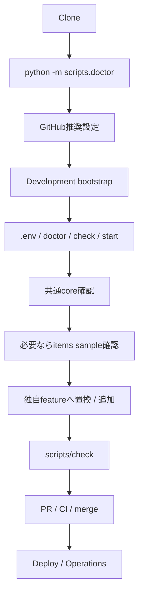
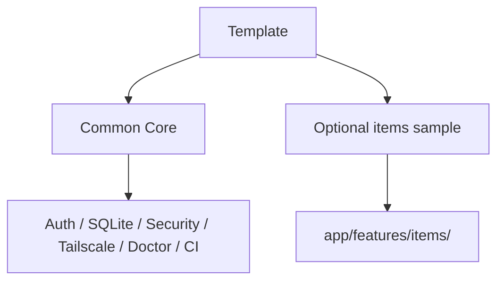
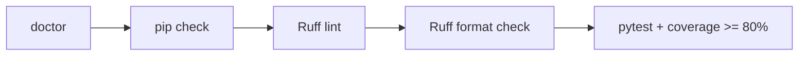
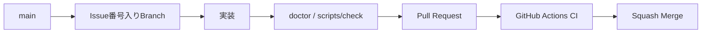

# Getting Started

このドキュメントは、このテンプレートをCloneして動作確認し、そこから自分のWebアプリ開発を始めるための手順です。

`app/features/items/` は利用者別CRUD・認可・feature Migrationを確認するための**丸ごと削除可能なサンプル**です。共通基盤とは分離されています。

## 全体フロー



## 1. 前提

- GitHubアカウント
- Git
- Python 3.11以上
- GitHub Desktop（推奨）
- GitHub CLI（GitHub推奨設定を自動化する場合）
- ChatGPTまたはCodex
- Tailscale（別端末から利用する場合）

CIではPython 3.11 / 3.12 / 3.13 / 3.14を確認しています。

```powershell
python --version
git --version
```

## 2. Clone

GitHub Desktop: `File` → `Clone repository...`

または:

```bash
git clone https://github.com/k-systems202208/python-sqlite-tailscale-webapp-template.git
cd python-sqlite-tailscale-webapp-template
```

自分の新規アプリとして利用する場合は、GitHub上で **Use this template** から新しいリポジトリを作成し、そのリポジトリをCloneする方法を推奨します。テンプレート本体へ案件固有コードを追加しません。

## 3. 最初にDoctorを実行

依存パッケージを入れる前でもsystem Pythonだけで実行できます。

```powershell
python -m scripts.doctor
```

主な確認項目:

- Python 3.11以上
- `pyproject.toml` / `requirements.txt` / `constraints.txt` / `.env.example`
- `.venv`
- `.env`
- `APP_DATA_DIR`
- Git / GitHub CLI / Tailscale command

`.venv`、`.env`、optional command不足は警告です。Python version不適合、必須ファイル欠落、`APP_DATA_DIR` の異常はFAILです。

## 4. GitHub推奨設定

Windows PowerShell:

```powershell
gh auth login
.\scripts\setup-github.ps1
```

Pull Request必須、Python 3.11〜3.14とWindows PowerShell 5.1のRequired Check、Squash Merge等を設定します。詳細は [docs/GITHUB-SETUP.md](docs/GITHUB-SETUP.md) を参照してください。

## 5. 開発環境を準備する

Windows:

```powershell
.\scripts\bootstrap.ps1
```

macOS / Linux:

```bash
./scripts/bootstrap.sh
```

runtimeだけ必要な稼働PCでは `bootstrap-runtime.ps1` / `bootstrap-runtime.sh` を利用できます。

## 6. `.env` と基準状態を確認

Windows:

```powershell
Copy-Item .env.example .env
.\.venv\Scripts\python.exe -m scripts.doctor
```

macOS / Linux:

```bash
cp .env.example .env
.venv/bin/python -m scripts.doctor
```

最小例:

```env
APP_NAME=Local Web App
LOG_LEVEL=INFO
LOCAL_OWNER_EMAIL=owner@example.local
LOCAL_OWNER_NAME=Local Owner
```

続けて品質チェックと起動を行います。

Windows:

```powershell
.\scripts\check.ps1
.\scripts\start.ps1
```

macOS / Linux:

```bash
./scripts/check.sh
./scripts/start.sh
```

確認URL:

```text
http://127.0.0.1:8000
http://127.0.0.1:8000/healthz
http://127.0.0.1:8000/readyz
http://127.0.0.1:8000/api/me
```

`/` は共通coreの確認画面です。itemsサンプルに依存しません。`/healthz` はWebプロセス、`/readyz` はSQLite readinessの確認です。

## 7. 共通基盤とitemsサンプルの境界

共通基盤は主に次です。

```text
app/core/
app/auth.py
app/db.py
app/csrf.py
app/security.py
app/features/__init__.py
scripts/doctor.py
scripts/db_tools.py
scripts/check.*
tests/ の共通基盤テスト
```

削除可能なサンプルは**この1フォルダ**です。

```text
app/features/items/
├─ routes.py
├─ service.py
├─ templates/items/index.html
└─ migrations/002_sample_items.sql
```



`app/features/` は起動時に自動検出されるため、itemsを使わない新規アプリでは `app/features/items/` を削除するだけで構いません。`app/__init__.py` を編集する必要はありません。

## 8. itemsサンプルを確認する（任意）

items featureを残している場合:

```text
http://127.0.0.1:8000/items
http://127.0.0.1:8000/api/items
```

ここでは利用者別CRUD、CSRF、SQL所有者条件、JSON APIを確認できます。詳細は [docs/AUTH-CRUD.md](docs/AUTH-CRUD.md) を参照してください。

## 9. SQLite Migration

Migration runnerは次の2か所を自動検出します。

```text
app/migrations/*.sql
app/features/*/migrations/*.sql
```

初期状態:

```text
app/migrations/001_initial.sql                       users共通Schema
app/features/items/migrations/002_sample_items.sql  itemsサンプル
```

初回起動前に `app/features/items/` を削除するとitems Migrationも適用されません。すでに適用した後は履歴を書き換えず、新Migrationで変更します。

詳細は [docs/SQLITE-SETUP.md](docs/SQLITE-SETUP.md) を参照してください。

## 10. Backup / Restoreを確認

```powershell
.\.venv\Scripts\python.exe -m scripts.db_tools backup
.\.venv\Scripts\python.exe -m scripts.db_tools check
```

Restoreはアプリ停止後に `restore <backup> --yes` で明示実行します。日常運用と復旧の詳細は [docs/OPERATIONS.md](docs/OPERATIONS.md) を参照してください。

## 11. Tailscaleで別端末から使う

Windows:

```powershell
.\scripts\tailscale-serve.ps1
```

macOS / Linux:

```bash
./scripts/tailscale-serve.sh
```

Python側を `0.0.0.0` へ変更しません。詳細は [docs/TAILSCALE-SETUP.md](docs/TAILSCALE-SETUP.md) を参照してください。

## 12. 自分のアプリへ作り替える / 拡張する

基本手順:

1. 初回起動前なら不要な `app/features/items/` を削除
2. `app/features/<your-feature>/` を作る
3. `register(app)` をfeatureの `__init__.py` に用意
4. Route / Service / Template / Migrationをfeature内へ置く
5. 認可をSQLでも実施
6. feature固有テストを追加
7. doctor / checkを実行

サンプル削除は [docs/CUSTOMIZING.md](docs/CUSTOMIZING.md)、新featureの設計契約は [docs/EXTENDING.md](docs/EXTENDING.md) を参照してください。

## 13. 品質チェック



変更の区切りごとに `scripts/check.ps1` または `scripts/check.sh` を実行します。check script内でもdoctorを先に実行します。

## 14. ChatGPT / Codex

例:

```text
このリポジトリは python-sqlite-tailscale-webapp-template から作成しました。
app/features/items は削除して、○○管理featureを実装してください。
app/core、Auth、CSRF、Security、SQLite Migration、Backup、Tailscale、Doctor、CIは維持してください。
新しい業務機能は app/features/<feature>/ 内へまとめてください。
完了条件は python -m scripts.doctor、scripts/check、GitHub Actions CI成功です。
```

## 15. Gitフロー



## 16. デプロイ後の運用

稼働PCへの反映は [docs/DEPLOYMENT.md](docs/DEPLOYMENT.md)、日常確認・障害切り分け・Backup / Restore・Rollbackは [docs/OPERATIONS.md](docs/OPERATIONS.md) を参照してください。

## 17. CI成功報告ルール

- 修正ソース一覧
- 修正ドキュメント一覧
- 修正または追加したテスト一覧
- CI結果
