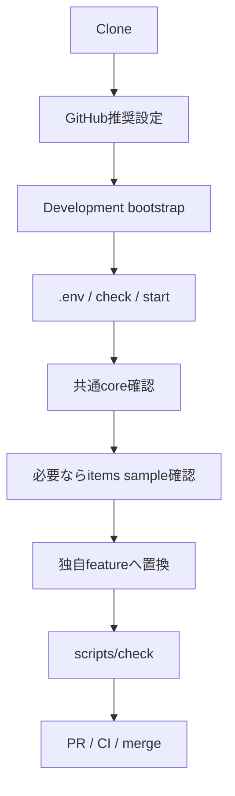
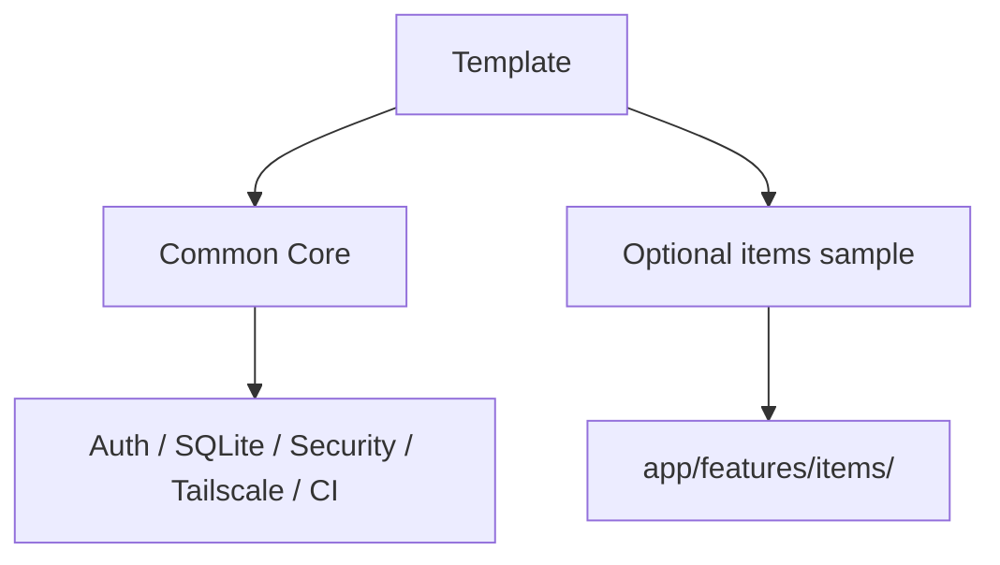
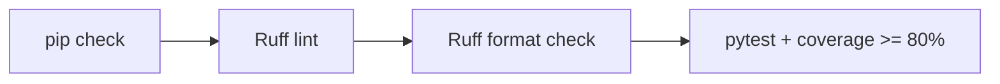
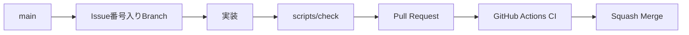

# Getting Started

このドキュメントは、このテンプレートをCloneして動作確認し、そこから自分のWebアプリ開発を始めるための手順です。

`app/features/items/` は利用者別CRUD・認可・feature Migrationを確認するための**丸ごと削除可能なサンプル**です。共通基盤とは分離されています。

## 全体フロー



## 1. 前提

- GitHubアカウント
- Git
- Python 3.11以上
- GitHub Desktop（推奨）
- GitHub CLI（GitHub推奨設定を自動化する場合）
- ChatGPTまたはCodex
- Tailscale（別端末から利用する場合）

CIではPython 3.11 / 3.12 / 3.13 / 3.14を確認しています。

```powershell
python --version
git --version
```

## 2. Clone

GitHub Desktop: `File` → `Clone repository...`

または:

```bash
git clone https://github.com/k-systems202208/python-sqlite-tailscale-webapp-template.git
cd python-sqlite-tailscale-webapp-template
```

自分の新規アプリとして利用する場合は、GitHub上で **Use this template** から新しいリポジトリを作成し、そのリポジトリをCloneする方法を推奨します。テンプレート本体へ案件固有コードを追加しません。

## 3. GitHub推奨設定

Windows PowerShell:

```powershell
gh auth login
.\scripts\setup-github.ps1
```

Pull Request必須、Python 3.11〜3.14とWindows PowerShell 5.1のRequired Check、Squash Merge等を設定します。詳細は [docs/GITHUB-SETUP.md](docs/GITHUB-SETUP.md) を参照してください。

## 4. 開発環境を準備する

Windows:

```powershell
.\scripts\bootstrap.ps1
```

macOS / Linux:

```bash
./scripts/bootstrap.sh
```

runtimeだけ必要な稼働PCでは `bootstrap-runtime.ps1` / `bootstrap-runtime.sh` を利用できます。

## 5. まずテンプレート単体を確認

`.env` を作成します。

Windows:

```powershell
Copy-Item .env.example .env
```

macOS / Linux:

```bash
cp .env.example .env
```

最小例:

```env
APP_NAME=Local Web App
LOG_LEVEL=INFO
LOCAL_OWNER_EMAIL=owner@example.local
LOCAL_OWNER_NAME=Local Owner
```

続けて品質チェックと起動を行います。

Windows:

```powershell
.\scripts\check.ps1
.\scripts\start.ps1
```

macOS / Linux:

```bash
./scripts/check.sh
./scripts/start.sh
```

確認URL:

```text
http://127.0.0.1:8000
http://127.0.0.1:8000/healthz
http://127.0.0.1:8000/readyz
http://127.0.0.1:8000/api/me
```

`/` は共通coreの確認画面です。itemsサンプルに依存しません。

## 6. 共通基盤とitemsサンプルの境界

共通基盤は主に次です。

```text
app/core/
app/auth.py
app/db.py
app/csrf.py
app/security.py
app/features/__init__.py
scripts/
tests/ の共通基盤テスト
```

削除可能なサンプルは**この1フォルダ**です。

```text
app/features/items/
├─ routes.py
├─ service.py
├─ templates/items/index.html
└─ migrations/002_sample_items.sql
```



`app/features/` は起動時に自動検出されるため、itemsを使わない新規アプリでは `app/features/items/` を削除するだけで構いません。`app/__init__.py` を編集する必要はありません。

## 7. itemsサンプルを確認する（任意）

items featureを残している場合:

```text
http://127.0.0.1:8000/items
http://127.0.0.1:8000/api/items
```

ここでは次を確認できます。

- 利用者本人のitems一覧
- 登録 / 完了切替 / 削除
- CSRF
- SQL所有者条件
- JSON API

詳細は [docs/AUTH-CRUD.md](docs/AUTH-CRUD.md) を参照してください。

## 8. SQLite Migration

Migration runnerは次の2か所を自動検出します。

```text
app/migrations/*.sql
app/features/*/migrations/*.sql
```

初期状態:

```text
app/migrations/001_initial.sql                  users共通Schema
app/features/items/migrations/002_sample_items.sql   itemsサンプル
```

新しいアプリで**初回起動前**に `app/features/items/` を削除すると、items Migrationも無くなるため `items` テーブルは作られません。

すでにアプリを起動してMigrationを適用した後は、既存Migrationを書き換えたり履歴を削除したりせず、新Migrationで変更します。

詳細は [docs/SQLITE-SETUP.md](docs/SQLITE-SETUP.md) を参照してください。

## 9. Backupを試す

```powershell
.\.venv\Scripts\python.exe -m scripts.db_tools backup
.\.venv\Scripts\python.exe -m scripts.db_tools check
```

Restoreはアプリ停止後に `restore <backup> --yes` で明示実行します。

## 10. Tailscaleで別端末から使う

Windows:

```powershell
.\scripts\tailscale-serve.ps1
```

macOS / Linux:

```bash
./scripts/tailscale-serve.sh
```

Python側を `0.0.0.0` へ変更しません。詳細は [docs/TAILSCALE-SETUP.md](docs/TAILSCALE-SETUP.md) を参照してください。

## 11. 自分のアプリへ作り替える

最も簡単な始め方は次です。

1. まだ初回起動前なら、不要な `app/features/items/` を削除
2. `app/features/<your-feature>/` を作る
3. `register(app)` をfeatureの `__init__.py` に用意
4. Route / Service / Template / Migrationをfeature内へ置く
5. 自分の業務テストを追加
6. `scripts/check` を実行

詳しくは [docs/CUSTOMIZING.md](docs/CUSTOMIZING.md) を参照してください。

## 12. 品質チェック



変更の区切りごとに `scripts/check.ps1` または `scripts/check.sh` を実行します。

## 13. ChatGPT / Codex

例:

```text
このリポジトリは python-sqlite-tailscale-webapp-template から作成しました。
app/features/items は削除して、○○管理featureを実装してください。
app/core、Auth、CSRF、Security、SQLite Migration、Backup、Tailscale、CIは維持してください。
新しい業務機能は app/features/<feature>/ 内へまとめてください。
完了条件は scripts/check とGitHub Actions CI成功です。
```

## 14. Gitフロー



## 15. CI成功報告ルール

- 修正ソース一覧
- 修正ドキュメント一覧
- 修正または追加したテスト一覧
- CI結果
