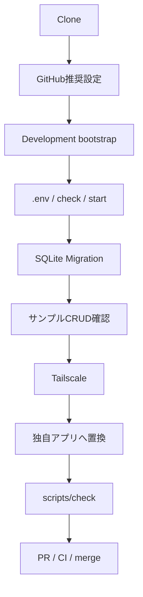
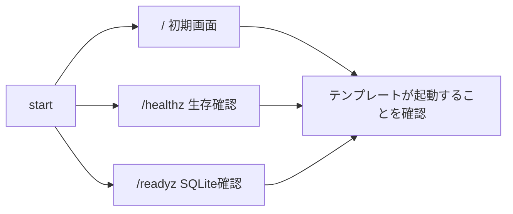
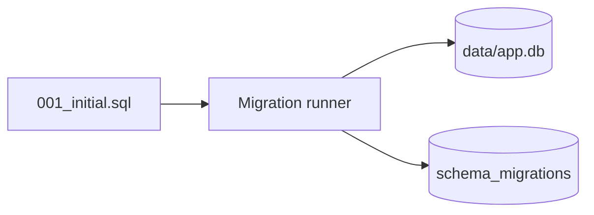
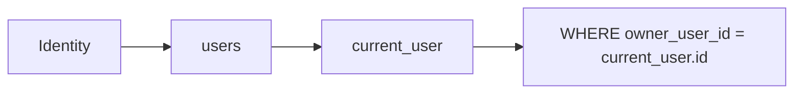
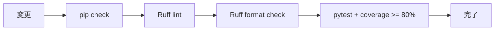
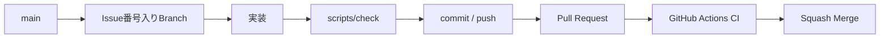

# Getting Started

このドキュメントは、このテンプレートをCloneして動作確認し、そこから自分のWebアプリ開発を始めるための手順です。

`items` は利用者識別・CRUD・SQLiteのデータ分離を確認するためのサンプルです。サンプルをそのまま使う必要はありません。独自アプリへ作り替える手順は [docs/CUSTOMIZING.md](docs/CUSTOMIZING.md) を参照してください。

## 全体フロー



## 1. 前提

- GitHubアカウント
- Git
- Python 3.11以上
- GitHub Desktop（推奨）
- GitHub CLI（GitHub推奨設定を自動化する場合）
- ChatGPTまたはCodex
- Tailscale（別端末から利用する場合）

CIではPython 3.11 / 3.12 / 3.13 / 3.14を確認しています。

```powershell
python --version
git --version
```

## 2. Clone

GitHub Desktop: `File` → `Clone repository...`

または:

```bash
git clone https://github.com/k-systems202208/python-sqlite-tailscale-webapp-template.git
cd python-sqlite-tailscale-webapp-template
```

自分の新規アプリとして利用する場合は、GitHub上で **Use this template** から新しいリポジトリを作成するか、Clone後に独自リポジトリへPushしてください。テンプレート本体へ案件固有コードを追加しないことを推奨します。

```text
python-sqlite-tailscale-webapp-template
        ↓ Use this template
my-home-inventory
```

## 3. GitHub推奨設定

自分のリポジトリを作成した場合は、開発を始める前にGitHub推奨設定を適用できます。

Windows PowerShell:

```powershell
gh auth login
.\scripts\setup-github.ps1
```

主に以下を設定します。

- Pull Request必須
- `test (3.11)` / `test (3.12)` / `test (3.13)` / `test (3.14)` 必須
- `windows-powershell-51` 必須
- Conversation resolution
- Linear history
- Squash Mergeのみ
- force push禁止
- Default branch削除禁止
- Merge後branch自動削除

詳細は [docs/GITHUB-SETUP.md](docs/GITHUB-SETUP.md) を参照してください。

## 4. 開発環境 / 依存関係

### Windows

```powershell
.\scripts\bootstrap.ps1
```

### macOS / Linux

```bash
./scripts/bootstrap.sh
```

bootstrapはPython 3.11以上を確認し、リポジトリルートへ `.venv` を作成して開発依存をインストールします。

依存関係は次のファイルで管理します。

- `requirements.txt`: runtimeの直接依存範囲
- `requirements-dev.txt`: 開発依存
- `constraints.txt`: CI確認済みバージョン固定
- `.github/dependabot.yml`: pip / GitHub Actionsの月次更新確認

依存バージョンを変更する場合は、`constraints.txt` も確認し、品質チェックとGitHub Actions CIが成功した状態で取り込みます。

実際にアプリを動かすだけの稼働PCでは、Ruff / pytest等を含めないruntime用bootstrapを利用できます。

Windows:

```powershell
.\scripts\bootstrap-runtime.ps1
```

macOS / Linux:

```bash
./scripts/bootstrap-runtime.sh
```

## 5. まずテンプレート単体を確認

SQLiteやTailscaleを独自用途へ変更する前に、テンプレートの基準状態が正常に動くことを確認します。

### `.env` を作る

Windows:

```powershell
Copy-Item .env.example .env
```

macOS / Linux:

```bash
cp .env.example .env
```

最小例:

```env
APP_NAME=Local Web App
LOG_LEVEL=INFO
LOCAL_OWNER_EMAIL=owner@example.local
LOCAL_OWNER_NAME=Local Owner
```

`.env` はGitHubへコミットしません。

### 品質チェック

Windows:

```powershell
.\scripts\check.ps1
```

macOS / Linux:

```bash
./scripts/check.sh
```

### 起動

Windows:

```powershell
.\scripts\start.ps1
```

macOS / Linux:

```bash
./scripts/start.sh
```

確認URL:

```text
http://127.0.0.1:8000
http://127.0.0.1:8000/healthz
http://127.0.0.1:8000/readyz
```



- `/healthz`: Webプロセスの生存確認
- `/readyz`: SQLiteへ接続・問い合わせできることまで確認

この時点で `scripts/check` が成功し、localhostでテンプレートが動作することを、カスタマイズ前の基準状態とします。Tailscaleはまだ不要です。

## 6. SQLite Migration

初回起動時に `app/migrations/*.sql` が番号順に適用されます。

```text
app/migrations/
└─ 001_initial.sql
```

SQLite側には `schema_migrations` が作成されます。



同じMigrationは2回目以降スキップされます。運用開始後のSchema変更は、既存Migrationを書き換えるのではなく `002_add_...sql` のように新しいMigrationを追加します。

詳細は [docs/SQLITE-SETUP.md](docs/SQLITE-SETUP.md) を参照してください。

## 7. サンプル利用者識別 / CRUD

localhostでは `.env` のローカルオーナーを利用し、Tailscale Serve経由ではloopbackから渡されたTailscale Identity Headerを利用します。

サンプル `items` は `owner_user_id` をSQL条件に含め、利用者本人のデータだけを扱います。



テンプレートを起動し、Itemの追加・更新・削除ができれば、Flask → SQLiteの基本CRUDと利用者分離の実装例を確認できています。

独自アプリでは `items` をそのまま業務テーブルとして使うのではなく、自分のテーブル・Service・Route・画面へ置き換えてください。

詳細は [docs/AUTH-CRUD.md](docs/AUTH-CRUD.md) を参照してください。

## 8. Tailscaleで別端末から使う

localhostで基準動作を確認した後、別端末から利用する場合だけTailscale Serveを設定します。

Windows:

```powershell
.\scripts\tailscale-serve.ps1
```

macOS / Linux:

```bash
./scripts/tailscale-serve.sh
```

Python側を `0.0.0.0` へ変更しません。Flask / Waitressは `127.0.0.1` のまま待ち受け、Tailscale Serve経由で公開します。

詳細は [docs/TAILSCALE-SETUP.md](docs/TAILSCALE-SETUP.md) を参照してください。

## 9. Backup / Restore

サンプルを一度操作した後、SQLiteのBackupと整合性確認を試せます。

Windows:

```powershell
.\.venv\Scripts\python.exe -m scripts.db_tools backup
.\.venv\Scripts\python.exe -m scripts.db_tools check
```

macOS / Linux:

```bash
.venv/bin/python -m scripts.db_tools backup
.venv/bin/python -m scripts.db_tools check
```

Backupは既定で `backups/` に作られ、Git管理対象外です。

Restoreは既存DBを置き換えるため、アプリ停止後に `--yes` を付けて明示実行します。実運用へ進む前に、Backupを作るだけでなくRestoreできることまで確認してください。

詳細は [docs/SQLITE-SETUP.md](docs/SQLITE-SETUP.md) と [docs/DEPLOYMENT.md](docs/DEPLOYMENT.md) を参照してください。

## 10. 自分のアプリへ作り替える

次は [docs/CUSTOMIZING.md](docs/CUSTOMIZING.md) に沿って、以下を自分のアプリ用に置き換えます。

1. アプリ名・説明・`.env.example`
2. `items` サンプル
3. `app/migrations/` の業務テーブル
4. Service / Route
5. `app/templates/` / `app/static/`
6. 業務テスト
7. README / docs

新規アプリを作り始めた直後で実データがない段階なら `001_initial.sql` を用途に合わせて大きく作り替えて構いません。実データを保存し始めた後は既存Migrationを書き換えず、新しいMigrationを追加します。

## 11. 品質チェック

変更の区切りごとに実行します。

Windows:

```powershell
.\scripts\check.ps1
```

macOS / Linux:

```bash
./scripts/check.sh
```



すべて成功した状態を開発開始点・完了条件にします。

## 12. ChatGPT / Codex

ChatGPT / Codexでは、テンプレートから作成した対象アプリのリポジトリと、変更目的・変更範囲・完了条件を明示します。

例:

```text
このリポジトリは python-sqlite-tailscale-webapp-template から作成しました。
itemsサンプルは削除して、○○管理アプリを実装してください。

127.0.0.1限定、Tailscale Serve、認証・認可、CSRF、Migration、Backup、品質ゲートを維持してください。
mainへ直接Commitせず、日本語Issue → Issue番号入りBranch → PR → CI → Squash Mergeで進めてください。
完了条件は scripts/check の成功とGitHub Actions CI成功です。
```

GitHub Appに対象リポジトリのアクセス権が付与されている場合は、ChatGPTからIssue作成・Branch作成・Commit・PR・CI確認・Squash Mergeまで進められます。

## 13. Gitフロー



基本運用は次です。

```text
日本語Issue → Issue番号入りBranch → 実装 → scripts/check → PR → CI → Squash Merge
```

## 14. CI成功報告ルール

CI成功報告時は必ず次を併記します。

- 修正ソース一覧
- 修正ドキュメント一覧
- 修正または追加したテスト一覧
- CI結果

## 次に読む


