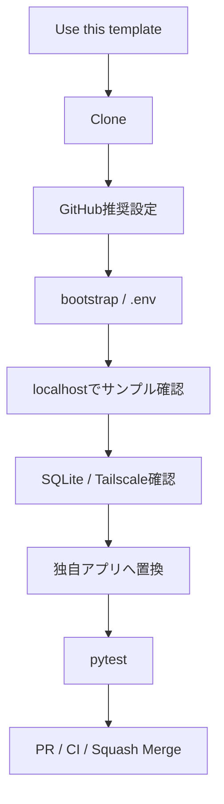
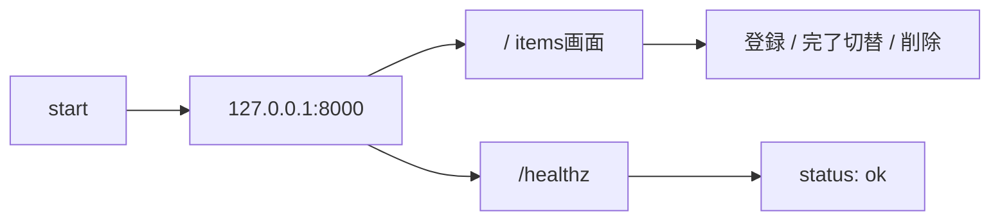
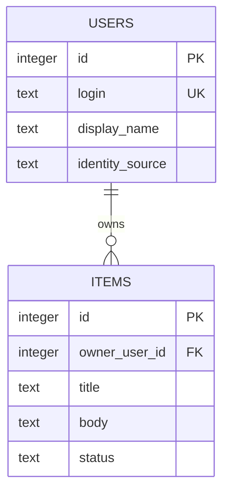
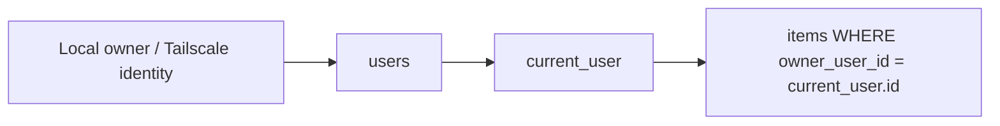
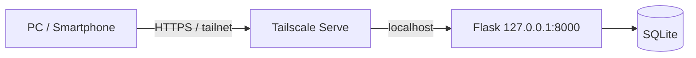
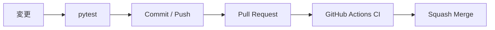
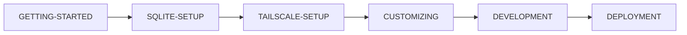

# Getting Started

このドキュメントは、このテンプレートから自分用リポジトリを作成し、ローカルで動作確認して、そこから独自Webアプリ開発を始めるための手順です。

サンプル `items` はSQLite CRUD・利用者識別・利用者別データ分離を確認するための実装例です。そのまま使う必要はありません。独自アプリへ作り替える手順は [docs/CUSTOMIZING.md](docs/CUSTOMIZING.md) を参照してください。

## 全体フロー



## 1. 前提

- GitHubアカウント
- Git
- Python 3.11以上
- GitHub Desktop（推奨）
- GitHub CLI（GitHub推奨設定を自動化する場合）
- 開発用PC
- ChatGPTまたはCodex
- Tailscale（別端末から利用する場合。localhost確認だけなら不要）

確認例:

```powershell
python --version
git --version
gh --version
```

## 2. 自分用リポジトリを作る

新しいアプリを開発する場合、テンプレート本体へ案件固有コードを追加せず、GitHubの **Use this template** から自分用リポジトリを作成する方法を推奨します。

例:

```text
python-sqlite-tailscale-webapp-template
        ↓ Use this template
my-home-inventory
```

テンプレート自体を試すだけなら通常のCloneでも構いません。

## 3. Clone

GitHub Desktopでは `File` → `Clone repository...` から自分用リポジトリを選びます。

CLIの場合:

```bash
git clone https://github.com/<owner>/<your-repository>.git
cd <your-repository>
```

Windowsでは、たとえば次のようなフォルダーになります。

```text
C:\Users\<user>\Documents\GitHub\<your-repository>
```

## 4. GitHub推奨設定を適用する

このテンプレートではmainへの直接Pushを避け、Pull RequestとCIを入口にします。

Windows PowerShellでGitHub CLIへログインします。

```powershell
gh auth login
```

続けて:

```powershell
.\scripts\setup-github.ps1
```

対象を明示する場合:

```powershell
.\scripts\setup-github.ps1 -Repository owner/repository
```

このスクリプトは `Protect main` Ruleset、3本の必須CI、Conversation resolution、Squash Mergeのみ、linear history、force push禁止、branch削除禁止、Merge後branch自動削除などを設定します。

詳細は [docs/GITHUB-SETUP.md](docs/GITHUB-SETUP.md) を参照してください。

## 5. 依存関係を準備する

### Windows

```powershell
.\scripts\bootstrap.ps1
```

### macOS / Linux

```bash
./scripts/bootstrap.sh
```

セットアップスクリプトは `.venv` を作成し、必要なPython依存関係をインストールします。

## 6. `.env` を作る

Windows:

```powershell
Copy-Item .env.example .env
```

macOS / Linux:

```bash
cp .env.example .env
```

最小例:

```env
APP_NAME=Local Web App
LOCAL_OWNER_EMAIL=owner@example.local
LOCAL_OWNER_NAME=Local Owner
```

`.env` はGitHubへコミットしません。秘密情報やPC固有設定を追加した場合も同様です。

## 7. まずテンプレート単体を確認する

Windows:

```powershell
.\scripts\start.ps1
```

macOS / Linux:

```bash
./scripts/start.sh
```

ブラウザで以下を開きます。

```text
http://127.0.0.1:8000
```



この時点ではTailscaleは不要です。localhostで正常に動くことを、カスタマイズ前の基準状態とします。

## 8. SQLiteを確認する

初回起動時に `app/schema.sql` が実行され、既定では次のDBが作成されます。

```text
data/app.db
```

サンプルSchema:



SQLiteの初期化、Schema変更、バックアップ、運用開始後の変更方針は [docs/SQLITE-SETUP.md](docs/SQLITE-SETUP.md) を参照してください。

## 9. サンプルの利用者識別とCRUDを確認する

localhostアクセス時は `.env` のローカルオーナーを利用者として扱います。Tailscale Serve経由では、loopbackから渡されたTailscale利用者ヘッダーを使って利用者を識別します。

サンプル `items` はSQLの `owner_user_id` 条件で利用者本人のデータだけを取得・更新します。



詳細は [docs/AUTH-CRUD.md](docs/AUTH-CRUD.md) を参照してください。

## 10. 別端末から使う場合はTailscaleを設定する

Tailscaleへログイン済みのホストPCで:

```powershell
.\scripts\tailscale-serve.ps1
```

または:

```powershell
tailscale serve --bg 8000
tailscale serve status
```

表示されたHTTPS URLを、同じtailnetから開きます。



Python側を `0.0.0.0` へ変更しません。詳細は [docs/TAILSCALE-SETUP.md](docs/TAILSCALE-SETUP.md) を参照してください。

## 11. 自分のアプリへ作り替える

次は [docs/CUSTOMIZING.md](docs/CUSTOMIZING.md) に沿って、主に以下を置き換えます。

1. アプリ名・説明
2. `app/schema.sql`
3. `app/services/items.py`
4. `app/routes.py`
5. `app/templates/` / `app/static/`
6. `tests/`
7. README / docs

`items` が不要なら削除して構いません。ただしlocalhost限定、認証・認可、CSRF、セキュリティヘッダーなどの共通基盤は、理由なく弱体化しないことを推奨します。

## 12. 品質チェック

Windows:

```powershell
.\.venv\Scripts\python.exe -m pytest
```

macOS / Linux:

```bash
.venv/bin/python -m pytest
```



## 13. ChatGPT / Codex

ChatGPT / Codexへ依頼する際は、テンプレートから作成した対象リポジトリ、変更目的、維持する共通基盤、完了条件を明示します。

例:

```text
このリポジトリは python-sqlite-tailscale-webapp-template から作成しました。
itemsサンプルを削除して、○○管理アプリを実装してください。
127.0.0.1限定、Tailscale Serve、認証・認可、CSRF、CIは維持してください。
mainへ直接Commitせず、日本語Issue → Issue番号入りBranch → PR → CI → Squash Mergeで進めてください。
完了条件はpytestとGitHub Actions CI成功です。
```

GitHub Appに対象リポジトリのアクセス権が付与されていれば、ChatGPTからIssue作成・Branch・Commit / Push・PR・CI確認・mergeまで進められます。

## 14. CI成功報告ルール

CI成功をもって作業完了と報告する場合は、最低限次を併記します。

- 修正ソース一覧
- 修正ドキュメント一覧
- 修正または追加したテスト一覧
- CI結果

## 次に読む


