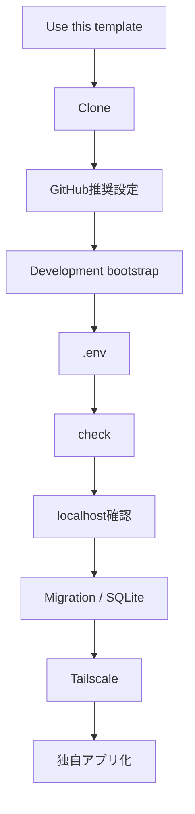
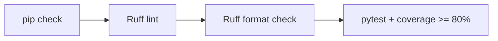
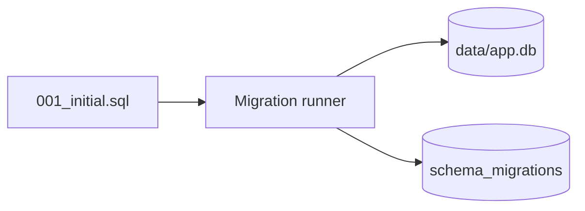
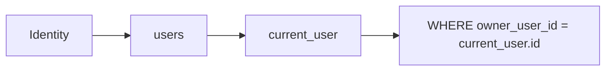
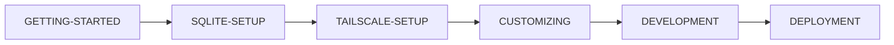

# Getting Started

このドキュメントは、このテンプレートから自分用リポジトリを作成し、ローカルで基準動作を確認して、独自Webアプリ開発へ入るまでの手順です。

## 全体フロー



## 1. 前提

- GitHubアカウント
- Git
- Python 3.11以上
- GitHub Desktop（推奨）
- GitHub CLI（GitHub推奨設定を自動化する場合）
- ChatGPTまたはCodex
- Tailscale（別端末から利用する場合）

CIではPython 3.11 / 3.12 / 3.13 / 3.14を確認しています。

## 2. 自分用リポジトリを作る

GitHubの **Use this template** から新しいリポジトリを作成します。テンプレート本体へ案件固有コードを追加しません。

```text
python-sqlite-tailscale-webapp-template
        ↓ Use this template
my-home-inventory
```

## 3. Clone

```bash
git clone https://github.com/<owner>/<your-repository>.git
cd <your-repository>
```

GitHub Desktopを利用しても構いません。

## 4. GitHub推奨設定

Windows PowerShell:

```powershell
gh auth login
.\scripts\setup-github.ps1
```

主に以下を設定します。

- Pull Request必須
- `test (3.11)` / `test (3.12)` / `test (3.13)` / `test (3.14)` 必須
- `windows-powershell-51` 必須
- Conversation resolution
- Linear history
- Squash Mergeのみ
- force push禁止
- Default branch削除禁止
- Merge後branch自動削除

詳細は [docs/GITHUB-SETUP.md](docs/GITHUB-SETUP.md) を参照してください。

## 5. 開発環境を準備する

### Windows

```powershell
.\scripts\bootstrap.ps1
```

### macOS / Linux

```bash
./scripts/bootstrap.sh
```

スクリプトはPython 3.11以上を確認し、リポジトリルートへ `.venv` を作り、開発依存をインストールします。

実際にアプリを動かすだけの稼働PCでは、Ruff / pytest等を含めないruntime用bootstrapを利用できます。

```powershell
.\scripts\bootstrap-runtime.ps1
```

```bash
./scripts/bootstrap-runtime.sh
```

## 6. `.env` を作る

Windows:

```powershell
Copy-Item .env.example .env
```

macOS / Linux:

```bash
cp .env.example .env
```

最小例:

```env
APP_NAME=Local Web App
LOG_LEVEL=INFO
LOCAL_OWNER_EMAIL=owner@example.local
LOCAL_OWNER_NAME=Local Owner
```

`.env` はGitHubへコミットしません。

## 7. 開発環境の品質チェック

Windows:

```powershell
.\scripts\check.ps1
```

macOS / Linux:

```bash
./scripts/check.sh
```



ChatGPT / Codexへ実装を依頼するときも、原則としてこのcheck成功を完了条件にします。

## 8. テンプレート単体を起動する

Windows:

```powershell
.\scripts\start.ps1
```

macOS / Linux:

```bash
./scripts/start.sh
```

確認URL:

```text
http://127.0.0.1:8000
http://127.0.0.1:8000/healthz
http://127.0.0.1:8000/readyz
```

- `/healthz`: Webプロセスの生存確認
- `/readyz`: SQLiteへ接続・問い合わせできることまで確認

この段階ではTailscaleは不要です。

## 9. SQLite Migrationを確認する

初回起動時に `app/migrations/*.sql` が番号順に適用されます。

```text
app/migrations/
└─ 001_initial.sql
```

SQLite側には `schema_migrations` が作成されます。



同じMigrationは2回目以降スキップされます。運用開始後のSchema変更は、既存Migrationを書き換えるのではなく `002_add_...sql` のように追加します。

詳細は [docs/SQLITE-SETUP.md](docs/SQLITE-SETUP.md) を参照してください。

## 10. Backupを試す

サンプルを一度操作した後、次を実行できます。

Windows:

```powershell
.\.venv\Scripts\python.exe -m scripts.db_tools backup
.\.venv\Scripts\python.exe -m scripts.db_tools check
```

macOS / Linux:

```bash
.venv/bin/python -m scripts.db_tools backup
.venv/bin/python -m scripts.db_tools check
```

Backupは既定で `backups/` に作られ、Git管理対象外です。Restoreは既存DBを置き換えるため、アプリ停止後に `--yes` を付けて明示実行します。

## 11. 利用者識別とCRUD

localhostでは `.env` のローカルオーナーを利用し、Tailscale Serve経由ではloopbackから渡されたTailscale Identity Headerを利用します。

サンプル `items` は `owner_user_id` をSQL条件に含め、利用者本人のデータだけを扱います。



詳細は [docs/AUTH-CRUD.md](docs/AUTH-CRUD.md) を参照してください。

## 12. Tailscaleで別端末から使う

```powershell
.\scripts\tailscale-serve.ps1
```

またはmacOS / Linux:

```bash
./scripts/tailscale-serve.sh
```

Python側を `0.0.0.0` へ変更しません。詳細は [docs/TAILSCALE-SETUP.md](docs/TAILSCALE-SETUP.md) を参照してください。

## 13. 自分のアプリへ作り替える

主な変更対象:

1. アプリ名・`.env.example`
2. `app/migrations/` の業務テーブル
3. `app/services/items.py` 等のService
4. `app/routes.py`
5. `app/templates/` / `app/static/`
6. 業務テスト
7. README / docs

初期 `001_initial.sql` を新規アプリ作成直後に大きく作り替えることはできますが、実データを保存し始めた後は既存Migrationを書き換えず、新Migrationを追加します。

詳しくは [docs/CUSTOMIZING.md](docs/CUSTOMIZING.md) を参照してください。

## 14. 依存関係

- `requirements.txt`: runtimeの直接依存範囲
- `requirements-dev.txt`: 開発依存
- `constraints.txt`: CI確認済みバージョン固定
- `.github/dependabot.yml`: pip / GitHub Actionsの月次更新確認

依存更新はCI成功を確認してから取り込みます。

## 15. ChatGPT / Codexへの最初の依頼例

```text
このリポジトリは python-sqlite-tailscale-webapp-template から作成しました。
itemsサンプルを○○管理アプリへ置き換えます。

127.0.0.1限定、Tailscale Serve、認証・認可、CSRF、Migration、Backup、品質ゲートを維持してください。
mainへ直接Commitせず、日本語Issue → Issue番号入りBranch → PR → CI → Squash Mergeで進めてください。
完了条件は scripts/check の成功とGitHub Actions CI成功です。
```

## 16. CI成功報告ルール

完了報告では最低限次を併記します。

- 修正ソース一覧
- 修正ドキュメント一覧
- 修正または追加したテスト一覧
- CI結果

## 次に読む


