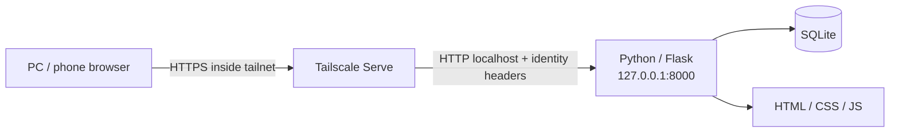

# Python + SQLite + Tailscale Local Web App Template

A reusable starter for **closed, self-hosted local web applications**.

The application runs only on `127.0.0.1`, stores application data in SQLite, and can be made available to approved devices/users through **Tailscale Serve**. Clone it, rename the app, replace the sample `items` feature, and build your own private web application.

## Architecture



### Design goals

- No cloud database required
- No router port forwarding
- No `0.0.0.0` bind by default
- No Tailscale Funnel
- SQLite data stays on the host PC
- Tailnet users can be identified from Tailscale Serve identity headers
- Direct localhost access can use a configured local owner identity
- Simple enough to fork for household tools, internal utilities, dashboards, inventory apps, checklists, media tools, and small workflow systems

## Stack

- Python 3.11+
- Flask
- SQLite (`sqlite3`)
- Waitress
- Tailscale Serve
- Plain HTML/CSS/JavaScript
- pytest / GitHub Actions

## Quick start

### Windows PowerShell

```powershell
git clone https://github.com/k-systems202208/python-sqlite-tailscale-webapp-template.git
cd python-sqlite-tailscale-webapp-template
.\scripts\bootstrap.ps1
Copy-Item .env.example .env
.\scripts\start.ps1
```

Open:

```text
http://127.0.0.1:8000
```

### macOS / Linux

```bash
git clone https://github.com/k-systems202208/python-sqlite-tailscale-webapp-template.git
cd python-sqlite-tailscale-webapp-template
./scripts/bootstrap.sh
cp .env.example .env
./scripts/start.sh
```

## Enable private access through Tailscale

Install Tailscale on the host PC and the client device, join both to the same tailnet (or configure the sharing/grants you need), then run:

```powershell
tailscale serve --bg 8000
```

Check the assigned URL:

```powershell
tailscale serve status
```

Tailscale Serve terminates HTTPS and proxies to the application on localhost. The backend can use `Tailscale-User-Login` and `Tailscale-User-Name` to identify the requester.

Official docs:
- https://tailscale.com/docs/features/tailscale-serve
- https://tailscale.com/docs/reference/tailscale-cli/serve

> Keep the Python application bound to localhost. Do not change it to `0.0.0.0` just to make remote access work. Tailscale Serve is the intended entry point.

## What is included

```text
app/
  auth.py          Tailscale/local identity resolution
  csrf.py          CSRF protection
  db.py            SQLite connection and initialization
  routes.py        Web + JSON API endpoints
  schema.sql        Starter DB schema
  services/        Business/service layer
  templates/       Server-rendered UI
  static/          CSS / JavaScript
docs/
  ARCHITECTURE.md
  CUSTOMIZE.md
  SECURITY.md
scripts/
  bootstrap.*
  start.*
  tailscale-serve.*
  tailscale-reset.*
tests/
  authentication, CRUD isolation, CSRF and security-header tests
```

## Sample feature: `items`

The starter includes a deliberately small multi-user CRUD feature:

- create an item
- mark it open/done
- delete it
- list only the current user's items

This is **example business logic**, not part of the infrastructure contract. Replace it with your own domain model.

## Identity model

Requests are resolved in this order:

1. **Tailscale Serve identity** — trusted only when the backend request comes from loopback.
2. **Local owner** — direct localhost access uses `LOCAL_OWNER_EMAIL` / `LOCAL_OWNER_NAME` from `.env`.
3. **Anonymous** — denied by default. Set `ALLOW_ANONYMOUS=true` only for intentional development scenarios.

The app stores a local user row keyed by email/login and maintains per-user sample data.

## SQLite

The database is created automatically at:

```text
data/app.db
```

SQLite is configured with foreign keys and WAL mode. Application data is intentionally kept outside source-control.

## API examples

Health check:

```text
GET /healthz
```

Current user:

```text
GET /api/me
```

Current user's items:

```text
GET /api/items
```

Creating data from custom JavaScript requires the same-origin CSRF token, available in the page as:

```html
<meta name="csrf-token" content="...">
```

Send it as `X-CSRF-Token` for mutating API requests.

## Security defaults

- hard refusal to bind to non-loopback IPs
- Tailscale identity headers ignored unless request source is loopback
- `HttpOnly` + `SameSite=Strict` session cookie
- CSRF protection on POST/PUT/PATCH/DELETE
- CSP, frame denial, MIME sniffing protection and no-store response headers
- Jinja auto-escaping
- no CORS enablement
- no public tunnel configuration

See [docs/SECURITY.md](docs/SECURITY.md).

## Build your own app

Start with [docs/CUSTOMIZE.md](docs/CUSTOMIZE.md). In most projects you will:

1. change `APP_NAME`
2. replace `items` with your domain tables/services/routes
3. replace `index.html`
4. add tests
5. define Tailscale grants/ACLs appropriate for your users

## Tests

```powershell
.\.venv\Scripts\python.exe -m pytest
```

or:

```bash
.venv/bin/python -m pytest
```

CI runs the same test suite on pushes and pull requests.

## License

MIT. Use it as the base of your own local/private application.
