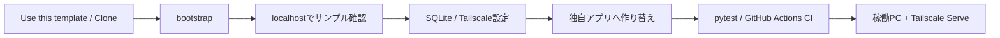
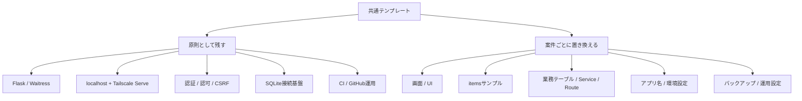
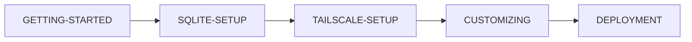
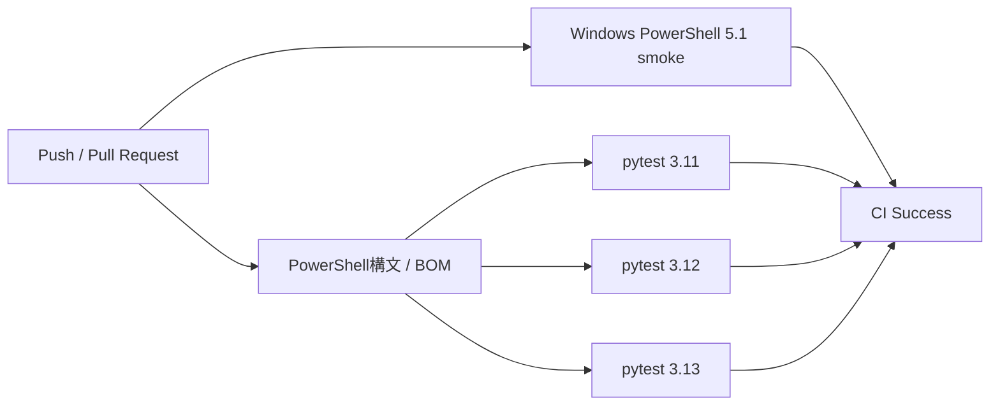
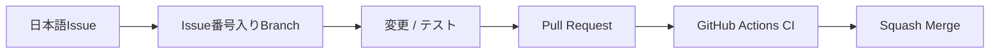
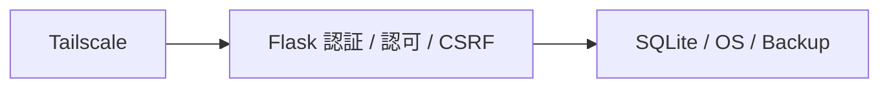

# Python + SQLite + Tailscale Web App Template

Python / Flask、SQLite、Tailscale を使ったクローズドWebアプリ開発をすぐに始めるための**共通テンプレート**です。

localhost限定のFlaskアプリ、SQLite、Tailscale Serve、利用者識別、利用者別CRUD、CSRF・セキュリティヘッダー、pytest、GitHub Actions CIまでを初期実装し、新規アプリごとの定型セットアップを減らします。第三者がこのリポジトリから新しいリポジトリを作成し、サンプル `items` を削除・置換して、用途を問わず自分のローカルWebアプリを作ることを前提にしています。

## このテンプレートの全体像



## このテンプレートの考え方

このリポジトリは完成済みのタスク管理アプリではありません。

`items` は、SQLite CRUD・利用者識別・所有者によるデータ分離・CSRFを確認するための**削除可能なサンプル**です。新しいアプリを作る際は、必要に応じて自由に削除・置換してください。

テンプレートとして原則残すもの:

- Flask / Waitress の基本構成
- `127.0.0.1` のみで待ち受ける安全設計
- SQLite接続・初期化の仕組み
- Tailscale Serve経由の利用者識別
- localhost用ローカルオーナー
- 認証と認可を分ける設計
- CSRF対策・セキュリティヘッダー
- pytest / GitHub Actions CI
- Issue → Branch → PR → CI → Squash Merge のGitHub運用

案件ごとに置き換えるもの:

- アプリ名・説明
- `items` サンプルテーブル
- `app/services/items.py`
- `app/routes.py` の業務URL / API
- `app/templates/` / `app/static/` の画面
- 業務固有のテスト
- `.env` のローカル設定
- SQLiteのバックアップ・移行方針

### 残すもの / 置き換えるもの



具体的な作り替え手順は [docs/CUSTOMIZING.md](docs/CUSTOMIZING.md) を参照してください。

## 技術構成

- Python 3.11以上（CI: 3.11 / 3.12 / 3.13）
- Flask 3.1系
- Waitress 3系
- SQLite
- Jinja / HTML / CSS / JavaScript
- Tailscale Serve
- python-dotenv
- pytest
- GitHub Actions CI

## 含まれるもの

- `127.0.0.1:8000` で動くFlask / Waitressアプリ
- `data/app.db` のSQLiteデータベース
- `users` / `items` サンプルSchema
- localhostのローカルオーナー識別
- Tailscale Serveの利用者ヘッダーによる識別
- 利用者ごとの `items` データ分離
- HTML画面とJSON APIのサンプル
- `/healthz` ヘルスチェック
- `/api/me` / `/api/items`
- CSRF対策
- CSP等のセキュリティヘッダー
- Windows / macOS / Linux用セットアップスクリプト
- Tailscale Serve / resetスクリプト
- GitHub Ruleset / Merge設定の自動セットアップ
- Python 3.11 / 3.12 / 3.13 のpytest CI
- Windows PowerShell 5.1でのGitHubセットアップスモークテスト

## クイックスタート

GitHub上では **Use this template** から自分用リポジトリを作る方法を推奨します。テンプレート自体を試すだけならCloneでも構いません。

```bash
git clone https://github.com/k-systems202208/python-sqlite-tailscale-webapp-template.git
cd python-sqlite-tailscale-webapp-template
```

Windows PowerShell:

```powershell
.\scripts\bootstrap.ps1
Copy-Item .env.example .env
.\scripts\start.ps1
```

macOS / Linux:

```bash
./scripts/bootstrap.sh
cp .env.example .env
./scripts/start.sh
```

ブラウザで `http://127.0.0.1:8000` を開きます。

`.env` の最小例:

```env
APP_NAME=Local Web App
LOCAL_OWNER_EMAIL=owner@example.local
LOCAL_OWNER_NAME=Local Owner
```

初回利用の詳細は [GETTING-STARTED.md](GETTING-STARTED.md) を参照してください。

## Tailscaleで別端末から使う

アプリ本体は `127.0.0.1` のままにし、別端末からの入口にはTailscale Serveを使います。

Windows:

```powershell
.\scripts\tailscale-serve.ps1
```

または:

```powershell
tailscale serve --bg 8000
tailscale serve status
```

**Pythonアプリを `0.0.0.0` へ変更しないでください。** 詳細は [docs/TAILSCALE-SETUP.md](docs/TAILSCALE-SETUP.md) を参照してください。

## サンプルURL

- `/` `items` 一覧・登録・完了切替・削除
- `/healthz` ヘルスチェック
- `/api/me` 現在の利用者情報
- `/api/items` 利用者本人の `items` JSON API

サンプルの認証・利用者分離・CRUDの仕組みは [docs/AUTH-CRUD.md](docs/AUTH-CRUD.md) を参照してください。

## 開発コマンド

Windows:

```powershell
.\.venv\Scripts\python.exe -m pytest
```

macOS / Linux:

```bash
.venv/bin/python -m pytest
```

GitHub ActionsではPython 3.11 / 3.12 / 3.13でpytestを実行し、`setup-github.ps1` の構文・UTF-8 BOM・Windows PowerShell 5.1動作も確認します。

## ドキュメント

初めて利用する場合は、次の順で読むと全体を追いやすくなります。



- [GETTING-STARTED.md](GETTING-STARTED.md) - テンプレートから開発開始まで
- [docs/SQLITE-SETUP.md](docs/SQLITE-SETUP.md) - SQLiteの初期化・Schema・バックアップ・変更方針
- [docs/TAILSCALE-SETUP.md](docs/TAILSCALE-SETUP.md) - Tailscale Serveと別端末アクセス
- [docs/CUSTOMIZING.md](docs/CUSTOMIZING.md) - サンプルから独自アプリへ作り替える手順
- [docs/AUTH-CRUD.md](docs/AUTH-CRUD.md) - 利用者識別・認可・サンプルCRUD
- [docs/ARCHITECTURE.md](docs/ARCHITECTURE.md) - 構成と設計方針
- [docs/DEVELOPMENT.md](docs/DEVELOPMENT.md) - 日常のIssue・Git・CI・依存関係更新
- [docs/DEPLOYMENT.md](docs/DEPLOYMENT.md) - 稼働PCへの反映・Tailscale・Release運用
- [docs/GITHUB-SETUP.md](docs/GITHUB-SETUP.md) - Ruleset / Squash Merge等の初期設定
- [docs/SECURITY.md](docs/SECURITY.md) - セキュリティ方針
- [CONTRIBUTING.md](CONTRIBUTING.md) - このテンプレート本体への変更ルール

## CI

PushおよびPull RequestでPython 3.11 / 3.12 / 3.13のpytestを実行します。また、GitHub初期設定スクリプトについてLinux上のPowerShell構文・文字コード確認とWindows PowerShell 5.1スモークテストを実行します。



## GitHub運用

このテンプレート本体では、mainへの直接Commit / Pushを行いません。



推奨Rulesetは `scripts/setup-github.ps1` で適用できます。詳細は [docs/GITHUB-SETUP.md](docs/GITHUB-SETUP.md) を参照してください。

## セキュリティ

Tailscaleだけを唯一の防御にしません。ネットワーク、アプリ、データの3層で守ります。



- Flask / Waitressは `127.0.0.1` のみにbind
- Tailscale利用者ヘッダーはloopback経由のときだけ信用
- 画面だけでなくSQLでも所有者条件を付ける
- `.env` / `data/` / 秘密鍵はGitHubへコミットしない
- Tailscale Funnelを前提にしない

詳細は [docs/SECURITY.md](docs/SECURITY.md) を参照してください。

## テンプレートとしての運用

このリポジトリ自体には案件固有仕様を積み上げません。サンプル機能は実装例として維持し、特定業務向けの機能追加は、このテンプレートから作成した各アプリ側で行います。

## License

MIT Licenseです。第三者はLICENSEの条件に従って、利用・変更・再配布できます。詳細は [LICENSE](LICENSE) を参照してください。
