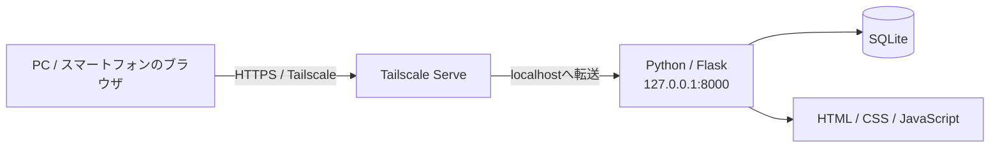

# Python + SQLite + Tailscale ローカルWebアプリ テンプレート

**Python・SQLite・Tailscaleを使って、家庭内・社内・個人用のクローズドなWebアプリを作るためのテンプレートです。**

このリポジトリを元に、在庫管理、予約管理、チェックリスト、家計管理、設備管理、メディア管理など、用途に合わせたローカルWebアプリを開発できます。

クラウド上にDBを用意したり、ルーターのポートを開放したりする必要はありません。アプリ本体とSQLiteデータは自分のPC上に置き、外出先や別端末から使いたい場合だけTailscale経由で接続します。

---

## まず、このテンプレートで何ができるの？



通常は、自宅PCや社内PCをアプリ本体として動かします。

- **Python / Flask**：Webアプリ本体
- **SQLite**：データ保存
- **HTML / CSS / JavaScript**：ブラウザ画面
- **Tailscale Serve**：許可した端末・ユーザーからの接続

アプリは初期状態では `127.0.0.1` のみに公開されます。Tailscaleを有効にすると、同じtailnetに参加しているスマートフォンや別PCからHTTPSでアクセスできます。

---

## このテンプレートの特徴

- クラウドDB不要
- SQLiteなのでDBサーバーの構築不要
- ルーターのポート開放不要
- `0.0.0.0` への公開を禁止
- Tailscale Funnelは使用しない
- データはアプリを動かすPC内に保存
- Tailscale利用者を識別可能
- 利用者ごとのデータ分離に対応
- CSRF対策・CSPなど基本的なWebセキュリティ対策を実装済み
- Windows / macOS / Linuxで利用可能
- pytestによる自動テスト付き
- GitHub ActionsによるCI付き
- MIT Licenseで自由に利用・改造可能

---

## 新しいアプリを開発するときの3段階

このテンプレートでは、開発手順を3つのガイドへ明確に分けています。

```text
① 作り始める
GETTING-STARTED.md
  自分用リポジトリ作成
  → Clone
  → 初回セットアップ
  → サンプル起動
  → ChatGPT / Codexへ最初の依頼
        ↓
② 作る
CUSTOMIZE.md
  データ設計
  → SQLite
  → 業務処理
  → URL / API
  → 画面
  → テスト
        ↓
③ 変更を運ぶ
DEVELOPMENT-DEPLOYMENT.md
  ローカルテスト
  → Commit / Push
  → CI
  → Pull / 稼働PC反映
  → Release
  → 将来の自動デプロイ
```

### どれを読めばいい？

| 今やりたいこと | 読むガイド |
| --- | --- |
| 新しいアプリを作り始めたい | **[① 新規開発スタートガイド](docs/GETTING-STARTED.md)** |
| サンプル `items` を自分の機能へ作り替えたい | **[② カスタマイズガイド](docs/CUSTOMIZE.md)** |
| Commit / Push / CI / Pull / Releaseを知りたい | **[③ 開発・CI・ローカル反映・デプロイ運用](docs/DEVELOPMENT-DEPLOYMENT.md)** |

この3つは似た内容の別資料ではなく、**開発工程の異なる段階を担当する連続したガイド**です。

---

## その他のドキュメント

3つの開発ガイドを補足する資料です。

| ドキュメント | 内容 |
| --- | --- |
| [アーキテクチャ](docs/ARCHITECTURE.md) | Python / Flask / SQLite / Tailscaleの役割、全体構成、変更してよい部分と残すべき共通基盤 |
| [セキュリティ設計](docs/SECURITY.md) | localhost限定、Tailscale利用者識別、CSRF、認証・認可、秘密情報・SQLiteの保護 |
| [コントリビューションガイド](CONTRIBUTING.md) | ブランチ、テスト、Pull Request、Gitへ登録してはいけない情報などの開発ルール |
| [ライセンス](LICENSE) | MIT Licenseの全文 |

初めて開発する場合は、まず **README → ① 新規開発スタートガイド** と進みます。実装を始めるときに **② カスタマイズガイド**、GitHubへ変更を反映するときに **③ 開発・CI・ローカル反映・デプロイ運用** を参照してください。アーキテクチャとセキュリティ設計は、設計変更が必要なときのリファレンスとして利用します。

---

# 1. 必要なもの

### 必須

1. **Git**
2. **Python 3.11以上**
3. **このリポジトリを保存できるPC**

### 外部のスマートフォンや別PCから使いたい場合

4. **Tailscale**

TailscaleはローカルPCだけで試す場合には不要です。

---

# 2. まずテンプレートを試す

テンプレートそのものを確認するだけなら、次のようにCloneできます。

```text
git clone https://github.com/k-systems202208/python-sqlite-tailscale-webapp-template.git
cd python-sqlite-tailscale-webapp-template
```

Gitを使わない場合は、GitHubの **Code → Download ZIP** からダウンロードして展開しても構いません。

> **新しいアプリを開発する場合**
>
> 元テンプレートをそのまま開発用リポジトリにするのではなく、自分用GitHubリポジトリを作成してから開始してください。手順は [① 新規開発スタートガイド](docs/GETTING-STARTED.md) にまとめています。

---

# 3. Windowsで起動する

プロジェクトフォルダーでPowerShellを開きます。

```powershell
.\scripts\bootstrap.ps1
Copy-Item .env.example .env
.\scripts\start.ps1
```

ブラウザで次を開きます。

```text
http://127.0.0.1:8000
```

画面が表示されれば導入成功です。

---

# 4. macOS / Linuxで起動する

```bash
./scripts/bootstrap.sh
cp .env.example .env
./scripts/start.sh
```

ブラウザで `http://127.0.0.1:8000` を開きます。

---

# 5. 初期設定 `.env`

`.env.example` をコピーして作った `.env` が、このアプリのローカル設定ファイルです。

```text
APP_NAME=Local Web App
LOCAL_OWNER_EMAIL=owner@example.local
LOCAL_OWNER_NAME=Local Owner
```

たとえば在庫管理アプリなら次のように変更できます。

```text
APP_NAME=自宅在庫管理
LOCAL_OWNER_EMAIL=myname@example.com
LOCAL_OWNER_NAME=山田太郎
```

`.env` はGitへ登録しません。パスワードや秘密情報をREADMEやソースコードへ直接書かないでください。

---

# 6. Tailscaleでスマートフォンや別PCから使う

ローカルPCだけで使う場合は、この章は飛ばして構いません。

アプリを動かしているPCと利用端末を同じtailnetへ参加させたあと、アプリPCで次を実行します。

```text
tailscale serve --bg 8000
tailscale serve status
```

表示されたHTTPS URLをTailscaleに参加している端末のブラウザで開きます。

> **重要**
>
> Pythonアプリを外部利用するために `0.0.0.0` へ変更しないでください。このテンプレートではPythonを `127.0.0.1` のみに待ち受けさせ、Tailscale Serveを入口にすることを前提としています。

Tailscale Serveの停止・リセットには次のスクリプトも利用できます。

```text
scripts/tailscale-reset.ps1
scripts/tailscale-reset.sh
```

---

# 7. 最初から入っているサンプル機能

動作確認用として小さな **`items` 管理機能** が入っています。

- アイテム登録
- 完了 / 未完了の切り替え
- 削除
- 現在の利用者のデータだけ表示

これは完成アプリではなく、自分のアプリを作るための見本です。

```text
items
  ↓
在庫 / 予約 / 設備 / タスク / 日報 / 家計 / 顧客 / 蔵書 ...
```

実際の置き換え方法は [② カスタマイズガイド](docs/CUSTOMIZE.md) へ進んでください。

---

# 8. フォルダー構成

```text
python-sqlite-tailscale-webapp-template/
│
├─ app/
│  ├─ auth.py             利用者識別
│  ├─ config.py           アプリ設定
│  ├─ csrf.py             CSRF対策
│  ├─ db.py               SQLite接続・初期化
│  ├─ routes.py           画面・API
│  ├─ schema.sql          DB定義
│  ├─ security.py         セキュリティヘッダー
│  ├─ services/           業務処理
│  ├─ templates/          HTML
│  └─ static/             CSS / JavaScript
│
├─ data/
│  └─ app.db              実行時に作成されるSQLite DB
│
├─ docs/
│  ├─ GETTING-STARTED.md         ① 作り始める
│  ├─ CUSTOMIZE.md               ② 作る
│  ├─ DEVELOPMENT-DEPLOYMENT.md  ③ 変更を運ぶ
│  ├─ ARCHITECTURE.md            構成・設計リファレンス
│  └─ SECURITY.md                セキュリティリファレンス
│
├─ scripts/
│  ├─ bootstrap.*         初期セットアップ
│  ├─ start.*             アプリ起動
│  ├─ tailscale-serve.*   Tailscale公開
│  └─ tailscale-reset.*   Tailscale公開解除
│
├─ tests/                 自動テスト
├─ .env.example           設定ファイル見本
├─ CONTRIBUTING.md        開発参加・変更時のルール
├─ LICENSE                MIT License
├─ requirements.txt       Python依存ライブラリ
└─ run.py                 起動エントリーポイント
```

`data/app.db` は初回起動時に自動作成されます。

---

# 9. 利用者の識別

### Tailscale経由

Tailscale Serveが渡す次の利用者情報を利用します。

```text
Tailscale-User-Login
Tailscale-User-Name
```

これらのヘッダーを信用するのは **localhostからTailscale Serve経由で渡された場合だけ**です。

### localhostから直接アクセス

`.env` の次の設定を利用します。

```text
LOCAL_OWNER_EMAIL
LOCAL_OWNER_NAME
```

匿名アクセスは初期状態では許可していません。

---

# 10. SQLiteについて

DBサーバーを別途インストールする必要はありません。アプリを起動すると次のファイルが作成されます。

```text
data/app.db
```

SQLiteでは外部キー有効化、WALモードなど、この規模のローカルWebアプリで扱いやすい初期設定を入れています。`data/` 内の実データはGitへコミットしません。

---

# 11. セキュリティ上の考え方

このテンプレートは **「インターネットへWebサーバーを直接公開しない」** ことを基本方針にしています。

- Pythonは `127.0.0.1` のみにbind
- `0.0.0.0` など外部IPへのbindを拒否
- 外部接続はTailscale Serve経由
- Tailscale Funnelは使用しない
- CORSは初期状態で有効化しない
- POST / PUT / PATCH / DELETEにCSRF対策
- `HttpOnly` / `SameSite=Strict` Cookie
- Content Security Policy
- iframe埋め込み抑止
- MIME sniffing対策
- API / HTMLのキャッシュ抑止
- Jinjaの自動エスケープ

詳しくは [セキュリティ設計](docs/SECURITY.md) を参照してください。

---

# 12. API

初期状態では次のAPIがあります。

```text
GET /healthz
GET /api/me
GET /api/items
```

JavaScriptから登録・更新・削除APIを呼ぶ場合はCSRFトークンが必要です。

```html
<meta name="csrf-token" content="...">
```

更新系APIでは `X-CSRF-Token` ヘッダーとして送信します。

---

# 13. テスト

Windows:

```powershell
.\.venv\Scripts\python.exe -m pytest
```

macOS / Linux:

```bash
.venv/bin/python -m pytest
```

サンプルには利用者識別、利用者間のデータ分離、CRUD、CSRF、セキュリティヘッダーなどのテストが含まれています。GitHubへPushするとGitHub Actionsでも自動テストが実行されます。

テスト・CI・GitHubへの反映方法は [③ 開発・CI・ローカル反映・デプロイ運用](docs/DEVELOPMENT-DEPLOYMENT.md) を参照してください。

---

# 14. よくある質問

### 新しいアプリを作りたいのですが、最初に何を読めばよいですか？

[① 新規開発スタートガイド](docs/GETTING-STARTED.md) から始めてください。自分用リポジトリの作成からサンプル起動、ChatGPT / Codexへの最初の依頼までを扱います。

### サンプル `items` を在庫管理などへ変更する方法は？

[② カスタマイズガイド](docs/CUSTOMIZE.md) を参照してください。DB・業務処理・API・画面・テストを自分用へ変更する方法を扱います。

### CIやGitHub Desktop、ローカルPCへの反映方法は？

[③ 開発・CI・ローカル反映・デプロイ運用](docs/DEVELOPMENT-DEPLOYMENT.md) を参照してください。実装方法ではなく、変更したソースをどう管理・検証・反映するかを扱います。

### PostgreSQLやMySQLは必要ですか？

不要です。初期状態ではPython標準のSQLiteを利用します。

### AWSやAzureなどのクラウド契約は必要ですか？

不要です。

### 自宅のルーターでポート開放が必要ですか？

不要です。外部から使う場合はTailscale Serveを利用します。

### スマートフォンから使えますか？

はい。スマートフォンにTailscaleを入れ、同じtailnetへ参加すればブラウザから利用できます。

### 複数人で使えますか？

はい。Tailscale経由の利用者を識別し、ユーザー単位でデータを分離できる構造をサンプル実装しています。

### ChatGPTとCodexのどちらを使えばよいですか？

どちらか一方に固定する必要はありません。要件整理や設計相談、軽微なGitHub修正にはChatGPT、本格的な実装や複数ファイル変更にはCodexを使うなど、用途に応じて併用できます。詳しくは [① 新規開発スタートガイド](docs/GETTING-STARTED.md) を参照してください。

### ChatGPTがGitHubを修正したらローカルPCも自動更新されますか？

いいえ。標準運用ではGitHub DesktopなどでFetch / PullしてローカルPCへ反映します。詳しくは [③ 開発・CI・ローカル反映・デプロイ運用](docs/DEVELOPMENT-DEPLOYMENT.md) を参照してください。

### 本当にインターネットへ公開されませんか？

標準構成ではPythonサーバーをlocalhostに限定し、Tailscale Serveを使います。ただし、ネットワーク設定やソースコードを変更した場合はその限りではありません。

### 自由に改造して公開してもいいですか？

はい。MIT Licenseです。ライセンス条件の範囲で自由に利用・改造できます。

---

# 15. 最短で試したい人へ

Windowsなら、PythonとGitをインストールしたあと、PowerShellで次を実行します。

```powershell
git clone https://github.com/k-systems202208/python-sqlite-tailscale-webapp-template.git
cd python-sqlite-tailscale-webapp-template
.\scripts\bootstrap.ps1
Copy-Item .env.example .env
.\scripts\start.ps1
```

ブラウザで `http://127.0.0.1:8000` を開いてください。

テンプレートを試すだけならここまでです。**このテンプレートから新しいアプリを作る場合は、次に [① 新規開発スタートガイド](docs/GETTING-STARTED.md) へ進んでください。**

---

## ライセンス

MIT License

このテンプレートをベースに、用途に合わせて自由にローカルWebアプリを開発してください。
