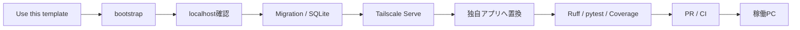
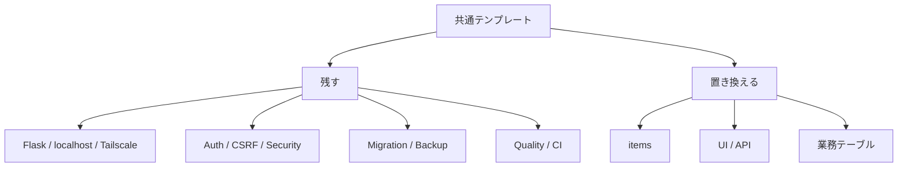
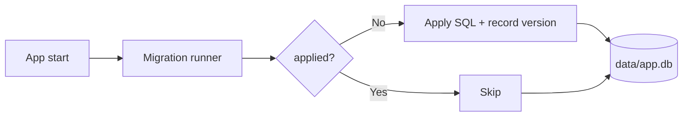
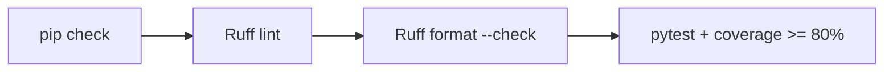
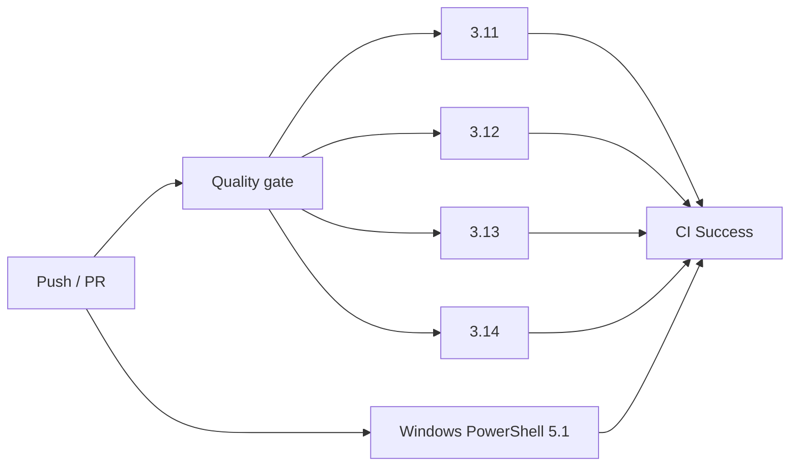
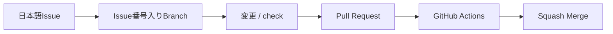
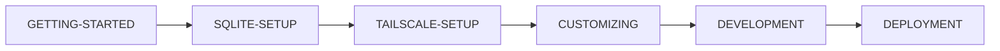
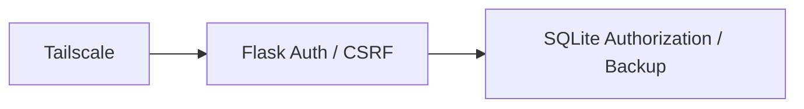

# Python + SQLite + Tailscale Web App Template

Python / Flask、SQLite、Tailscale を使ったクローズドWebアプリ開発をすぐに始めるための**共通テンプレート**です。

localhost限定のFlask / Waitress、SQLite Migration、Tailscale Serve、利用者識別、利用者別CRUD、CSRF・セキュリティヘッダー、Backup / Restore、Ruff / pytest / Coverage、GitHub Actions CIまでを初期実装しています。第三者が **Use this template** から自分用リポジトリを作り、サンプル `items` を独自機能へ置き換えて利用することを前提にしています。

## 全体像



## このテンプレートで原則残すもの

- Flask / Waitress の基本構成
- `127.0.0.1` のみで待ち受ける安全設計
- Tailscale Serve経由の利用者識別
- localhost用ローカルオーナー
- 認証と認可を分ける設計
- CSRF対策・セキュリティヘッダー
- SQLite接続と番号付きMigration
- Backup / Restore / integrity check
- Ruff / pytest / Coverage品質ゲート
- GitHub Actions CI / Dependabot
- Issue → Branch → PR → CI → Squash Merge のGitHub運用

案件ごとに置き換えるもの:

- アプリ名・説明
- `items` サンプルMigration / Service / Route
- `app/templates/` / `app/static/`
- 業務固有のテスト
- `.env` のローカル設定
- 業務固有のMigration



## 技術構成

- Python 3.11〜3.14
- Flask 3.1系
- Waitress 3系
- SQLite
- Tailscale Serve
- Jinja / HTML / CSS / JavaScript
- python-dotenv
- Ruff
- pytest / pytest-cov
- GitHub Actions / Dependabot

`requirements*.txt` には採用可能な範囲を記載し、`constraints.txt` にテンプレートでCI確認済みの既知良好バージョンを固定しています。

## クイックスタート

### 開発PC

Windows PowerShell:

```powershell
.\scripts\bootstrap.ps1
Copy-Item .env.example .env
.\scripts\check.ps1
.\scripts\start.ps1
```

macOS / Linux:

```bash
./scripts/bootstrap.sh
cp .env.example .env
./scripts/check.sh
./scripts/start.sh
```

ブラウザで以下を確認します。

```text
http://127.0.0.1:8000
http://127.0.0.1:8000/healthz
http://127.0.0.1:8000/readyz
```

`/healthz` はWebプロセスの生存確認、`/readyz` はSQLiteへ `SELECT 1` できることまで確認します。

詳細は [GETTING-STARTED.md](GETTING-STARTED.md) を参照してください。

### 稼働PCだけを準備する場合

開発ツールを入れずruntime依存だけを導入できます。

Windows:

```powershell
.\scripts\bootstrap-runtime.ps1
```

macOS / Linux:

```bash
./scripts/bootstrap-runtime.sh
```

## SQLite Migration

初回起動時、`app/migrations/` の番号付きSQLを順番に適用します。

```text
app/migrations/
└─ 001_initial.sql
```

適用済みMigrationはSQLiteの `schema_migrations` に記録され、同じMigrationは再適用されません。



運用開始後はDBを削除して作り直さず、新しい `002_...sql`、`003_...sql` のようなMigrationを追加します。詳細は [docs/SQLITE-SETUP.md](docs/SQLITE-SETUP.md) を参照してください。

## Backup / Restore

SQLiteのbackup APIを使った共通ツールを用意しています。

```powershell
# Backup
.\.venv\Scripts\python.exe -m scripts.db_tools backup

# Integrity check
.\.venv\Scripts\python.exe -m scripts.db_tools check

# Restore（アプリ停止後）
.\.venv\Scripts\python.exe -m scripts.db_tools restore backups\app-YYYYMMDD-HHMMSS-xxxxxx.db --yes
```

Restore前に既存DBがある場合は、自動的に `pre-restore` 安全バックアップを作成します。`backups/` はGit管理対象外です。

## Tailscaleで別端末から使う

アプリ本体は `127.0.0.1` のままにします。

Windows:

```powershell
.\scripts\tailscale-serve.ps1
```

macOS / Linux:

```bash
./scripts/tailscale-serve.sh
```

**Flask / Waitressを `0.0.0.0` へ変更しないでください。** 詳細は [docs/TAILSCALE-SETUP.md](docs/TAILSCALE-SETUP.md) を参照してください。

## サンプルURL

- `/` - `items` 一覧・登録・完了切替・削除
- `/healthz` - プロセス生存確認
- `/readyz` - SQLite readiness確認
- `/api/me` - 現在の利用者情報
- `/api/items` - 利用者本人の `items` JSON API

APIのHTTPエラーはJSON形式で返します。利用者識別・利用者分離・CRUDの仕組みは [docs/AUTH-CRUD.md](docs/AUTH-CRUD.md) を参照してください。

## 品質チェック

開発時の完了条件は、個別のpytest実行ではなく共通checkコマンドを推奨します。

Windows:

```powershell
.\scripts\check.ps1
```

macOS / Linux:

```bash
./scripts/check.sh
```

実行内容:



## CI

GitHub Actionsでは次を検証します。

- Python 3.11 / 3.12 / 3.13 / 3.14
- 全PowerShellスクリプトの構文
- 全shellスクリプトの構文
- `setup-github.ps1` のUTF-8 BOM
- `pip check`
- Ruff lint / format
- pytest + Coverage 80%以上
- Windows PowerShell 5.1でGitHub初期設定スモークテスト



## GitHub運用



`github/protect-main.ruleset.json` では `test (3.11)`〜`test (3.14)` と `windows-powershell-51` を必須Checkとして定義しています。新しいリポジトリでは `scripts/setup-github.ps1` を実行して適用します。

## ドキュメント

推奨読書順:



- [GETTING-STARTED.md](GETTING-STARTED.md) - テンプレートから開発開始まで
- [docs/SQLITE-SETUP.md](docs/SQLITE-SETUP.md) - Migration / Backup / Restore
- [docs/TAILSCALE-SETUP.md](docs/TAILSCALE-SETUP.md) - Tailscale Serve
- [docs/CUSTOMIZING.md](docs/CUSTOMIZING.md) - 独自アプリ化
- [docs/AUTH-CRUD.md](docs/AUTH-CRUD.md) - 利用者識別・認可・CRUD
- [docs/ARCHITECTURE.md](docs/ARCHITECTURE.md) - 構成と設計
- [docs/DEVELOPMENT.md](docs/DEVELOPMENT.md) - 日常開発・品質ゲート・依存更新
- [docs/DEPLOYMENT.md](docs/DEPLOYMENT.md) - 稼働PC反映・Backup・Rollback
- [docs/GITHUB-SETUP.md](docs/GITHUB-SETUP.md) - Ruleset / Merge設定
- [docs/SECURITY.md](docs/SECURITY.md) - セキュリティ
- [CONTRIBUTING.md](CONTRIBUTING.md) - テンプレート本体の変更ルール

## セキュリティ



- Flask / Waitressは `127.0.0.1` のみにbind
- Tailscale利用者ヘッダーはloopback経由のときだけ信用
- SQLでも所有者条件を付ける
- `.env` / `data/` / `backups/` / 秘密鍵はGitHubへコミットしない
- Tailscale Funnelを前提にしない

詳細は [docs/SECURITY.md](docs/SECURITY.md) を参照してください。

## License

MIT Licenseです。詳細は [LICENSE](LICENSE) を参照してください。
