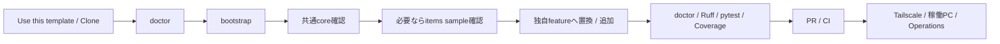
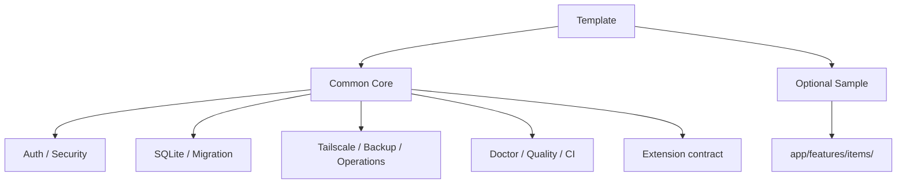
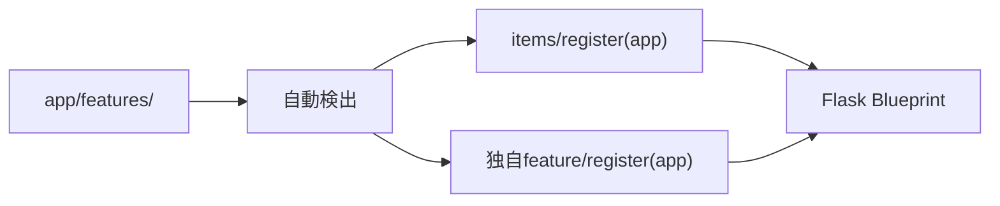
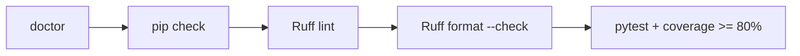
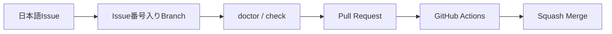
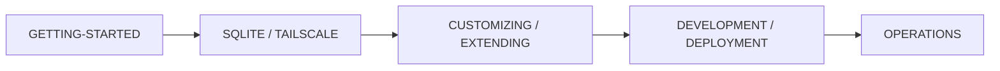

# Python + SQLite + Tailscale Web App Template

Python / Flask、SQLite、Tailscale を使ったクローズドWebアプリ開発をすぐに始めるための**共通テンプレート**です。

localhost限定のFlask / Waitress、Tailscale利用者識別、SQLite Migration、Backup / Restore、CSRF・セキュリティヘッダー、Ruff / pytest / Coverage、GitHub Actions CIを共通基盤として初期実装しています。`items` CRUDは仕組みを確認するための**丸ごと削除可能なサンプルfeature**として分離しています。

## 全体像



## 共通基盤とサンプル

### 原則として残す共通基盤

- `app/core/` - 共通Route・利用者チェック
- `app/auth.py` - Tailscale / localhost利用者識別
- `app/db.py` - SQLite接続・Migration runner
- `app/csrf.py` / `app/security.py` - Webセキュリティ
- `app/features/__init__.py` - feature自動検出・登録
- `scripts/doctor.py` - Python / Repository / env / data / optional tool診断
- `scripts/` - bootstrap / check / DB tools / Tailscale / GitHub設定
- `/`, `/healthz`, `/readyz`, `/api/me`
- Ruff / pytest / Coverage / GitHub Actions CI
- Backup / Restoreと運用Runbook
- feature拡張の共通契約

### 丸ごと削除できるitemsサンプル

```text
app/features/items/
├─ __init__.py
├─ routes.py
├─ service.py
├─ templates/items/index.html
└─ migrations/002_sample_items.sql
```

`app/features/` は自動検出されるため、**新規アプリでitemsサンプルを使わない場合は `app/features/items/` を削除するだけで、`app/__init__.py` の編集は不要**です。



新規DBを作る前にitems featureを削除すれば、items用Migrationも検出されないため `items` テーブルは作成されません。既にMigrationを適用したDBでは履歴を書き換えず、必要なら新しいMigrationでテーブルを削除します。

## 技術構成

- Python 3.11〜3.14
- Flask 3.1系
- Waitress 3系
- SQLite
- Tailscale Serve
- Jinja / HTML / CSS / JavaScript
- python-dotenv
- Ruff
- pytest / pytest-cov
- GitHub Actions / Dependabot

`requirements*.txt` には採用可能な範囲を記載し、`constraints.txt` にCI確認済みの既知良好バージョンを固定しています。

## クイックスタート

新しいアプリを作る場合はGitHubの **Use this template** から自分用リポジトリを作成し、そのリポジトリをCloneする方法を推奨します。

依存関係を入れる前に、system Pythonだけで構成を診断できます。

```powershell
python -m scripts.doctor
```

### 開発PC

Windows PowerShell:

```powershell
python -m scripts.doctor
.\scripts\bootstrap.ps1
Copy-Item .env.example .env
.\.venv\Scripts\python.exe -m scripts.doctor
.\scripts\check.ps1
.\scripts\start.ps1
```

macOS / Linux:

```bash
python3 -m scripts.doctor
./scripts/bootstrap.sh
cp .env.example .env
.venv/bin/python -m scripts.doctor
./scripts/check.sh
./scripts/start.sh
```

`doctor` はPython version、Repository必須ファイル、`.venv`、`.env`、`APP_DATA_DIR`、Git / GitHub CLI / Tailscale commandを確認します。開発前の `.venv` / `.env` 未作成やoptional command不足は警告に留め、致命的な構成不整合だけをFAILにします。

ブラウザで以下を確認します。

```text
http://127.0.0.1:8000
http://127.0.0.1:8000/healthz
http://127.0.0.1:8000/readyz
```

共通トップ `/` はitemsサンプルに依存しません。itemsサンプルを残している場合だけ次も利用できます。

```text
http://127.0.0.1:8000/items
http://127.0.0.1:8000/api/items
```

詳細は [GETTING-STARTED.md](GETTING-STARTED.md) を参照してください。

### 稼働PCだけを準備する場合

```powershell
.\scripts\bootstrap-runtime.ps1
```

または:

```bash
./scripts/bootstrap-runtime.sh
```

## Featureの仕組み

`app/features/` 直下のPython packageは起動時に自動検出され、`register(app)` を持つfeatureだけが登録されます。



特定feature名を `app/__init__.py` にハードコードしないため、サンプル削除や独自feature追加を行いやすくしています。独自featureの設計契約は [docs/EXTENDING.md](docs/EXTENDING.md) を参照してください。

## SQLite Migration

Migrationは2種類の場所から番号順に自動検出します。

```text
app/migrations/*.sql                    共通core
app/features/*/migrations/*.sql         feature固有
```

初期状態:

```text
app/migrations/001_initial.sql
app/features/items/migrations/002_sample_items.sql
```

適用済みMigrationは `schema_migrations` に記録され、再適用されません。全Migrationでversion番号は重複させません。

詳細は [docs/SQLITE-SETUP.md](docs/SQLITE-SETUP.md) を参照してください。

## Backup / Restore

```powershell
# Backup
.\.venv\Scripts\python.exe -m scripts.db_tools backup

# Integrity check
.\.venv\Scripts\python.exe -m scripts.db_tools check

# Restore（アプリ停止後）
.\.venv\Scripts\python.exe -m scripts.db_tools restore backups\app-YYYYMMDD-HHMMSS-xxxxxx.db --yes
```

Restore前には既存DBの `pre-restore` safety backupを作成します。日常確認・障害切り分け・復旧の流れは [docs/OPERATIONS.md](docs/OPERATIONS.md) にまとめています。

## Tailscaleで別端末から使う

アプリ本体は `127.0.0.1` のままにします。

Windows:

```powershell
.\scripts\tailscale-serve.ps1
```

macOS / Linux:

```bash
./scripts/tailscale-serve.sh
```

**Flask / Waitressを `0.0.0.0` へ変更しません。** 詳細は [docs/TAILSCALE-SETUP.md](docs/TAILSCALE-SETUP.md) を参照してください。

## URL

共通基盤:

- `/` - 共通core確認画面
- `/healthz` - Webプロセス生存確認
- `/readyz` - SQLite readiness確認
- `/api/me` - 現在の利用者情報

itemsサンプルを残した場合:

- `/items` - 一覧・登録・完了切替・削除
- `/api/items` - 利用者本人のitems JSON API

## 開発・品質コマンド

| コマンド | 内容 |
| --- | --- |
| `python -m scripts.doctor` | Python / Repository / env / data / optional tool診断 |
| `.\scripts\bootstrap.ps1` / `./scripts/bootstrap.sh` | 開発用venvと依存関係を準備 |
| `.\scripts\check.ps1` / `./scripts/check.sh` | doctor → pip check → Ruff → pytest + Coverage |
| `.\scripts\start.ps1` / `./scripts/start.sh` | localhostでアプリ起動 |



itemsサンプルのテストは `tests/test_sample_items.py` に分離しています。共通基盤のテストはitems feature固有の仕様に依存しません。

## CI

GitHub ActionsではPython 3.11 / 3.12 / 3.13 / 3.14の各jobでdoctor、PowerShell / shell構文、依存関係、Ruff、pytest + Coverageを確認し、別jobでWindows PowerShell 5.1のGitHub設定スモークテストを実行します。

Required Check名は従来どおり `test (3.11)`〜`test (3.14)` と `windows-powershell-51` のため、今回のdoctor追加でRulesetのcheck名は変わりません。

## GitHub運用



## ドキュメント

推奨読書順:



- [GETTING-STARTED.md](GETTING-STARTED.md) - Cloneから開発開始まで
- [docs/CUSTOMIZING.md](docs/CUSTOMIZING.md) - itemsサンプルから独自アプリへ作り替える手順
- [docs/EXTENDING.md](docs/EXTENDING.md) - 独自feature追加時の共通契約
- [docs/SQLITE-SETUP.md](docs/SQLITE-SETUP.md) - Migration / Backup / Restore
- [docs/TAILSCALE-SETUP.md](docs/TAILSCALE-SETUP.md) - Tailscale Serve
- [docs/AUTH-CRUD.md](docs/AUTH-CRUD.md) - 利用者識別・認可・CRUD
- [docs/ARCHITECTURE.md](docs/ARCHITECTURE.md) - 構成と設計
- [docs/DEVELOPMENT.md](docs/DEVELOPMENT.md) - 日常開発・品質ゲート
- [docs/DEPLOYMENT.md](docs/DEPLOYMENT.md) - 稼働PC反映
- [docs/OPERATIONS.md](docs/OPERATIONS.md) - 日常確認・障害切り分け・Backup / Restore・Rollback
- [docs/GITHUB-SETUP.md](docs/GITHUB-SETUP.md) - Ruleset / Merge設定
- [docs/SECURITY.md](docs/SECURITY.md) - セキュリティ

## セキュリティ

- Flask / Waitressは `127.0.0.1` のみにbind
- Tailscale利用者ヘッダーはloopback経由のときだけ信用
- SQLでも所有者条件を付ける
- `.env` / `data/` / `backups/` / 秘密鍵はGitHubへコミットしない
- Tailscale Funnelを前提にしない

## テンプレートとしての運用

このリポジトリ自体には案件固有仕様を積み上げません。itemsは実装例として維持し、特定業務向け機能は各アプリの `app/features/<feature>/` に実装します。運用時は [docs/OPERATIONS.md](docs/OPERATIONS.md)、新feature追加時は [docs/EXTENDING.md](docs/EXTENDING.md) を基準にします。

## License

MIT Licenseです。詳細は [LICENSE](LICENSE) を参照してください。
