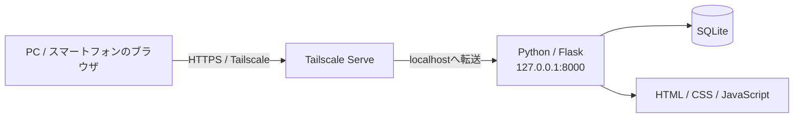

# Python + SQLite + Tailscale ローカルWebアプリ テンプレート

**Python・SQLite・Tailscaleを使って、家庭内・社内・個人用のクローズドなWebアプリを作るためのテンプレートです。**

このリポジトリを元に、在庫管理、予約管理、チェックリスト、家計管理、設備管理、メディア管理など、用途に合わせたローカルWebアプリを開発できます。

## 開発時の重要ルール

このテンプレートでは、変更履歴と変更理由を確実に残すため、**mainへの直接Commit / Pushを禁止**します。READMEの誤字修正など、どんなに軽微な変更も例外ではありません。

標準フローは次です。

```text
日本語Issueを作成
   ↓
Issue番号入り作業ブランチ
   ↓
実装・テスト
   ↓
Commit / Push
   ↓
Pull Request
   ↓
CI・差分確認
   ↓
Squash Merge
   ↓
Issue Close
   ↓
作業ブランチ削除
```

mainへ取り込む変更単位ごとにIssueを作成し、**Issueのタイトルと本文は日本語で記載**します。ブランチ名にはIssue番号を含め、PR本文から `Closes #Issue番号` でIssueを関連付けます。

作業ブランチに複数Commitがあっても、mainへは原則 **Squash Merge** でPR単位の1Commitとして取り込みます。

詳しいルールは [開発・CI・ローカル反映・デプロイ運用](docs/DEVELOPMENT-DEPLOYMENT.md) と [コントリビューションガイド](CONTRIBUTING.md) を参照してください。

---

## 基本構成



- **Python / Flask**：Webアプリ本体
- **SQLite**：データ保存
- **HTML / CSS / JavaScript**：ブラウザ画面
- **Tailscale Serve**：許可した端末・ユーザーからの接続

アプリは初期状態では `127.0.0.1` のみに公開されます。Tailscaleを有効にすると、同じtailnetに参加しているスマートフォンや別PCからHTTPSでアクセスできます。

---

## このテンプレートの特徴

- クラウドDB不要
- SQLiteなのでDBサーバーの構築不要
- ルーターのポート開放不要
- `0.0.0.0` への公開を禁止
- Tailscale Funnelは使用しない
- データはアプリを動かすPC内に保存
- Tailscale利用者を識別可能
- 利用者ごとのデータ分離に対応
- CSRF対策・CSPなど基本的なWebセキュリティ対策を実装済み
- pytestによる自動テスト付き
- GitHub ActionsによるCI付き
- Issue / Branch / PR / Squash Mergeによる変更管理
- Issueテンプレート / PRテンプレート付き
- MIT License

---

## 新しいアプリを開発するときの3段階

```text
① 作り始める
GETTING-STARTED.md
  自分用リポジトリ作成 → Clone → 初回起動 → AIへ最初の依頼
        ↓
② 作る
CUSTOMIZE.md
  データ設計 → SQLite → 業務処理 → API → 画面 → テスト
        ↓
③ 変更を運ぶ
DEVELOPMENT-DEPLOYMENT.md
  日本語Issue → Issue番号入りBranch → PR → CI → Squash Merge → Pull
```

| 今やりたいこと | 読むガイド |
| --- | --- |
| 新しいアプリを作り始めたい | **[① 新規開発スタートガイド](docs/GETTING-STARTED.md)** |
| サンプル `items` を自分の機能へ作り替えたい | **[② カスタマイズガイド](docs/CUSTOMIZE.md)** |
| Issue / PR / CI / Pull / Releaseを知りたい | **[③ 開発・CI・ローカル反映・デプロイ運用](docs/DEVELOPMENT-DEPLOYMENT.md)** |

### その他のドキュメント

| ドキュメント | 内容 |
| --- | --- |
| [アーキテクチャ](docs/ARCHITECTURE.md) | Python / Flask / SQLite / Tailscaleの役割と全体構成 |
| [セキュリティ設計](docs/SECURITY.md) | localhost、Tailscale利用者識別、CSRF、認証・認可など |
| [コントリビューションガイド](CONTRIBUTING.md) | Issue / Branch / PR / Squash Merge / テスト等の必須ルール |
| [ライセンス](LICENSE) | MIT License |

---

## 必要なもの

- Git
- Python 3.11以上
- 開発・稼働用PC
- 外部端末から利用する場合はTailscale

---

## テンプレートを試す

```text
git clone https://github.com/k-systems202208/python-sqlite-tailscale-webapp-template.git
cd python-sqlite-tailscale-webapp-template
```

新しいアプリを開発する場合は、元テンプレートを直接編集せず、自分用リポジトリを作成してください。詳しくは [新規開発スタートガイド](docs/GETTING-STARTED.md) を参照してください。

### Windows

```powershell
.\scripts\bootstrap.ps1
Copy-Item .env.example .env
.\scripts\start.ps1
```

### macOS / Linux

```bash
./scripts/bootstrap.sh
cp .env.example .env
./scripts/start.sh
```

ブラウザで `http://127.0.0.1:8000` を開きます。

---

## 初期設定 `.env`

```text
APP_NAME=Local Web App
LOCAL_OWNER_EMAIL=owner@example.local
LOCAL_OWNER_NAME=Local Owner
```

`.env`、`data/app.db`、`.venv/` はGitHubへ登録しません。

---

## Tailscaleで別端末から使う

```text
tailscale serve --bg 8000
tailscale serve status
```

表示されたHTTPS URLを、同じtailnetに参加している端末から開きます。

**Pythonアプリを `0.0.0.0` へ変更しないでください。** Pythonは `127.0.0.1` のみに待ち受け、Tailscale Serveを入口にします。

---

## サンプル機能

動作確認用の `items` 管理機能があります。登録、完了状態切替、削除、利用者ごとのデータ分離を確認できます。

実際のアプリへ置き換える方法は [カスタマイズガイド](docs/CUSTOMIZE.md) を参照してください。

---

## GitHubテンプレート

変更管理の抜け漏れを減らすため、次を用意しています。

```text
.github/ISSUE_TEMPLATE/change-request.md
.github/pull_request_template.md
```

Issueは目的・対応内容・影響範囲・完了条件、PRは対応Issue・変更内容・テスト・影響範囲・ドキュメント更新状況を確認できる構成です。

---

## フォルダー構成

```text
python-sqlite-tailscale-webapp-template/
├─ .github/
│  ├─ ISSUE_TEMPLATE/
│  │  └─ change-request.md
│  ├─ pull_request_template.md
│  └─ workflows/
│     └─ ci.yml
├─ app/
│  ├─ auth.py
│  ├─ config.py
│  ├─ csrf.py
│  ├─ db.py
│  ├─ routes.py
│  ├─ schema.sql
│  ├─ security.py
│  ├─ services/
│  ├─ templates/
│  └─ static/
├─ docs/
│  ├─ GETTING-STARTED.md
│  ├─ CUSTOMIZE.md
│  ├─ DEVELOPMENT-DEPLOYMENT.md
│  ├─ ARCHITECTURE.md
│  └─ SECURITY.md
├─ scripts/
├─ tests/
├─ .env.example
├─ CONTRIBUTING.md
├─ LICENSE
├─ requirements.txt
└─ run.py
```

---

## セキュリティの基本方針

- Pythonは `127.0.0.1` のみにbind
- `0.0.0.0` など外部IPへのbindを拒否
- 外部接続はTailscale Serve経由
- Tailscale Funnelは使用しない
- CORSは初期状態で有効化しない
- 更新リクエストにCSRF対策
- `HttpOnly` / `SameSite=Strict` Cookie
- Content Security Policy等のセキュリティヘッダー
- 利用者単位のデータ分離

詳しくは [セキュリティ設計](docs/SECURITY.md) を参照してください。

---

## テスト

Windows:

```powershell
.\.venv\Scripts\python.exe -m pytest
```

macOS / Linux:

```bash
.venv/bin/python -m pytest
```

GitHubへ作業ブランチをPushするとCIが実行されます。CI成功後、PRの差分を確認してSquash Mergeでmainへ取り込みます。

---

## GitHub側のmain保護

ドキュメント上のルールに加えて、GitHubのBranch protection / Rulesetsでもmainを保護することを推奨します。

最低限の推奨設定は次です。

- Pull Request経由の変更を必須にする
- CI成功を必須にする
- 未解決Conversationがある場合はMerge不可にする
- force pushを禁止する
- mainブランチ削除を禁止する
- Merge後のhead branch自動削除を有効にする

リポジトリの権限やGitHubプランによって設定画面・利用可能項目が異なる場合があります。具体的な考え方は [開発・CI・ローカル反映・デプロイ運用](docs/DEVELOPMENT-DEPLOYMENT.md) を参照してください。

---

## よくある質問

### 小さなREADME修正だけならmainへ直接Commitしてよいですか？

**いいえ。禁止です。** 日本語Issueを作成し、Issue番号入り作業ブランチで修正してPRからmainへSquash Mergeします。

### Issueは不具合のときだけ必要ですか？

いいえ。新機能、修正、リファクタリング、テスト、ドキュメント、誤字修正を含め、mainへ取り込むすべての変更単位でIssueを作成します。

### ブランチ名は自由ですか？

用途を表すプレフィックスとIssue番号を含めます。例：`feat/12-inventory-search`、`fix/18-user-isolation`、`docs/23-update-readme`。

### なぜSquash Mergeを使うのですか？

作業中の細かなCommitをPR単位の1Commitへまとめ、mainの履歴をIssue / PR単位で読みやすくするためです。

### ChatGPT / CodexがGitHubを変更する場合も同じですか？

はい。同じです。AIから変更する場合も、先に日本語Issueを作成し、Issue番号入り作業ブランチへ変更し、PR・CI・Squash Mergeを経由します。

### GitHubの変更はローカルPCへ自動反映されますか？

いいえ。PRをMergeしたあと、稼働PCでmainをPullして反映します。

---

## ライセンス

MIT License
