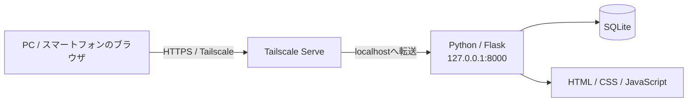

# Python + SQLite + Tailscale ローカルWebアプリ テンプレート

**Python・SQLite・Tailscaleを使って、家庭内・社内・個人用のクローズドなWebアプリを作るためのテンプレートです。**

このリポジトリをクローンして、画面やデータ項目を自分の用途に合わせて変更することで、在庫管理、予約管理、チェックリスト、家計管理、設備管理、メディア管理など、さまざまなローカルWebアプリの土台として利用できます。

クラウド上にDBを用意したり、ルーターのポートを開放したりする必要はありません。アプリ本体とSQLiteデータは自分のPC上に置き、外出先や別端末から使いたい場合だけTailscale経由で安全に接続します。

---

## まず、このテンプレートで何ができるの？

構成はとてもシンプルです。



通常は、自宅PCや社内PCをアプリの本体として動かします。

- **Python / Flask**：Webアプリ本体
- **SQLite**：データ保存
- **HTML / CSS / JavaScript**：ブラウザ画面
- **Tailscale Serve**：許可した端末・ユーザーからの安全な接続

アプリは初期状態では `127.0.0.1` のみに公開されます。つまり、そのPC自身からしかアクセスできません。

Tailscaleを有効にすると、同じtailnetに参加しているスマートフォンや別PCからHTTPSでアクセスできるようになります。

---

## このテンプレートの特徴

- クラウドDB不要
- SQLiteなのでDBサーバーの構築不要
- ルーターのポート開放不要
- `0.0.0.0` への公開を禁止
- Tailscale Funnelは使用しない
- データはアプリを動かすPC内に保存
- Tailscale利用者を識別可能
- 利用者ごとのデータ分離に対応
- CSRF対策・CSPなど基本的なWebセキュリティ対策を実装済み
- Windows / macOS / Linuxで利用可能
- pytestによる自動テスト付き
- GitHub ActionsによるCI付き
- MIT Licenseで自由に利用・改造可能

---

## ドキュメント一覧

READMEを入口として、目的に応じて次のドキュメントへ進んでください。

| ドキュメント | 内容 |
| --- | --- |
| [新規開発スタートガイド](docs/GETTING-STARTED.md) | 自分用リポジトリの作成、GitHub DesktopでのClone、初期起動、ChatGPT / Codexを使った開発、CI、Pull、実機確認までの手順 |
| [アーキテクチャ](docs/ARCHITECTURE.md) | Python / Flask / SQLite / Tailscaleの役割、全体構成、変更してよい部分と残すべき共通基盤 |
| [カスタマイズガイド](docs/CUSTOMIZE.md) | サンプルの `items` を自分のアプリへ置き換える手順、DB・API・画面・利用者モデルの変更方法 |
| [セキュリティ設計](docs/SECURITY.md) | localhost限定、Tailscale利用者識別、CSRF、認証・認可、秘密情報・SQLiteの保護 |
| [開発・CI・ローカル反映・デプロイ運用](docs/DEVELOPMENT-DEPLOYMENT.md) | GitHub Desktopを使った開発、CI、Pullによるローカル反映、将来の自動デプロイとロールバック方針 |
| [コントリビューションガイド](CONTRIBUTING.md) | ブランチ、テスト、Pull Request、Gitへ登録してはいけない情報などの開発ルール |
| [ライセンス](LICENSE) | MIT Licenseの全文 |

初めて使う場合は、**README → 新規開発スタートガイド → カスタマイズガイド → 開発・CI・ローカル反映・デプロイ運用 → セキュリティ設計** の順に読むと、導入から開発・運用まで理解しやすくなります。

---

# 1. 必要なもの

初めて使う場合は、次の3つを準備してください。

### 必須

1. **Git**
2. **Python 3.11以上**
3. **このリポジトリを保存できるPC**

### 外部のスマートフォンや別PCから使いたい場合

4. **Tailscale**

TailscaleはローカルPCだけで試す場合には不要です。

---

# 2. ダウンロード（クローン）

ターミナルまたはPowerShellを開き、次のコマンドを実行します。

```text
git clone https://github.com/k-systems202208/python-sqlite-tailscale-webapp-template.git
```

続けてフォルダーへ移動します。

```text
cd python-sqlite-tailscale-webapp-template
```

Gitを使わない場合は、GitHubの **Code → Download ZIP** からダウンロードして展開しても構いません。

> **新しいアプリの開発を始める場合**  
> 元テンプレートを直接編集するのではなく、自分用のGitHubリポジトリを作成してから開発を開始することを推奨します。詳しくは [新規開発スタートガイド](docs/GETTING-STARTED.md) を参照してください。

---

# 3. Windowsで起動する

Windowsでは **PowerShell** を使用します。

プロジェクトフォルダーで次を実行してください。

```powershell
.\scripts\bootstrap.ps1
```

この処理でPythonの仮想環境 `.venv` を作成し、必要なライブラリをインストールします。

次に設定ファイルを作成します。

```powershell
Copy-Item .env.example .env
```

そしてアプリを起動します。

```powershell
.\scripts\start.ps1
```

ブラウザで次を開きます。

```text
http://127.0.0.1:8000
```

画面が表示されれば導入成功です。

---

# 4. macOS / Linuxで起動する

ターミナルで次を実行します。

```bash
./scripts/bootstrap.sh
```

設定ファイルを作成します。

```bash
cp .env.example .env
```

アプリを起動します。

```bash
./scripts/start.sh
```

ブラウザで次を開きます。

```text
http://127.0.0.1:8000
```

---

# 5. 初期設定 `.env`

`.env.example` をコピーして作った `.env` が、このアプリの設定ファイルです。

最初に確認したいのは主に次の項目です。

```text
APP_NAME=Local Web App
LOCAL_OWNER_EMAIL=owner@example.local
LOCAL_OWNER_NAME=Local Owner
```

たとえば自分用の在庫管理アプリなら、次のように変更できます。

```text
APP_NAME=自宅在庫管理
LOCAL_OWNER_EMAIL=myname@example.com
LOCAL_OWNER_NAME=山田太郎
```

`.env` はGitへ登録されない設定になっています。

パスワードや秘密情報をREADMEやソースコードへ直接書かないようにしてください。

---

# 6. Tailscaleでスマートフォンや別PCから使う

ローカルPCだけで使う場合は、この章は飛ばして構いません。

まず、アプリを動かしているPCと、利用するスマートフォンまたは別PCの両方にTailscaleをインストールし、同じtailnetへ参加させます。

その後、アプリを動かしているPCで次を実行します。

```text
tailscale serve --bg 8000
```

公開状態を確認します。

```text
tailscale serve status
```

表示されたHTTPS URLを、Tailscaleに参加しているスマートフォンや別PCのブラウザで開きます。

これで、インターネットへ一般公開することなく、自分のTailscaleネットワーク内だけでWebアプリを利用できます。

> **重要**  
> Pythonアプリを外部利用するために `0.0.0.0` へ変更しないでください。  
> このテンプレートでは、Pythonは `127.0.0.1` のみに待ち受け、外部接続はTailscale Serveを入口にすることを前提としています。

Tailscale Serveを停止・リセットしたい場合は、同梱のスクリプトも利用できます。

```text
scripts/tailscale-reset.ps1
scripts/tailscale-reset.sh
```

---

# 7. 最初から入っているサンプル機能

テンプレートには動作確認用として、小さな **`items` 管理機能** が入っています。

できることは次の程度です。

- アイテム登録
- 完了 / 未完了の切り替え
- 削除
- 現在の利用者のデータだけ表示

これは完成アプリではなく、**自分のアプリを作るための見本**です。

たとえば、

```text
items
  ↓
在庫
予約
設備
タスク
日報
家計
顧客
蔵書
```

のように、サンプル部分を自分の業務や用途へ置き換えていきます。

---

# 8. 自分用アプリへ変更するには

最初は次の順番で変更するのがおすすめです。

### 1. アプリ名を変更

`.env` の `APP_NAME` を変更します。

### 2. DBを変更

```text
app/schema.sql
```

に、自分が保存したいデータ項目を追加します。

### 3. 業務処理を変更

```text
app/services/
```

に処理を追加します。

現在の `items.py` がサンプルです。

### 4. URL / APIを変更

```text
app/routes.py
```

に画面やAPIの処理を追加します。

### 5. 画面を変更

```text
app/templates/
app/static/
```

を変更します。

より詳しい説明は次を参照してください。

- [新規開発スタートガイド](docs/GETTING-STARTED.md)
- [カスタマイズガイド](docs/CUSTOMIZE.md)
- [アーキテクチャ](docs/ARCHITECTURE.md)
- [セキュリティ](docs/SECURITY.md)
- [開発・CI・ローカル反映・デプロイ運用](docs/DEVELOPMENT-DEPLOYMENT.md)

---

# 9. フォルダー構成

```text
python-sqlite-tailscale-webapp-template/
│
├─ app/
│  ├─ auth.py             利用者識別
│  ├─ config.py           アプリ設定
│  ├─ csrf.py             CSRF対策
│  ├─ db.py               SQLite接続・初期化
│  ├─ routes.py           画面・API
│  ├─ schema.sql          DB定義
│  ├─ security.py         セキュリティヘッダー
│  ├─ services/           業務処理
│  ├─ templates/          HTML
│  └─ static/             CSS / JavaScript
│
├─ data/
│  └─ app.db              実行時に作成されるSQLite DB
│
├─ docs/
│  ├─ GETTING-STARTED.md         新規開発開始手順（ChatGPT / Codex対応）
│  ├─ ARCHITECTURE.md            アーキテクチャ
│  ├─ CUSTOMIZE.md               カスタマイズ方法
│  ├─ DEVELOPMENT-DEPLOYMENT.md  開発・CI・デプロイ運用
│  └─ SECURITY.md                セキュリティ設計
│
├─ scripts/
│  ├─ bootstrap.*         初期セットアップ
│  ├─ start.*             アプリ起動
│  ├─ tailscale-serve.*   Tailscale公開
│  └─ tailscale-reset.*   Tailscale公開解除
│
├─ tests/                 自動テスト
├─ .env.example           設定ファイル見本
├─ CONTRIBUTING.md        開発参加・変更時のルール
├─ LICENSE                MIT License
├─ requirements.txt       Python依存ライブラリ
└─ run.py                 起動エントリーポイント
```

`data/app.db` は初回起動時に自動作成されます。

---

# 10. 利用者の識別

このテンプレートでは、接続方法によって利用者を識別します。

### Tailscale経由

Tailscale Serveが渡す利用者情報を利用します。

```text
Tailscale-User-Login
Tailscale-User-Name
```

ただし、これらのヘッダーを信用するのは **localhostからTailscale Serve経由で渡された場合だけ**です。

### アプリを動かしているPCから直接アクセス

`.env` の次の設定を利用します。

```text
LOCAL_OWNER_EMAIL
LOCAL_OWNER_NAME
```

### 匿名アクセス

初期状態では許可していません。

開発時に意図的に匿名アクセスを許可したい場合のみ、`.env` で設定を変更してください。

---

# 11. SQLiteについて

DBサーバーを別途インストールする必要はありません。

アプリを起動すると、自動的に次のファイルが作成されます。

```text
data/app.db
```

SQLiteには、

- 外部キー有効化
- WALモード

など、この規模のローカルWebアプリで扱いやすい初期設定を入れています。

`data/` 内の実データはGitへコミットしない構成です。

---

# 12. セキュリティ上の考え方

このテンプレートは **「インターネットへWebサーバーを直接公開しない」** ことを基本方針にしています。

主な初期設定は次のとおりです。

- Pythonは `127.0.0.1` のみにbind
- `0.0.0.0` など外部IPへのbindを拒否
- 外部接続はTailscale Serve経由
- Tailscale Funnelは使用しない
- CORSは初期状態で有効化しない
- POST / PUT / PATCH / DELETEにCSRF対策
- `HttpOnly` / `SameSite=Strict` Cookie
- Content Security Policy
- iframe埋め込み抑止
- MIME sniffing対策
- API / HTMLのキャッシュ抑止
- Jinjaの自動エスケープ

ただし、このテンプレートを使えば無条件にすべてのアプリが安全になるわけではありません。

追加する機能、保存する情報、Tailscaleのアクセス設定に応じて、必要なセキュリティ対策を追加してください。

詳しくは [SECURITY.md](docs/SECURITY.md) を参照してください。

---

# 13. API

初期状態では次のAPIがあります。

### ヘルスチェック

```text
GET /healthz
```

### 現在の利用者

```text
GET /api/me
```

### 現在の利用者のアイテム

```text
GET /api/items
```

JavaScriptから登録・更新・削除APIを呼ぶ場合はCSRFトークンが必要です。

HTMLには次の形式でトークンが設定されます。

```html
<meta name="csrf-token" content="...">
```

更新系APIでは `X-CSRF-Token` ヘッダーとして送信します。

---

# 14. テスト

Windowsの場合：

```powershell
.\.venv\Scripts\python.exe -m pytest
```

macOS / Linuxの場合：

```bash
.venv/bin/python -m pytest
```

サンプルには、利用者識別、利用者間のデータ分離、CRUD、CSRF、セキュリティヘッダーなどのテストが含まれています。

GitHubへpushすると、GitHub Actionsでも自動テストが実行されます。

---

# 15. よくある質問

### PostgreSQLやMySQLは必要ですか？

不要です。初期状態ではPython標準のSQLiteを利用します。

### AWSやAzureなどのクラウド契約は必要ですか？

不要です。

### 自宅のルーターでポート開放が必要ですか？

不要です。外部から使う場合はTailscale Serveを利用します。

### スマートフォンから使えますか？

はい。スマートフォンにTailscaleを入れ、同じtailnetへ参加すればブラウザから利用できます。

### 複数人で使えますか？

はい。Tailscale経由の利用者を識別し、ユーザー単位でデータを分離できる構造をサンプル実装しています。

### ChatGPTとCodexのどちらを使えばよいですか？

どちらか一方に固定する必要はありません。要件整理や設計相談、軽微なGitHub修正にはChatGPT、本格的な実装や複数ファイル変更にはCodexを使うなど、用途に応じて併用できます。詳しくは [新規開発スタートガイド](docs/GETTING-STARTED.md) を参照してください。

### ChatGPTがGitHubを修正したらローカルPCも自動更新されますか？

いいえ。標準運用ではGitHub DesktopなどでFetch / PullしてローカルPCへ反映します。将来、自動デプロイを導入することは可能です。詳しくは [開発・CI・ローカル反映・デプロイ運用](docs/DEVELOPMENT-DEPLOYMENT.md) を参照してください。

### 本当にインターネットへ公開されませんか？

このテンプレートの標準構成ではPythonサーバーをlocalhostに限定し、Tailscale Serveを使います。ただし、利用者がネットワーク設定やソースコードを変更した場合はその限りではありません。

### 自由に改造して公開してもいいですか？

はい。MIT Licenseです。ライセンス条件の範囲で自由に利用・改造できます。

---

# 16. 最短で試したい人へ

Windowsなら、PythonとGitをインストールしたあと、PowerShellで次の順に実行すればまず動かせます。

```powershell
git clone https://github.com/k-systems202208/python-sqlite-tailscale-webapp-template.git
cd python-sqlite-tailscale-webapp-template
.\scripts\bootstrap.ps1
Copy-Item .env.example .env
.\scripts\start.ps1
```

その後、ブラウザで

```text
http://127.0.0.1:8000
```

を開いてください。

まずローカルで動作確認し、その後必要になったらTailscaleを追加するのがおすすめです。

新しいアプリの開発へ進む場合は、次に [新規開発スタートガイド](docs/GETTING-STARTED.md) を参照してください。

---

## ライセンス

MIT License

このテンプレートをベースに、用途に合わせて自由にローカルWebアプリを開発してください。