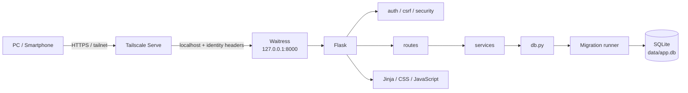
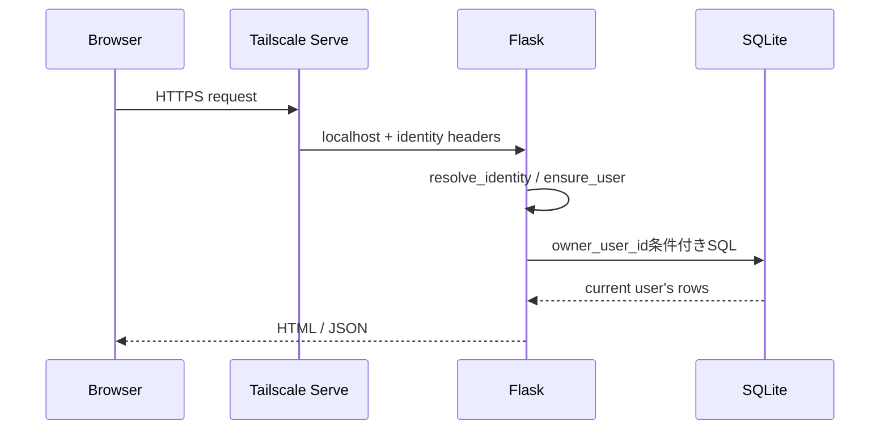
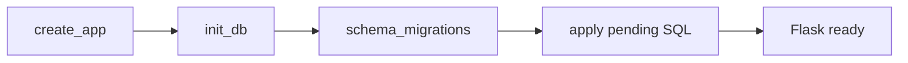
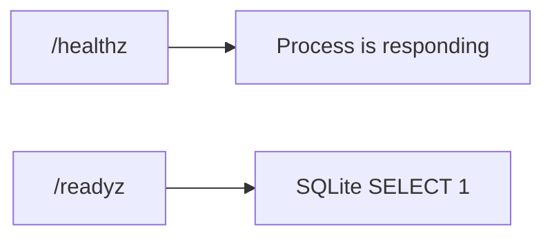
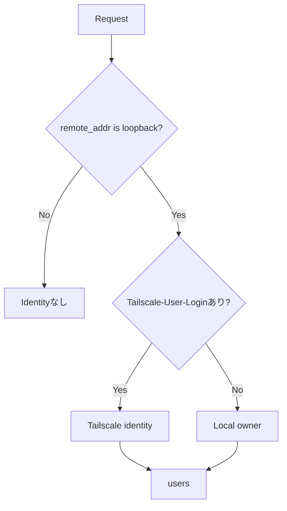
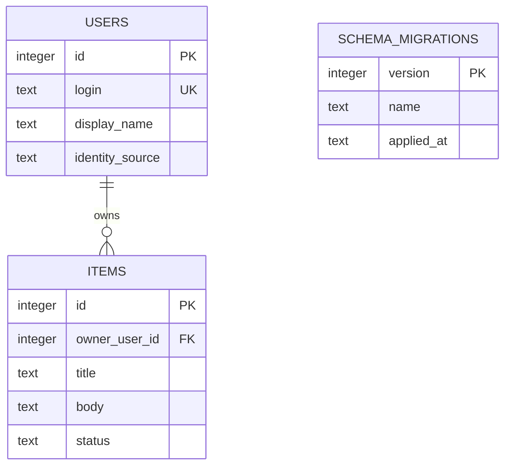
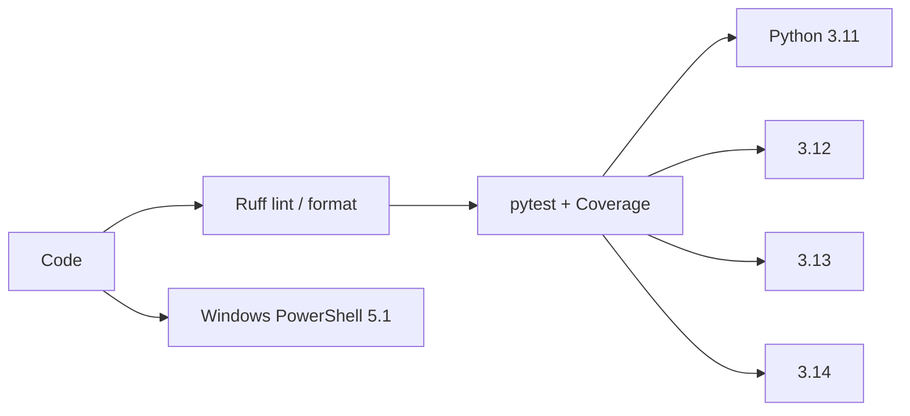
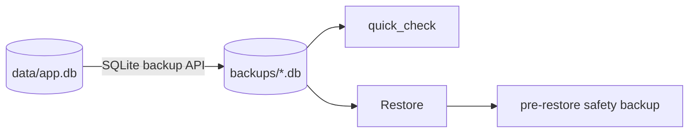

# Architecture

このテンプレートは、1台のホストPCでPython / FlaskとSQLiteを動かし、必要な場合だけTailscale Serve経由で別端末から利用する、小規模なクローズドWebアプリ向けの構成です。

## 全体構成



ホストPC自身から利用する場合は、ブラウザから直接 `http://127.0.0.1:8000` を開きます。

## 各レイヤー

- **Tailscale Serve**: 別端末からのHTTPS入口
- **Waitress**: `127.0.0.1` だけでFlaskを待ち受ける
- **Flask**: Route / Identity / CSRF / Security headers
- **Service**: 業務処理とSQL
- **SQLite**: `data/app.db` にデータ保存
- **Migration runner**: `app/migrations/*.sql` の未適用分だけ実行

## リクエストの流れ



localhostアクセスではTailscale Headerがないため `.env` のローカルオーナーを利用します。

## 起動とMigration

アプリ生成時に `init_db()` が未適用Migrationを確認します。



初期Migration:

```text
app/migrations/001_initial.sql
```

Migration SQLとversion記録は同じtransactionで扱い、適用済みversionは再実行しません。

## Health / Readiness



`/healthz` と `/readyz` は利用者登録処理から分離しており、監視アクセスだけで `users` に不要なレコードを作りません。

## 利用者識別



Tailscale Identity Headerはloopback経由のときだけ信用します。

## データモデル



独自アプリでは `items` を置き換えますが、利用者別データは所有者IDを持たせ、SQLで認可します。

## フォルダー構成

```text
app/
├─ __init__.py       Flask初期化 / current_user
├─ auth.py           Identity解決
├─ config.py         環境設定 / LOG_LEVEL
├─ csrf.py           CSRF
├─ db.py             SQLite接続 / Migration / users同期
├─ migrations/       番号付きSQL Migration
├─ routes.py         画面 / API / health / ready
├─ security.py       Security headers
├─ services/         業務処理
├─ templates/        HTML
└─ static/           CSS / JavaScript

scripts/
├─ bootstrap*        開発環境
├─ bootstrap-runtime* 稼働環境
├─ check*            Ruff / pytest / Coverage
├─ db_tools.py       Backup / Restore / integrity
├─ start*            アプリ起動
├─ tailscale-*       Tailscale Serve
└─ setup-github.ps1  GitHub初期設定

tests/               pytest
docs/                目的別ドキュメント
github/              Ruleset JSON
```

## 品質基盤



- `scripts/check.ps1` / `check.sh` をローカル品質ゲートにする
- Coverage最低80%
- `constraints.txt` でCI確認済み依存バージョンを固定
- Dependabotでpip / GitHub Actionsを定期確認

## Backup / Restore



実データの正本はホストPCです。GitHubはSQLiteデータのBackupではありません。

## 残す共通基盤

- `127.0.0.1` bind
- Tailscale Serve
- Identity Headerの信頼条件
- `g.current_user`
- SQLでの所有者チェック
- CSRF / Security headers
- Migration / SQLite接続
- Backup / Restore
- Ruff / pytest / Coverage
- GitHub CI / Ruleset

## 置き換える業務部分

- `items` 初期Schema / 後続Migration
- `app/services/items.py`
- 業務Route / API
- Templates / CSS / JavaScript
- 業務テスト
- アプリ名 / `.env.example`

## 想定する規模

向いている用途:

- 個人・家庭
- 小規模チーム
- 社内の小さな補助ツール
- 1台のホストPCで十分なアプリ

構成見直しを検討する要件:

- 複数サーバーから同じDBへ接続
- 大量の同時書き込み
- インターネット一般公開
- 高可用性 / 冗長化

その場合はPostgreSQL等へのDB移行や公開Web構成を別途設計します。

## 関連ドキュメント

- [SQLITE-SETUP.md](SQLITE-SETUP.md)
- [TAILSCALE-SETUP.md](TAILSCALE-SETUP.md)
- [AUTH-CRUD.md](AUTH-CRUD.md)
- [DEVELOPMENT.md](DEVELOPMENT.md)
- [DEPLOYMENT.md](DEPLOYMENT.md)
- [SECURITY.md](SECURITY.md)
