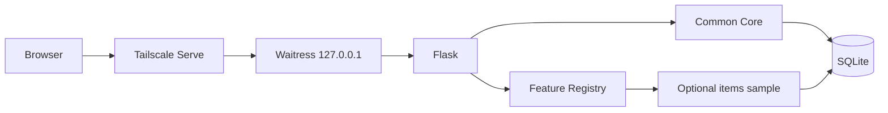
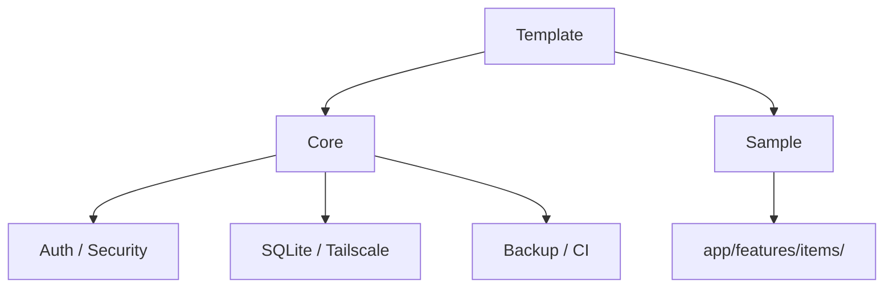
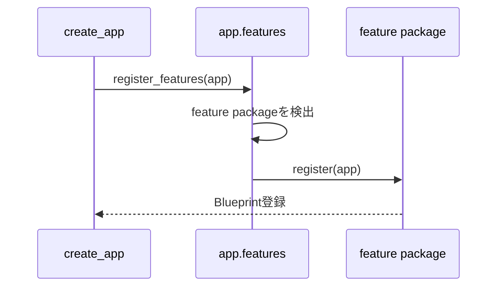
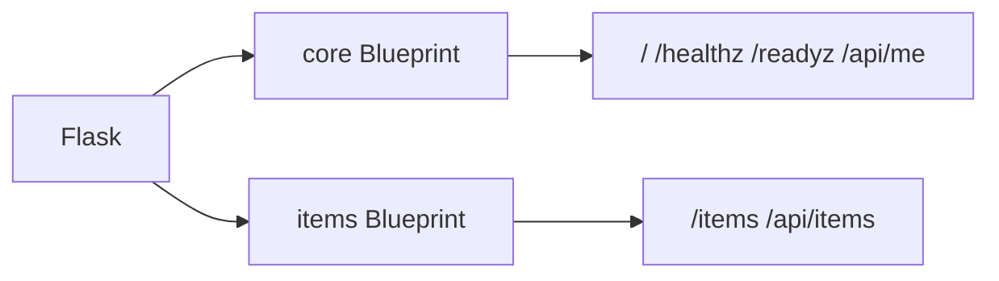
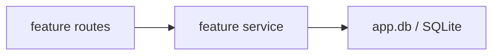
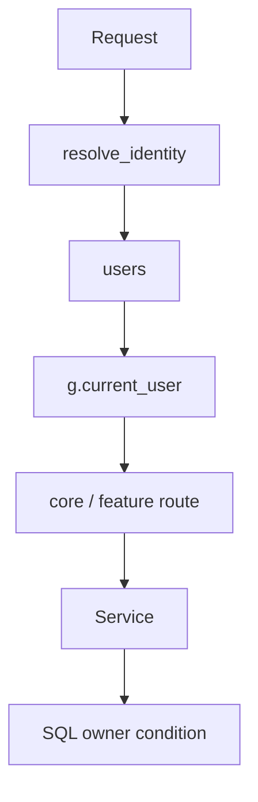
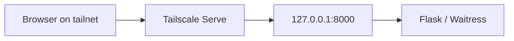
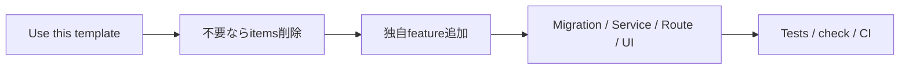

# Architecture

## 目的

このテンプレートは、Python / Flask + SQLite + Tailscale の共通基盤を再利用しながら、業務機能を `feature` 単位で追加・削除できる構成にします。

最重要ルールは、**共通基盤からサンプル業務ロジックを分離すること**です。

## 全体像



## Common Core

```text
app/core/                 共通Route・アクセス制御
app/auth.py               利用者識別
app/config.py             設定
app/csrf.py               CSRF
app/db.py                 SQLite / Migration runner
app/security.py           セキュリティヘッダー
app/features/__init__.py  feature自動検出・登録
app/templates/            共通Template
app/static/               共通static
scripts/                  運用・品質ツール
```

共通coreは、特定の業務featureが存在しなくても動きます。

共通URL:

- `/`
- `/healthz`
- `/readyz`
- `/api/me`

## Optional items sample

```text
app/features/items/
├─ __init__.py
├─ routes.py
├─ service.py
├─ templates/items/index.html
└─ migrations/002_sample_items.sql
```



itemsを使わない新規アプリでは、このfolderを削除できます。

## Feature自動登録

`app/features/__init__.py` は `app/features/` 直下のPython packageを検出します。packageに `register(app)` があればFlask appへ登録します。



`app/__init__.py` に `items` というfeature名をハードコードしないため、feature folderを削除してもfactoryを編集する必要がありません。

## Routeの分離

共通Routeは `app/core/routes.py` に置きます。

items sample Routeは `app/features/items/routes.py` に置きます。



## Service層

業務featureのSQL / 業務処理はfeature内のServiceへ寄せます。



共通DB接続やMigration処理は `app/db.py` に残します。

## Migration

Migration sourceは2系統あります。

```text
app/migrations/*.sql                    core Migration
app/features/*/migrations/*.sql         feature Migration
```

初期状態:

```text
001_initial.sql                         users
002_sample_items.sql                    optional items sample
```

全Migrationは共通の `schema_migrations` で管理し、version番号はリポジトリ全体で一意にします。

## Identity / Authorization



Tailscale到達制御とアプリ内認可は別の層です。利用者別データはSQLでも所有者条件を付けます。

## Tailscale境界



Flask / Waitressは `0.0.0.0` へ公開しません。Identity Headerはloopback経由のときだけ信用します。

## Templateから独自アプリへ



このfeature境界を維持することで、テンプレート本体へ案件固有コードが混ざりにくくなります。
