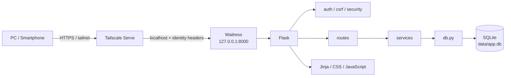
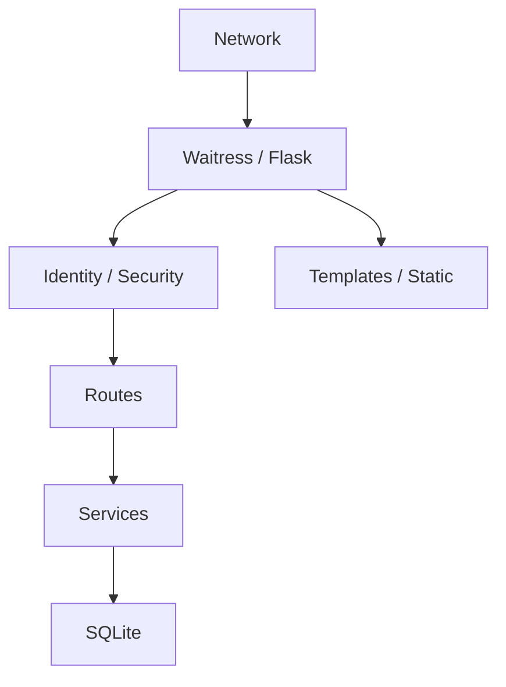
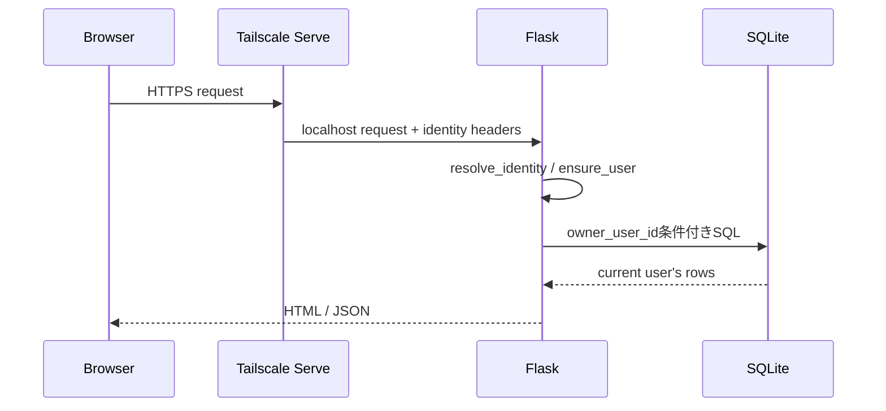
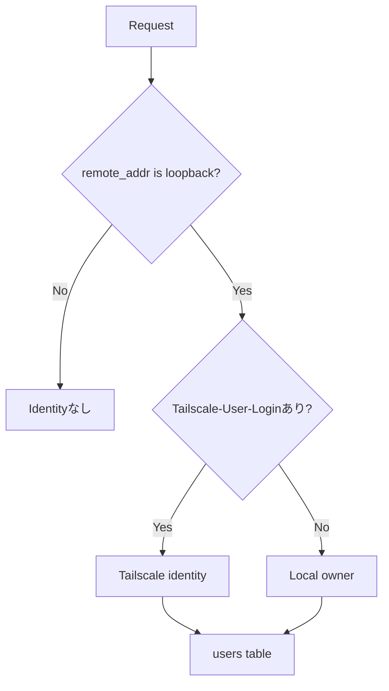
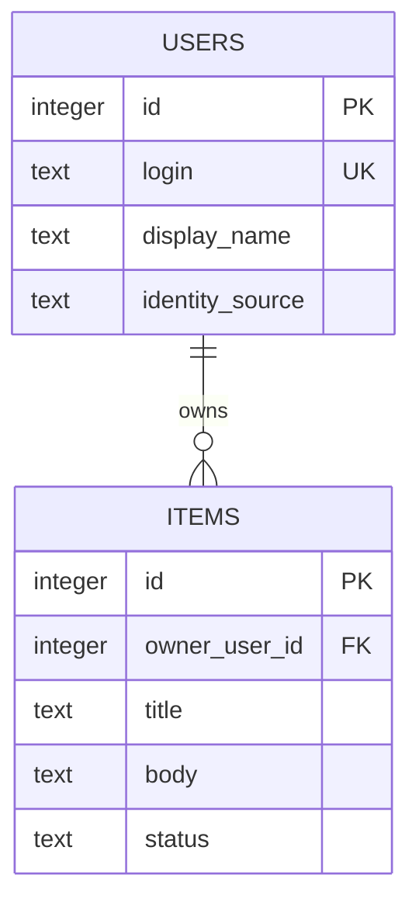
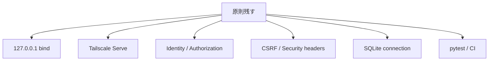
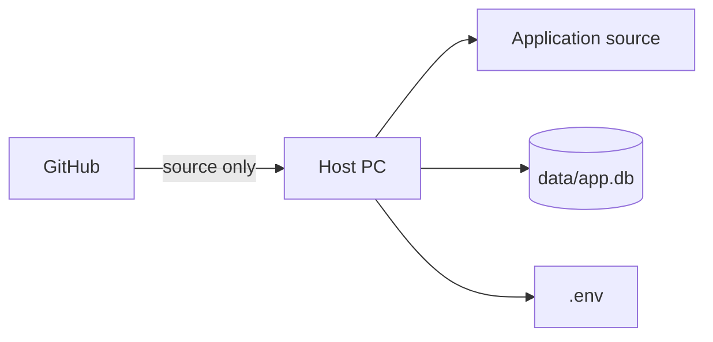

# Architecture

このテンプレートは、1台のホストPCでPython / FlaskとSQLiteを動かし、必要な場合だけTailscale Serve経由で別端末から利用する、小規模なクローズドWebアプリ向けの構成です。

## 全体構成



ホストPC自身から利用する場合はTailscale Serveを経由せず、ブラウザから直接 `http://127.0.0.1:8000` を開きます。

## 各レイヤーの役割



### Tailscale Serve

別端末からの安全な入口です。ルーターのポート開放やFlaskの外部公開を行わず、tailnet内からHTTPSでアクセスします。

### Waitress

Flaskアプリを実際に待ち受けるWebサーバーです。このテンプレートでは `127.0.0.1` のみにbindします。

### Flask

HTTPリクエスト、利用者情報、画面・API、CSRF、セキュリティヘッダーなどを担当します。

### SQLite

アプリデータを `data/app.db` に保存します。DBサーバーは不要です。接続は `app/db.py` でリクエスト単位に管理します。

## リクエストの流れ



localhostアクセスでは、Tailscale利用者ヘッダーがないため `.env` のローカルオーナーを利用します。

## 利用者識別



Tailscale利用者ヘッダーはloopback経由のときだけ信用します。詳細は [AUTH-CRUD.md](AUTH-CRUD.md) と [SECURITY.md](SECURITY.md) を参照してください。

## データモデル

サンプルは `users` と `items` の2テーブルです。



独自アプリでは `items` を置き換えますが、利用者ごとのデータなら所有者IDを持たせ、Service / SQLで認可する考え方を維持します。

## フォルダー構成

```text
app/
├─ __init__.py       Flask初期化 / current_user
├─ auth.py           Identity解決
├─ config.py         環境設定
├─ csrf.py           CSRF
├─ db.py             SQLite接続 / users同期
├─ routes.py         画面 / API
├─ schema.sql        初期Schema
├─ security.py       Security headers
├─ services/         業務処理
├─ templates/        HTML
└─ static/           CSS / JavaScript

docs/                目的別ドキュメント
github/              Ruleset JSON
scripts/             bootstrap / start / Tailscale / GitHub setup
tests/               pytest
```

## 残す共通基盤



- localhost限定
- Tailscaleを入口にする設計
- Tailscaleヘッダーの信頼条件
- `g.current_user`
- SQLでの所有者チェック
- CSRF
- セキュリティヘッダー
- SQLite接続管理
- GitHub CI

## 置き換える業務部分

- `items` Schema
- `app/services/items.py`
- 業務Route / API
- Templates / CSS / JavaScript
- 業務テスト
- アプリ名 / `.env.example`

詳細は [CUSTOMIZING.md](CUSTOMIZING.md) を参照してください。

## データの正本



GitHubにはソースを保存します。SQLite実データと `.env` はホストPC側の正本です。

## 想定する規模

向いている用途:

- 個人
- 家庭
- 小規模チーム
- 社内の小さな補助ツール
- 1台のホストPCで十分なアプリ

構成見直しを検討する要件:

- 複数サーバーから同じDBへ同時接続
- 大量の同時書き込み
- インターネット一般公開
- 高可用性 / 冗長化
- 大規模な組織認証基盤

その場合はPostgreSQL等へのDB移行や、一般公開を前提としたWeb構成を別途設計します。

## 関連ドキュメント

- [SQLITE-SETUP.md](SQLITE-SETUP.md)
- [TAILSCALE-SETUP.md](TAILSCALE-SETUP.md)
- [AUTH-CRUD.md](AUTH-CRUD.md)
- [SECURITY.md](SECURITY.md)
