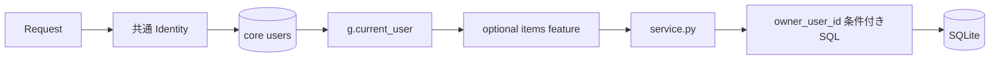
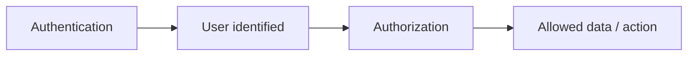
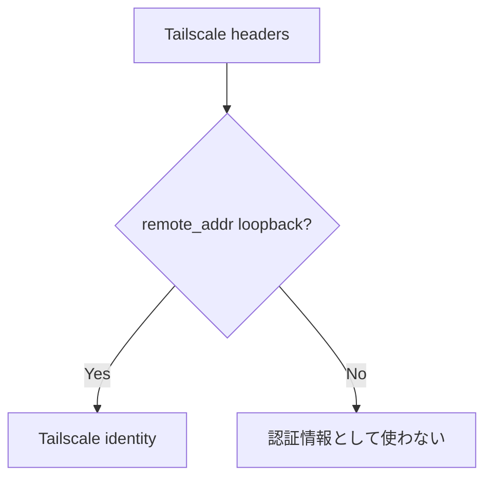
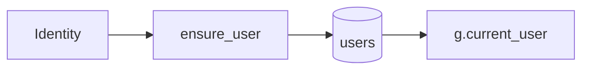
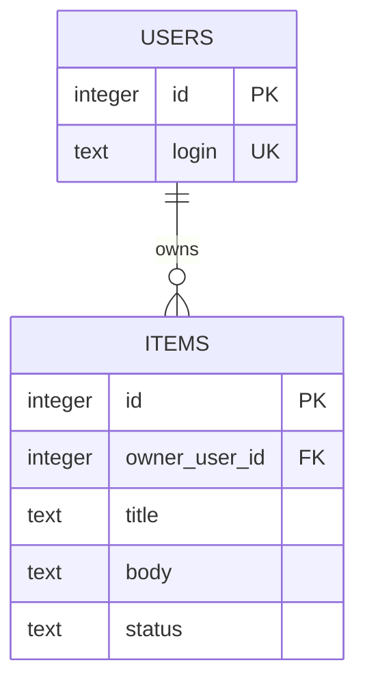
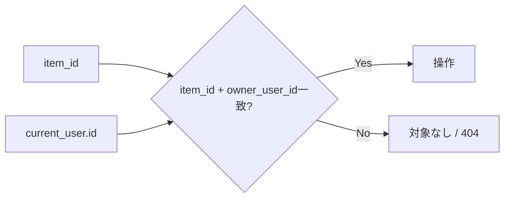
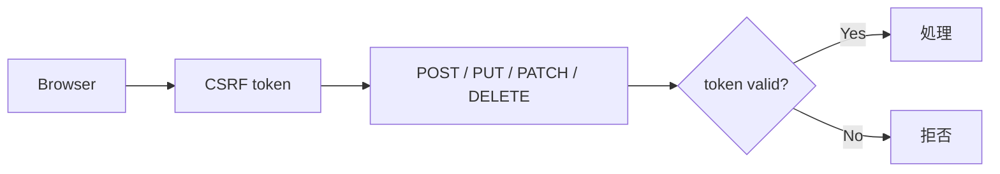

# Authentication / Authorization / CRUD

このドキュメントは、**共通の利用者識別・認可基盤**と、削除可能な `items` CRUDサンプルがどのようにつながっているかを説明します。

`items` 固有実装は `app/features/items/` に分離されています。独自アプリで不要ならこのfeatureを丸ごと削除できます。

## 全体像



## 1. 共通基盤とサンプルの境界

共通側:

```text
app/auth.py
app/core/access.py
app/core/routes.py
app/db.py
app/migrations/001_initial.sql
```

itemsサンプル側:

```text
app/features/items/
├─ routes.py
├─ service.py
├─ templates/items/index.html
└─ migrations/002_sample_items.sql
```

共通基盤は `/`、`/healthz`、`/readyz`、`/api/me` を提供します。itemsサンプルは `/items` と `/api/items` を追加します。

## 2. 認証と認可は別

- **認証**: この利用者は誰か
- **認可**: この利用者が何を操作できるか

Tailscaleにログインしているだけで、アプリ内の全データを操作できる設計にはしません。



## 3. localhostの利用者識別

ホストPC自身から `127.0.0.1` へアクセスする場合は `.env` の値を利用します。

```env
LOCAL_OWNER_EMAIL=owner@example.local
LOCAL_OWNER_NAME=Local Owner
```

`app/auth.py` はloopbackアクセスでTailscale利用者ヘッダーがない場合、このローカルオーナーを返します。

## 4. Tailscale利用者識別

Tailscale Serve経由では次のヘッダーを利用します。

```text
Tailscale-User-Login
Tailscale-User-Name
```

ただし、接続元 `request.remote_addr` がloopbackのときだけ信用します。



## 5. `users` テーブルへの対応付け

`app/__init__.py` の `before_request` でIdentityを解決し、`app/db.py` の `ensure_user()` で共通 `users` テーブルへ登録・更新します。

同じ `login` が存在する場合は `display_name`、`identity_source`、`last_seen_at` を更新します。



`users` は `app/migrations/001_initial.sql` で作成される共通テーブルなので、items featureを削除しても残ります。

## 6. Routeの認証チェック

認証必須Routeでは `app/core/access.py` の `@require_user` を使います。

共通例:

```text
GET /        core確認画面
GET /api/me  現在利用者
```

itemsサンプル例:

```text
GET  /items
POST /items
GET  /api/items
POST /api/items
```

featureを追加するときも、認証が必要なRouteには同じ共通デコレーターを利用できます。

## 7. サンプル `items`

`items` は `owner_user_id` を持ちます。



このテーブルは `app/features/items/migrations/002_sample_items.sql` で作成されます。初回起動前にitems featureを削除すれば、items Migrationも検出されず、テーブルは作成されません。

## 8. 一覧取得

`app/features/items/service.py` の `list_items(owner_user_id)` は必ず所有者条件を使います。

```sql
SELECT ...
FROM items
WHERE owner_user_id = ?
```

画面からIDを隠すのではなく、DB取得時点で他利用者の行を除外します。

## 9. 1件取得 / 更新 / 削除

サンプルでは1件操作でも `id` だけではなく `owner_user_id` を組み合わせます。

```sql
WHERE id = ? AND owner_user_id = ?
```



独自featureでも、本人所有データならこの考え方を維持します。

## 10. HTML画面のitemsサンプル

主な画面操作:

- `GET /items` - 本人のitems一覧
- `POST /items` - 登録
- `POST /items/<id>/toggle` - 完了状態切替
- `POST /items/<id>/delete` - 削除

`GET /` はitems一覧ではなく、共通coreの確認画面です。

## 11. JSON API

共通API:

- `GET /api/me` - 現在利用者

itemsサンプルAPI:

- `GET /api/items` - 本人のitems一覧
- `POST /api/items` - 本人のitem登録

未認証で `/api/` にアクセスした場合は共通エラーハンドラーがJSONの401を返します。

## 12. CSRF

状態を変更するリクエストは共通CSRF対策の対象です。



独自APIを追加するときも既存CSRFの仕組みを理由なく外しません。

## 13. 独自アプリへ置き換える場合

たとえば `equipment` featureへ置き換える場合も、本人所有データなら次を維持します。

```text
users.id
  ↓
equipment.owner_user_id
  ↓
service.py の SELECT / UPDATE / DELETE で所有者条件
```

共有データや管理者権限が必要なら、単純な所有者一致ではなく、共有テーブルやRoleを設計します。

## 14. テストの分離

共通認証・Health・Migration等のテストはitems固有仕様に依存しません。

items固有テストは次へ分離しています。

```text
tests/test_sample_items.py
```

このテストはitems featureが存在しない場合は自動skipされるため、`app/features/items/` を削除した状態でも共通テストとCIを継続できます。

itemsサンプルでは次を確認します。

- 利用者Aの一覧に利用者Bのデータが出ない
- 利用者Aが利用者BのIDを指定しても更新・削除できない
- CSRFなしの更新が拒否される
- 不正入力がJSONエラーになる
- 正常なCRUDが成功する
- 旧version 1 DBの既存itemsデータを保持できる

## 15. 関連ドキュメント

- [TAILSCALE-SETUP.md](TAILSCALE-SETUP.md) - Tailscale Serveと利用者ヘッダー
- [SQLITE-SETUP.md](SQLITE-SETUP.md) - Migration / DB / Backup
- [SECURITY.md](SECURITY.md) - セキュリティ境界
- [CUSTOMIZING.md](CUSTOMIZING.md) - 独自featureへの置き換え
