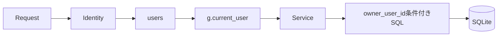
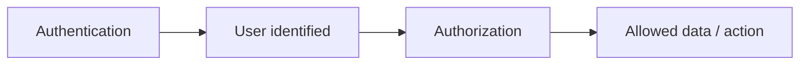
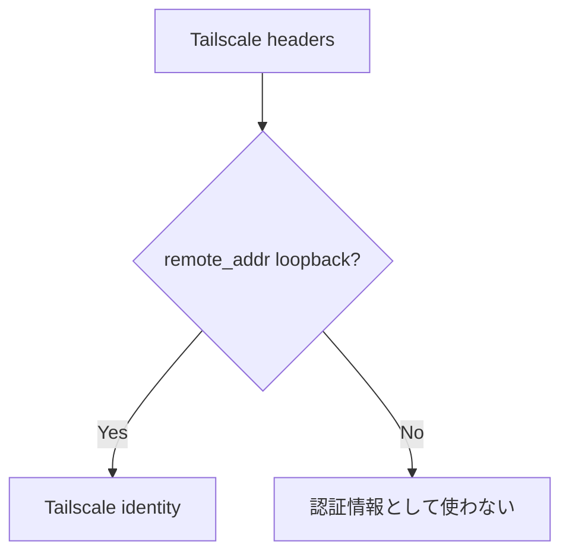
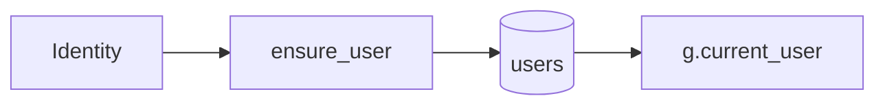
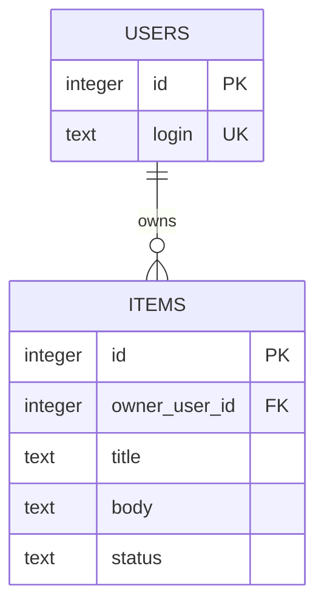
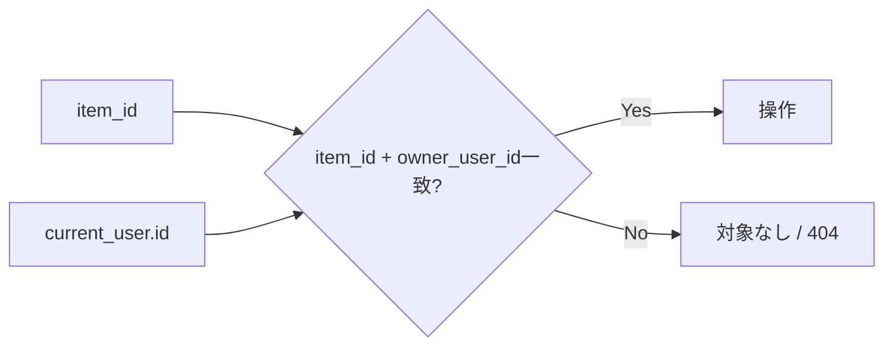
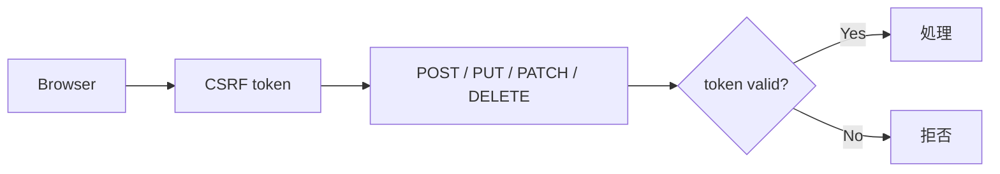

# Authentication / Authorization / CRUD

このドキュメントは、サンプル `items` を使って、このテンプレートの利用者識別・認可・CRUDがどのようにつながっているかを説明します。

## 全体像



## 1. 認証と認可は別

- **認証**: この利用者は誰か
- **認可**: この利用者が何を操作できるか

Tailscaleにログインしているだけで、アプリ内の全データを操作できる設計にはしません。



## 2. localhostの利用者識別

ホストPC自身から `127.0.0.1` へアクセスする場合は `.env` の値を利用します。

```env
LOCAL_OWNER_EMAIL=owner@example.local
LOCAL_OWNER_NAME=Local Owner
```

`app/auth.py` はloopbackアクセスでTailscale利用者ヘッダーがない場合、このローカルオーナーを返します。

## 3. Tailscale利用者識別

Tailscale Serve経由では次のヘッダーを利用します。

```text
Tailscale-User-Login
Tailscale-User-Name
```

ただし、接続元 `request.remote_addr` がloopbackのときだけ信用します。



## 4. `users` テーブルへの対応付け

`app/__init__.py` の `before_request` でIdentityを解決し、`app/db.py` の `ensure_user()` で `users` テーブルへ登録・更新します。

同じ `login` が存在する場合は `display_name`、`identity_source`、`last_seen_at` を更新します。



## 5. サンプル `items`

`items` は `owner_user_id` を持ちます。



## 6. 一覧取得

`list_items(owner_user_id)` は必ず所有者条件を使います。

```sql
SELECT ...
FROM items
WHERE owner_user_id = ?
```

画面からIDを隠すのではなく、DB取得時点で他利用者の行を除外します。

## 7. 1件取得 / 更新 / 削除

サンプルでは1件操作でも `id` だけではなく `owner_user_id` を組み合わせます。

```sql
WHERE id = ? AND owner_user_id = ?
```



この考え方は独自テーブルでも維持します。

## 8. HTML画面のサンプル

主な画面操作:

- `GET /` - 本人のitems一覧
- `POST /items` - 登録
- `POST /items/<id>/toggle` - 完了状態切替
- `POST /items/<id>/delete` - 削除

すべて利用者が必要なRouteには `@require_user` を付けています。

## 9. JSON APIのサンプル

- `GET /api/me` - 現在利用者
- `GET /api/items` - 本人のitems一覧
- `POST /api/items` - 本人のitem登録

未認証で `/api/` にアクセスした場合はJSONの401を返します。

## 10. CSRF

状態を変更するリクエストはCSRF対策の対象です。



独自APIを追加するときも既存CSRFの仕組みを外さないでください。

## 11. 独自アプリへ置き換える場合

たとえば `equipment` へ置き換える場合も、本人所有データなら次を維持します。

```text
users.id
  ↓
equipment.owner_user_id
  ↓
ServiceのSELECT / UPDATE / DELETEで所有者条件
```

共有データや管理者権限が必要なら、単純な所有者一致ではなく、共有テーブルやRoleを設計します。

## 12. テストで確認すること

- localhostでローカルオーナーとして認識される
- Tailscaleヘッダーはloopback経由でのみ信用される
- 未認証アクセスは拒否される
- 利用者Aの一覧に利用者Bのデータが出ない
- 利用者Aが利用者BのIDを指定しても更新・削除できない
- CSRFなしの更新が拒否される
- 正常なCRUDは成功する

## 13. 関連ドキュメント

- [TAILSCALE-SETUP.md](TAILSCALE-SETUP.md) - Tailscale Serveと利用者ヘッダー
- [SQLITE-SETUP.md](SQLITE-SETUP.md) - Schema / DB / Backup
- [SECURITY.md](SECURITY.md) - セキュリティ境界
- [CUSTOMIZING.md](CUSTOMIZING.md) - 独自アプリへの置き換え
