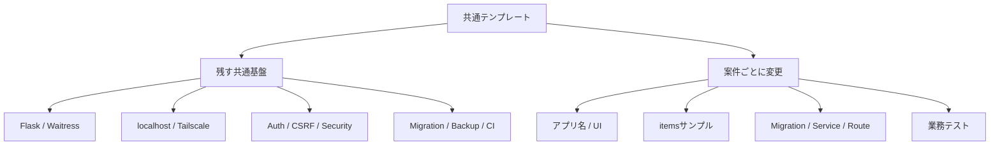
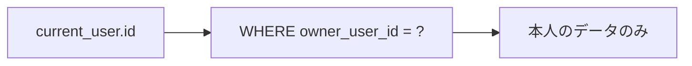
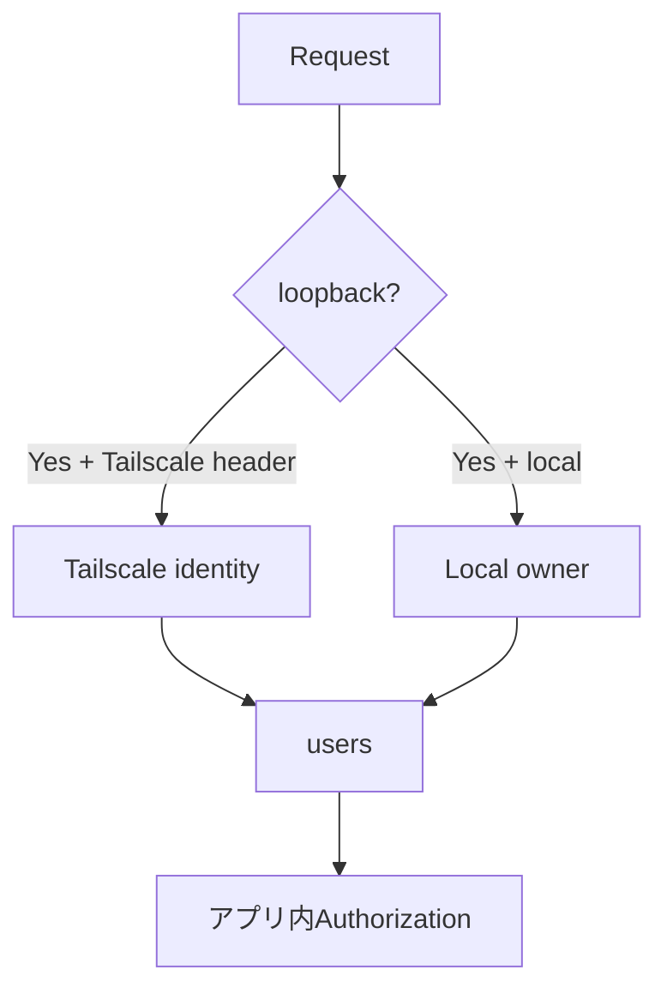
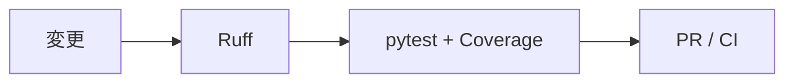
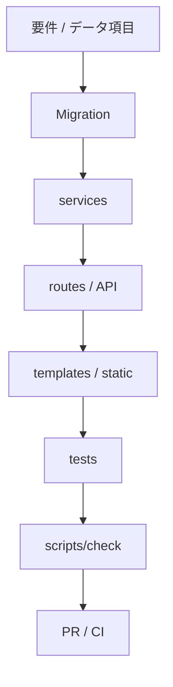

# 独自アプリへのカスタマイズ

このテンプレートは特定業務向けの完成アプリではなく、Python / Flask + SQLite + Tailscale を使ったクローズドWebアプリ開発の共通土台です。

`items` は認証・認可・CRUD・Migrationの実装例です。新しいアプリでは自由に削除・置換してください。

## カスタマイズの全体像



## 1. 最初に決めること

- アプリ名・目的
- 主な利用者
- 保存するデータ
- 利用者別 / 共有データ
- 登録・更新・削除権限
- 稼働PC
- Tailscale利用範囲
- Backup保存先・頻度

## 2. 環境設定

`.env` を自分のアプリへ変更します。

```env
APP_NAME=家庭用在庫管理
LOG_LEVEL=INFO
LOCAL_OWNER_EMAIL=owner@example.com
LOCAL_OWNER_NAME=山田太郎
```

アプリ独自の環境変数を追加した場合は `.env.example` にダミー値と説明を追加します。秘密情報の実値は書きません。

## 3. `items` サンプルの範囲

```text
app/migrations/001_initial.sql   users / items初期Schema
app/services/items.py            items CRUD
app/routes.py                    items画面 / API
app/templates/                   サンプル画面
app/static/                      CSS / JavaScript
tests/                           サンプル仕様と共通基盤テスト
```

サンプルを削除する場合も、認証・CSRF・Migration・Backup・品質ゲートなどの共通基盤は維持します。

## 4. 独自Schemaへ変更する

### まだ実データを使っていない新規アプリ

テンプレートから作った直後であれば `001_initial.sql` を独自アプリの初期Schemaへ編集できます。

例:

```sql
CREATE TABLE equipment (
    id INTEGER PRIMARY KEY AUTOINCREMENT,
    owner_user_id INTEGER NOT NULL,
    name TEXT NOT NULL,
    location TEXT NOT NULL DEFAULT '',
    created_at TEXT NOT NULL DEFAULT CURRENT_TIMESTAMP,
    updated_at TEXT NOT NULL DEFAULT CURRENT_TIMESTAMP,
    FOREIGN KEY(owner_user_id) REFERENCES users(id) ON DELETE CASCADE
);
```

### 実データ運用開始後

適用済みMigrationを書き換えず、新しい番号を追加します。

```text
001_initial.sql
002_add_equipment_category.sql
003_add_equipment_index.sql
```

詳細は [SQLITE-SETUP.md](SQLITE-SETUP.md) を参照してください。

## 5. 認可はSQLでも行う

利用者本人だけが操作するデータなら所有者列を持たせます。



画面でボタンを隠すだけでは認可になりません。SELECT / UPDATE / DELETE自体を所有者条件で制限します。

## 6. Serviceへ業務処理を分ける

`app/services/items.py` を参考に、業務処理をServiceへ寄せます。

```text
items.py
  list / create / get / toggle / delete
        ↓
equipment.py
  list / create / get / update / delete / search
```

RouteへSQLや複雑なルールを詰め込みすぎない方がテストしやすくなります。

## 7. URL / API

例:

```text
GET  /equipment
POST /equipment
POST /equipment/<id>/update
POST /equipment/<id>/delete
GET  /api/equipment
```

更新リクエストには既存CSRF対策を維持します。APIでHTTPエラーを返す場合は既存のJSONエラーハンドラーを利用できます。

理由なくCORSを広く許可しません。

## 8. 画面

主に変更する場所:

```text
app/templates/
app/static/app.css
app/static/app.js
```

スマートフォン利用を想定する場合はPC幅だけでなくスマートフォン幅でも確認します。

## 9. 認証・認可

初期状態:



用途に応じて管理者・共有データ・組織等を追加できますが、Tailscaleの到達制御とアプリ内認可は別に設計します。

## 10. Health / Readiness

共通基盤として以下を残します。

- `/healthz`: Webプロセス生存確認
- `/readyz`: SQLiteへの問い合わせ確認

独自の必須外部資源が増えた場合は、必要に応じてreadinessへ追加します。ただし重い業務処理をhealth endpointへ入れません。

## 11. Backup / Restore

実データを扱う前に共通ツールを試します。

```powershell
.\.venv\Scripts\python.exe -m scripts.db_tools backup
.\.venv\Scripts\python.exe -m scripts.db_tools check
```

Restore手順もテスト用DBで確認します。GitHubはSQLite実データのBackupではありません。

## 12. テストをアプリ仕様へ置き換える

最低限:

- 正常登録
- 一覧・詳細取得
- 更新 / 削除
- 不正入力拒否
- 未認証利用者拒否
- CSRFなし更新拒否
- 利用者Aが利用者Bのデータを取得・変更できない
- Migrationが新規DBへ適用できる
- Migration再実行が安全
- `/readyz` が正常

共通基盤のテストは理由なく削除しません。

## 13. 品質チェック

Windows:

```powershell
.\scripts\check.ps1
```

macOS / Linux:

```bash
./scripts/check.sh
```



## 14. 共通基盤を変更するときの注意

特別な理由がない限り、次を削除・弱体化しません。

- `app/auth.py`
- `app/csrf.py`
- `app/security.py`
- `app/db.py` の接続 / Migration
- `run.py` のlocalhost限定
- `scripts/db_tools.py`
- 品質ゲート / CI

## 15. 推奨カスタマイズ順序



## 16. 完了条件

- テンプレートのアプリ名・説明を置換した
- 不要な `items` が残っていない
- 独自データの所有・共有ルールが決まっている
- Migration方針がある
- SQL / Serviceで認可している
- `.env.example` が最新
- Backup / Restore方法を確認した
- `scripts/check` が成功
- GitHub Actions CIが成功
- README / docsが独自アプリ用に更新されている

## 17. テンプレート本体へ追加しないもの

特定業務だけで必要な画面、マスタ、通知、外部API、権限ロール等は、このテンプレートから作成した各アプリ側で実装します。共通テンプレートは小さく再利用しやすい基盤を維持します。
