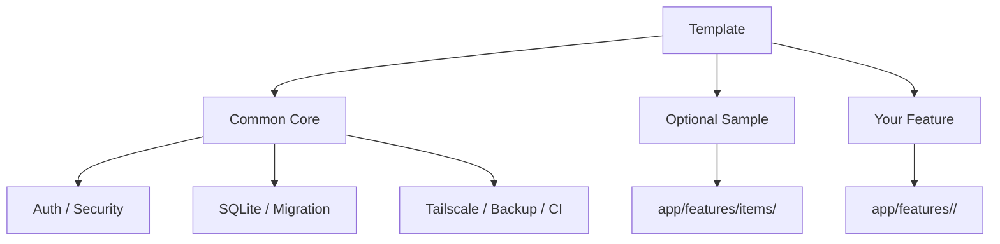
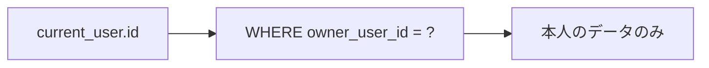
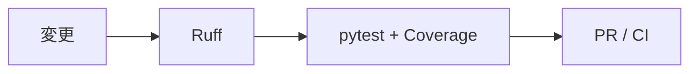
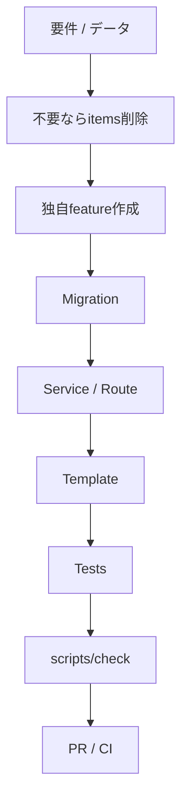

# 独自アプリへのカスタマイズ

このテンプレートは特定業務向けの完成アプリではなく、Python / Flask + SQLite + Tailscale を使ったクローズドWebアプリ開発の共通土台です。

`app/features/items/` は認証・認可・CRUD・feature Migrationを確認するための**丸ごと削除可能なサンプル**です。新しい業務機能は `app/features/<feature>/` にまとめます。

## カスタマイズの全体像



## 1. 最初に決めること

- アプリ名・目的
- 主な利用者
- 保存するデータ
- 利用者別 / 共有データ
- 登録・更新・削除権限
- 稼働PC
- Tailscale利用範囲
- Backup保存先・頻度

## 2. 共通基盤とitemsサンプルの境界

原則として残すもの:

```text
app/core/
app/auth.py
app/config.py
app/csrf.py
app/db.py
app/security.py
app/features/__init__.py
app/templates/base.html
app/templates/unauthorized.html
scripts/
```

削除可能なサンプル:

```text
app/features/items/
├─ __init__.py
├─ routes.py
├─ service.py
├─ templates/items/index.html
└─ migrations/002_sample_items.sql
```

新規アプリでitemsを使わない場合は**このフォルダを丸ごと削除**します。featureは自動検出されるため、`app/__init__.py` の登録処理を編集する必要はありません。

## 3. itemsを削除するタイミング

### 初回起動前

最も簡単です。

```text
app/features/items/ を削除
        ↓
初回起動
        ↓
core Migrationだけ適用
        ↓
itemsテーブルは作られない
```

### すでに起動・運用した後

適用済みMigration履歴は書き換えません。コードとしてitems featureを使わなくするだけならfeature削除で構いませんが、既存 `items` テーブルも削除したい場合は新しいMigrationを追加します。

実データがある場合は先にBackupを取得します。

## 4. 独自featureを作る

例として設備管理を追加する場合:

```text
app/features/equipment/
├─ __init__.py
├─ routes.py
├─ service.py
├─ templates/equipment/
│  └─ index.html
└─ migrations/
   └─ 003_equipment.sql
```

`__init__.py` は次の形にします。

```python
def register(app) -> None:
    from .routes import bp
    app.register_blueprint(bp)
```

`app/features/` の自動検出機構がこの `register(app)` を呼び出します。

## 5. Migrationを追加する

共通Migration:

```text
app/migrations/*.sql
```

feature固有Migration:

```text
app/features/*/migrations/*.sql
```

全Migrationでversion番号は一意にします。

例:

```text
001_initial.sql
002_sample_items.sql
003_equipment.sql
004_equipment_category.sql
```

適用済みMigrationは編集せず、新しい番号を追加します。詳細は [SQLITE-SETUP.md](SQLITE-SETUP.md) を参照してください。

## 6. Serviceへ業務処理を分ける

`app/features/items/service.py` を参考に、SQLや業務処理をfeatureのServiceへ寄せます。

```text
routes.py
   ↓
service.py
   ↓
SQLite
```

RouteへSQLや複雑なルールを詰め込みすぎない方がテストしやすくなります。

## 7. 認可はSQLでも行う

利用者本人だけが操作するデータなら所有者列を持たせます。



画面でボタンを隠すだけでは認可になりません。SELECT / UPDATE / DELETE自体を所有者条件で制限します。

## 8. Route / API

Blueprintはfeature内で定義します。

例:

```text
GET  /equipment
POST /equipment
POST /equipment/<id>/update
POST /equipment/<id>/delete
GET  /api/equipment
```

更新処理では既存CSRFを維持します。APIのHTTPエラーは共通coreのJSONエラーハンドラーを利用できます。

## 9. Template / UI

feature固有Templateはfeature内へ置きます。

```text
app/features/equipment/templates/equipment/
```

共通レイアウト `app/templates/base.html` を継承できます。

共通静的処理は `app/static/` に残し、特定featureだけに必要な大きなCSS / JSは必要に応じてfeature側へ分けます。

## 10. 共通Health / Identity

以下は業務featureと分離された共通Routeです。

- `/` - core確認画面
- `/healthz` - Webプロセス生存確認
- `/readyz` - SQLite問い合わせ確認
- `/api/me` - 現在利用者

items featureを削除してもこれらは残ります。

## 11. Backup / Restore

実データを扱う前に確認します。

```powershell
.\.venv\Scripts\python.exe -m scripts.db_tools backup
.\.venv\Scripts\python.exe -m scripts.db_tools check
```

Schema削除・大きなMigrationの前にはBackupを取得します。

## 12. テストを分ける

共通基盤テストは維持し、業務feature固有テストは名前で分かるようにします。

初期sample:

```text
tests/test_sample_items.py
```

独自feature例:

```text
tests/test_equipment.py
```

少なくとも以下を確認します。

- 正常登録・取得・更新・削除
- 不正入力拒否
- CSRFなし更新拒否
- 利用者Aが利用者Bのデータを操作できない
- Migration適用 / 再実行
- `/readyz`

## 13. 品質チェック

Windows:

```powershell
.\scripts\check.ps1
```

macOS / Linux:

```bash
./scripts/check.sh
```



## 14. 共通基盤を変更するときの注意

特別な理由がない限り、次を削除・弱体化しません。

- `app/core/`
- `app/auth.py`
- `app/csrf.py`
- `app/security.py`
- `app/db.py`
- `app/features/__init__.py`
- `run.py` のlocalhost限定
- `scripts/db_tools.py`
- 品質ゲート / CI

## 15. 推奨カスタマイズ順序



## 16. 完了条件

- アプリ名・説明を置換した
- 不要な `app/features/items/` が残っていない
- 独自featureが `app/features/<feature>/` にまとまっている
- データ所有・共有ルールが決まっている
- Migration方針がある
- SQL / Serviceで認可している
- `.env.example` が最新
- Backup / Restore方法を確認した
- `scripts/check` が成功
- GitHub Actions CIが成功
- README / docsが独自アプリ用に更新されている

## 17. テンプレート本体へ追加しないもの

特定業務だけで必要な画面、マスタ、通知、外部API、権限ロール等は、このテンプレートから作成した各アプリ側でfeatureとして実装します。共通テンプレートは小さく再利用しやすい基盤を維持します。
