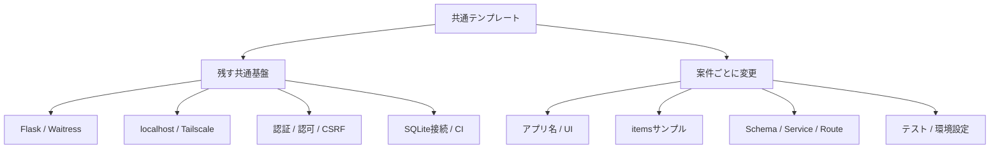
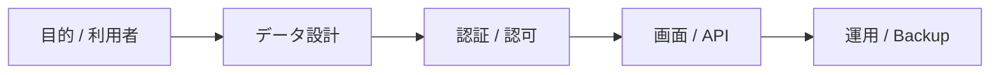
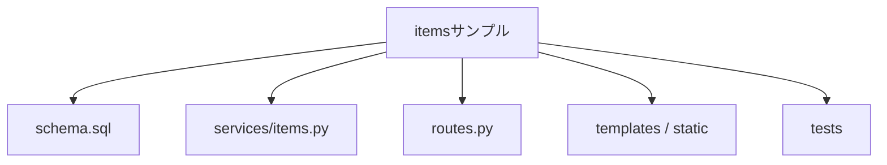
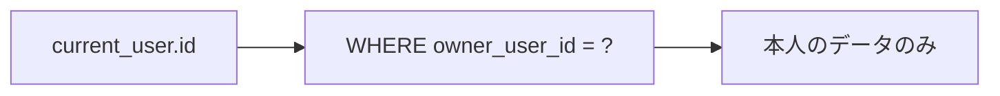
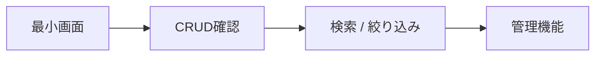
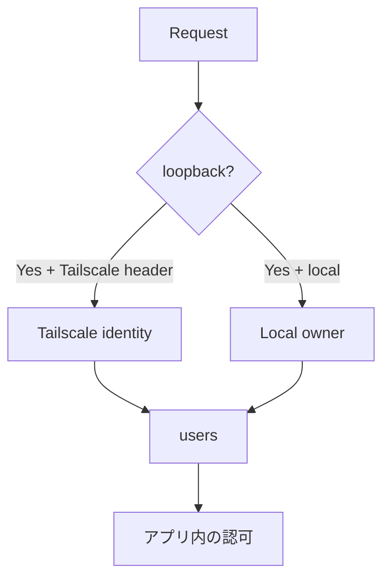
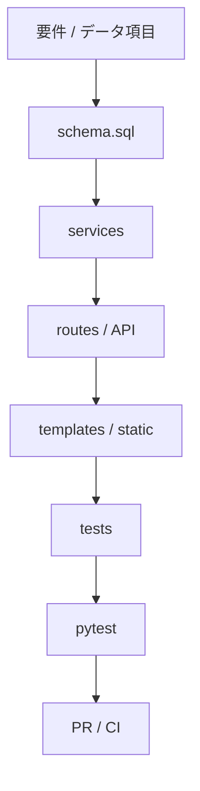

# 独自アプリへのカスタマイズ

このテンプレートは特定業務向けの完成アプリではなく、Python / Flask + SQLite + Tailscale を使ったクローズドWebアプリ開発の共通土台です。

`items` は認証・認可・CRUD・SQLiteの実装方法を確認するためのサンプルです。新しいアプリでは自由に削除・置換してください。

## カスタマイズの全体像



## 1. 最初に決めること

実装を始める前に最低限以下を決めます。

- アプリ名
- 目的
- 主な利用者
- 保存するデータ
- 利用者ごとに分離するデータ / 共有するデータ
- 誰が登録・更新・削除できるか
- スマートフォンから使うか
- 稼働PC
- バックアップ方法



## 2. アプリ名・環境設定を変更する

`.env` の `APP_NAME`、ローカル利用者の設定を自分のアプリに合わせます。

```env
APP_NAME=家庭用在庫管理
LOCAL_OWNER_EMAIL=owner@example.com
LOCAL_OWNER_NAME=山田太郎
```

アプリ独自の環境変数を追加した場合は `.env.example` に変数名とダミー値だけを追記します。秘密情報の実値は書きません。

READMEも自分のアプリの目的・起動方法・運用方法へ更新してください。

## 3. `items` サンプルを使わない場合

主なサンプル実装は次です。

```text
app/schema.sql            itemsテーブル
app/services/items.py     CRUD
app/routes.py              items画面 / API
app/templates/             画面
app/static/                CSS / JavaScript
tests/                     サンプル仕様のテスト
```



不要なサンプルを削除した場合は、関連するテストとドキュメントも同時に更新します。

## 4. 独自テーブルへ置き換える

`app/schema.sql` の `items` を参考に、アプリ固有のテーブルを設計します。

例:

```sql
CREATE TABLE equipment (
    id INTEGER PRIMARY KEY AUTOINCREMENT,
    owner_user_id INTEGER NOT NULL,
    name TEXT NOT NULL,
    location TEXT NOT NULL DEFAULT '',
    created_at TEXT NOT NULL DEFAULT CURRENT_TIMESTAMP,
    updated_at TEXT NOT NULL DEFAULT CURRENT_TIMESTAMP,
    FOREIGN KEY(owner_user_id) REFERENCES users(id) ON DELETE CASCADE
);
```

利用者本人だけが操作するデータなら、`owner_user_id` のような所有者列を持たせ、取得・更新・削除SQLで必ず所有者条件を使います。



SQLiteの変更・バックアップ方針は [SQLITE-SETUP.md](SQLITE-SETUP.md) を参照してください。

## 5. 業務処理をServiceへ分ける

現在の `app/services/items.py` がサンプルです。

```text
items.py
  list / create / get / toggle / delete
        ↓
equipment.py
  list / create / get / update / delete / search ...
```

RouteへSQLや複雑な業務ルールを詰め込みすぎず、Service層へ寄せるとテストしやすくなります。

## 6. URL / APIを変更する

`app/routes.py` に自分の画面・APIを追加します。

例:

```text
GET  /equipment
POST /equipment
POST /equipment/<id>/update
POST /equipment/<id>/delete
GET  /api/equipment
```

更新リクエストには既存のCSRF対策を維持します。JavaScriptから更新APIを呼ぶ場合もCSRFトークンを送信します。

理由なくCORSを広く許可しないでください。

## 7. 画面を変更する

主に次を変更します。

```text
app/templates/
app/static/app.css
app/static/app.js
```

最初は一覧・登録など最小限の画面から始め、検索・絞り込み・管理画面は段階的に追加します。



スマートフォン利用を想定する場合はPC幅だけでなくスマートフォン幅でも確認します。

## 8. 認証・認可をカスタマイズする

初期状態では、localhostでは `.env` のローカルオーナー、Tailscale Serve経由ではTailscale利用者を識別します。



用途に応じて次を追加できます。

- 管理者 / 一般利用者
- 共有データ
- 組織 / グループ
- オーナーフラグ
- 操作履歴

Tailscaleは「アプリへ到達できる人」を制限します。アプリ内で「何を操作できるか」はFlask / SQLite側で判定します。

詳細は [AUTH-CRUD.md](AUTH-CRUD.md) と [SECURITY.md](SECURITY.md) を参照してください。

## 9. テストをアプリ仕様へ置き換える

サンプルを削除したら、サンプル固有テストも削除・変更し、独自アプリの重要仕様へ置き換えます。

最低限、次を推奨します。

- 正常登録
- 一覧・詳細取得
- 更新 / 削除
- 不正入力拒否
- 未認証利用者拒否
- CSRFなし更新拒否
- 利用者Aが利用者Bのデータを取得・変更できない
- `127.0.0.1` 以外へのbindを許可しない

## 10. 共通基盤を変更するときの注意

特別な理由がない限り、次の役割を削除・弱体化しないことを推奨します。

- `app/auth.py` - 安全な利用者識別
- `app/csrf.py` - 更新リクエスト保護
- `app/security.py` - セキュリティヘッダー
- `app/db.py` - SQLite接続管理
- `run.py` - localhost限定の起動


## 11. 実データを扱う前にバックアップを決める

実データは通常 `data/app.db` に保存されます。

最低限、次を決めます。

- バックアップ先
- バックアップ頻度
- 保存世代数
- 復元手順
- Schema変更前のバックアップ

GitHubはSQLite実データのバックアップ先ではありません。

## 12. 推奨カスタマイズ順序



## 13. カスタマイズ後の完了条件

- アプリ名・説明がテンプレートのまま残っていない
- 不要な `items` サンプルが残っていない
- 独自データの所有・共有ルールが定義されている
- SQL / Serviceで認可している
- `.env.example` が最新
- README / docsが独自アプリ用に更新されている
- pytestが成功する
- GitHub Actions CIが成功する
- 稼働PCへの反映方法とバックアップ方法が決まっている

## 14. テンプレート本体へ追加しないもの

このテンプレート本体へ追加するのは、複数のローカルWebアプリで再利用価値がある共通基盤・安全策・開発手順を基本とします。

特定業務だけで必要な画面、マスタ、外部API、権限ロール、通知などは、テンプレートから作成した各アプリ側で実装します。
