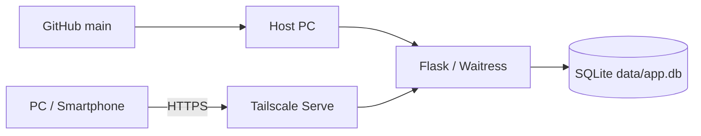
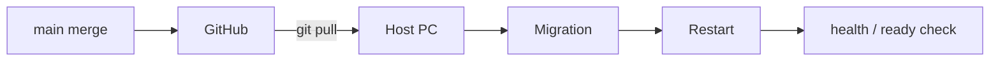
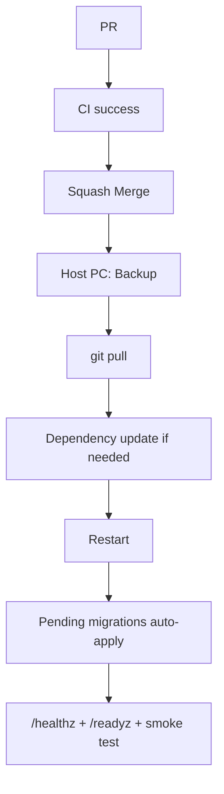
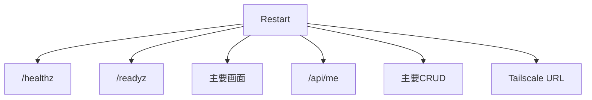
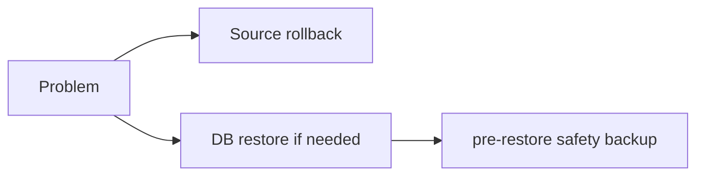

# Deployment to Local Host PC

このテンプレートの本番環境は、Python / Flask / SQLiteを動かす**稼働PC**です。別端末からのアクセスにはTailscale Serveを使います。

## 全体構成



## 1. 開発PCと稼働PCを分ける

GitHubへMergeしても稼働PCへ自動反映されません。



`.env`、`data/app.db`、`backups/` は稼働PC側のローカルデータです。

## 2. 初回の稼働PCセットアップ

稼働PCにはRuff / pytest等の開発ツールを必須にしません。runtime用bootstrapを使います。

Windows:

```powershell
.\scripts\bootstrap-runtime.ps1
Copy-Item .env.example .env
```

macOS / Linux:

```bash
./scripts/bootstrap-runtime.sh
cp .env.example .env
```

`.env` を本番用に設定します。

```env
APP_NAME=My Local App
LOG_LEVEL=INFO
LOCAL_OWNER_EMAIL=owner@example.local
LOCAL_OWNER_NAME=Local Owner
```

## 3. 起動

Windows:

```powershell
.\scripts\start.ps1
```

macOS / Linux:

```bash
./scripts/start.sh
```

まずホストPCで確認します。

```text
http://127.0.0.1:8000/healthz
http://127.0.0.1:8000/readyz
```

- `/healthz`: Flask / Waitressが応答しているか
- `/readyz`: SQLiteへ問い合わせできるか

## 4. Tailscale Serve

Windows:

```powershell
.\scripts\tailscale-serve.ps1
```

macOS / Linux:

```bash
./scripts/tailscale-serve.sh
```

Python側は `127.0.0.1` のまま維持します。詳細は [TAILSCALE-SETUP.md](TAILSCALE-SETUP.md) を参照してください。

## 5. 通常のリリースフロー



Migrationはアプリ起動時に未適用分だけ自動適用されます。DB変更があるReleaseでは、**起動前に必ずBackupを確保**します。

## 6. 反映前Backup

Windows:

```powershell
.\.venv\Scripts\python.exe -m scripts.db_tools backup
```

macOS / Linux:

```bash
.venv/bin/python -m scripts.db_tools backup
```

既定では `backups/` に日時付きDBを作成し、作成後に `PRAGMA quick_check` を実行します。

Backupを外部ドライブ等へ直接保存する場合:

```powershell
.\.venv\Scripts\python.exe -m scripts.db_tools backup --backup-dir D:\SQLiteBackup
```

## 7. 稼働PCのmainを更新

アプリを停止できる状態にしてから:

```powershell
git switch main
git status --short
git pull origin main
```

`git status --short` に意図しないローカル編集がある場合は、そのままPullしません。稼働PC上で独自のソース編集をしない運用を推奨します。

## 8. 依存関係が変わった場合

`requirements.txt` / `constraints.txt` が変わったReleaseではruntime依存を更新します。

Windows:

```powershell
.\.venv\Scripts\python.exe -m pip install -r requirements.txt
.\.venv\Scripts\python.exe -m pip check
```

macOS / Linux:

```bash
.venv/bin/python -m pip install -r requirements.txt
.venv/bin/python -m pip check
```

大きな変更時は `.venv` を作り直して `bootstrap-runtime` を再実行する方法もあります。

## 9. Migration

`app/migrations/` に新しいSQLが追加されている場合、次回アプリ起動時に未適用versionだけ実行します。

```text
schema_migrations
  001 initial      applied
  002 add_category pending -> startupで適用
```

適用済みMigrationを書き換えないことが重要です。詳細は [SQLITE-SETUP.md](SQLITE-SETUP.md) を参照してください。

## 10. デプロイ後確認



最低限:

- `/healthz` = `status: ok`
- `/readyz` = `status: ready`, `database: ok`
- 主要画面が表示される
- `/api/me` が期待する利用者
- 主要CRUDが成功する
- 利用者間データ分離が維持される
- Tailscale経由でアクセスできる

## 11. DB Integrity確認

必要に応じて稼働中DBを確認します。

```powershell
.\.venv\Scripts\python.exe -m scripts.db_tools check
```

正常時:

```text
SQLite quick_check: ok
```

## 12. Restore

問題発生時はソースとDBを別々に考えます。

Restoreはアプリ停止後に実行します。

```powershell
.\.venv\Scripts\python.exe -m scripts.db_tools restore backups\app-....db --yes
```

既存DBがある場合、Restore直前の `pre-restore` Backupが自動作成されます。



Migrationを伴うReleaseでは、旧ソースへ戻すだけでは新Schemaと互換性がない場合があります。Release前に戻し方を確認します。

## 13. Release / Tag

安定版を明示する場合はGitHub Release / tagを利用できます。

```text
v1.0.0
v1.1.0
v1.1.1
```

Releaseには以下を記録すると安全です。

- 変更内容
- Migrationの有無
- `.env` 変更
- requirements / constraints変更
- Backup要否
- 反映手順
- Rollback注意点

## 14. 将来の自動デプロイ

自動化は、次が安定してから検討します。

- CI
- Backup
- Migration
- Restart
- `/readyz`
- Rollback

SQLiteのローカルアプリでは、無条件の自動Pullより安全性を優先します。

## 15. 本番チェックリスト

- main CIが成功
- 稼働PCに未Commit変更がない
- DB Backupを取得
- `.env` 変更有無を確認
- requirements / constraints変更有無を確認
- Migration有無を確認
- Pull後に依存更新が必要なら実施
- アプリを再起動
- `/healthz` 成功
- `/readyz` 成功
- Tailscale経由成功
- 主要CRUD / 認可成功
- 必要なら `scripts.db_tools check` 成功
