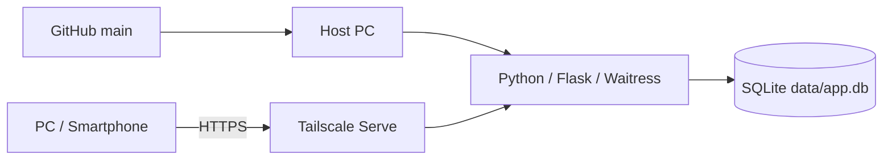
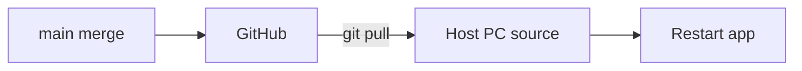
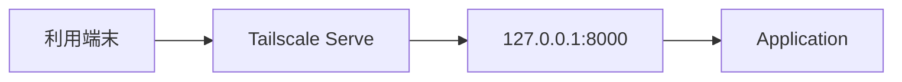
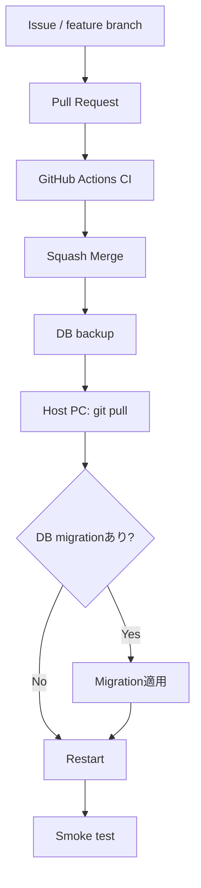
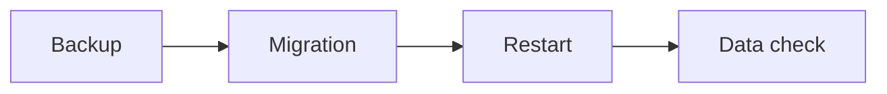
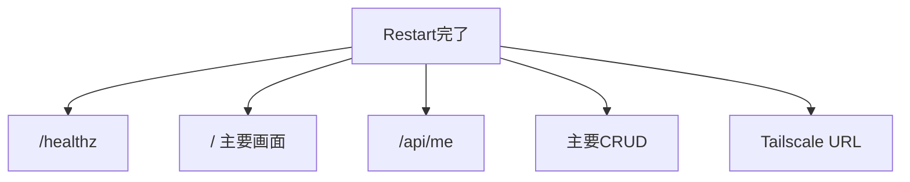
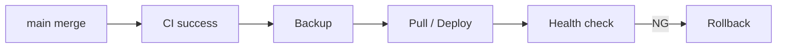

# Deployment to Local Host PC

このテンプレートの本番環境は、Vercel等のクラウドではなく、Python / Flask / SQLiteを動かす**稼働PC**です。別端末からのアクセスにはTailscale Serveを使います。

## 全体構成



## 1. GitHubと稼働PCを分けて考える

GitHubへMergeしても、稼働PCのソースは自動更新されません。



`.env` と `data/app.db` は稼働PC側のローカルデータで、通常GitHubから配布しません。

## 2. 初回セットアップ

稼働PCへ自分用リポジトリをCloneし、依存関係を準備します。

Windows:

```powershell
.\scripts\bootstrap.ps1
Copy-Item .env.example .env
```

macOS / Linux:

```bash
./scripts/bootstrap.sh
cp .env.example .env
```

`.env` を本番用途に合わせて設定します。

## 3. 起動

Windows:

```powershell
.\scripts\start.ps1
```

macOS / Linux:

```bash
./scripts/start.sh
```

まずホストPCで確認します。

```text
http://127.0.0.1:8000
http://127.0.0.1:8000/healthz
```

## 4. Tailscale Serve

別端末から使う場合:

Windows:

```powershell
.\scripts\tailscale-serve.ps1
```

macOS / Linux:

```bash
./scripts/tailscale-serve.sh
```



詳細は [TAILSCALE-SETUP.md](TAILSCALE-SETUP.md) を参照してください。

## 5. 通常のリリースフロー



## 6. 反映前にバックアップする

DB変更がある場合は特に、`data/app.db` のバックアップを取得してから反映します。

GitのPullはソースを更新しますが、DBの復旧手段にはなりません。

詳細は [SQLITE-SETUP.md](SQLITE-SETUP.md) を参照してください。

## 7. mainを最新化する

稼働PCでアプリを停止できる状態にしてから、リポジトリのmainを更新します。

```powershell
git switch main
git pull origin main
```

GitHub Desktopを使う場合はmainへ切り替え、Fetch / Pullします。

**稼働PC上で独自のソース編集を行わない**ことを推奨します。ローカル変更があるとPull時の競合や、GitHubに存在しない本番差分の原因になります。

## 8. 依存関係が変わった場合

`requirements.txt` / `requirements-dev.txt` が変わった場合は、必要に応じて依存関係を更新します。

Windows:

```powershell
.\.venv\Scripts\python.exe -m pip install -r requirements.txt
```

macOS / Linux:

```bash
.venv/bin/python -m pip install -r requirements.txt
```

大きな依存変更時は、仮想環境を作り直す方法も検討します。

## 9. DB Migrationがある場合

運用開始後のSchema変更は、`data/app.db` を削除して作り直しません。



Migration手順はアプリごとにREADME / docsへ記録します。

## 10. デプロイ後確認

最低限次を確認します。



- `/healthz` が `status: ok`
- 主要画面が表示される
- `/api/me` が期待する利用者
- 主要CRUDが成功する
- 利用者間データ分離が維持される
- Tailscale経由で別端末からアクセスできる
- `.env` / DBが意図したものを参照している

## 11. ロールバック

問題があった場合に備え、次の2種類を分けます。

```text
ソースのロールバック
  Gitの直前安定版へ戻す

データのロールバック
  SQLiteバックアップから復元
```

DB変更を伴う場合、ソースだけ戻しても旧Schemaと互換性がない可能性があります。Release前に戻し方を決めます。

## 12. Release運用

安定版を明示したい場合はGitHub Release / tagを利用できます。

例:

```text
v1.0.0
v1.1.0
v1.1.1
```

Releaseには、変更内容、DB Migrationの有無、`.env` 変更、反映手順、ロールバック注意点を記録すると稼働PC更新が安全になります。

## 13. 将来の自動デプロイ

運用が安定した後、main merge後の稼働PC更新を自動化することは可能です。ただし、SQLiteとローカル運用では無条件の自動更新より、次を満たしてから導入します。

- CIが安定
- Backup自動化
- Migration手順が定型化
- Restart方法が定型化
- Health check / rollbackがある



## 14. 本番チェックリスト

- mainのCIが成功している
- 稼働PCのソースに未Commit変更がない
- DBバックアップがある
- `.env` 変更の要否を確認した
- requirements変更の要否を確認した
- Migrationの要否を確認した
- Pull後にアプリを再起動した
- `/healthz` を確認した
- Tailscale経由を確認した
- 主要CRUD / 認可を確認した
