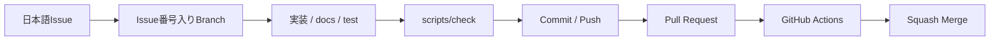
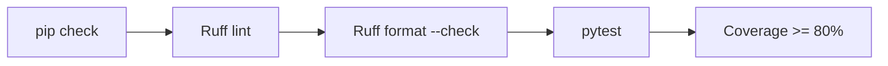
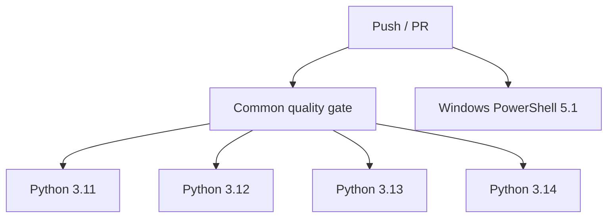
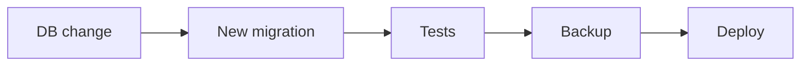

# Development

このドキュメントは、開発開始後の日常的なIssue・Branch・品質チェック・Pull Request・CI・依存関係更新を扱います。稼働PCへの反映は [DEPLOYMENT.md](DEPLOYMENT.md) を参照してください。

## 基本フロー



必須ルール:

1. mainへ取り込む変更単位ごとにIssueを作成
2. Issueのタイトル・本文は日本語
3. Branch名にIssue番号を含める
4. mainへ直接Commit / Pushしない
5. Pull Request必須
6. CI成功と差分を確認
7. Squash Merge
8. README / docsへの影響を同じPRで更新

詳細は [../CONTRIBUTING.md](../CONTRIBUTING.md) を参照してください。

## 開発用セットアップ

Windows:

```powershell
.\scripts\bootstrap.ps1
```

macOS / Linux:

```bash
./scripts/bootstrap.sh
```

Python 3.11未満は拒否します。開発用bootstrapはruntime依存に加えてRuff / pytest / pytest-covを導入します。

## 統一品質チェック

Windows:

```powershell
.\scripts\check.ps1
```

macOS / Linux:

```bash
./scripts/check.sh
```

実行順:



AIへ作業を依頼するときも、`scripts/check` 成功をローカル完了条件として扱います。

## CI

GitHub ActionsはPush / Pull Requestで次を確認します。

- Python 3.11
- Python 3.12
- Python 3.13
- Python 3.14
- `pip check`
- Ruff lint
- Ruff format check
- pytest + Coverage 80%以上
- 全 `.ps1` のPowerShell構文
- 全 `.sh` のshell構文
- `setup-github.ps1` のUTF-8 BOM
- Windows PowerShell 5.1でGitHub設定スモークテスト



Ruleset定義では `test (3.11)`〜`test (3.14)` と `windows-powershell-51` をRequired Status Checkにします。

## Ruff

設定は `pyproject.toml` に集約しています。

手動実行:

```bash
python -m ruff check .
python -m ruff format --check .
```

自動整形する場合:

```bash
python -m ruff format .
```

自動整形後も差分を確認してからCommitします。

## Coverage

CIと `scripts/check` は次を対象にCoverageを取得します。

- `app`
- `scripts.db_tools`

最低基準は80%です。新しい共通基盤を追加してCoverageが下がった場合、まず意味のあるテスト追加を優先します。

## SQLite変更

Schema変更は `app/migrations/` に新しい番号付きSQLを追加します。

```text
001_initial.sql
002_add_category.sql
003_add_audit_log.sql
```

実データ運用開始後は適用済みMigrationを書き換えません。



詳細は [SQLITE-SETUP.md](SQLITE-SETUP.md) を参照してください。

## 依存関係

役割:

```text
requirements.txt       runtimeの直接依存範囲
requirements-dev.txt   開発依存
constraints.txt        CI確認済みの固定バージョン
```

`constraints.txt` により同じCommitからのインストール再現性を高めています。

Dependabotは月次で次を確認します。

- pip
- GitHub Actions

Dependabot PRも通常のCIを通して取り込みます。major updateは変更点を確認し、機械的にMergeしません。

## Branch命名

```text
feat/25-inventory-search
fix/31-csrf-error
docs/42-update-readme
refactor/50-item-service
test/61-user-isolation
chore/70-update-dependencies
```

## Pull Request

最低限記載する内容:

- 対応Issue
- 変更内容
- テスト
- 影響範囲
- Migration有無
- `.env.example` 変更
- requirements / constraints変更
- 認証・セキュリティ影響
- README / docs更新

## Merge前チェック

- 日本語Issueがある
- BranchにIssue番号がある
- PRとIssueが関連付いている
- `scripts/check` または同等の品質確認が成功
- GitHub Actionsが成功
- `.env` / `data/` / `backups/` / 秘密情報が含まれていない
- Migration変更のデータ影響を確認した
- 認証・認可を弱めていない
- `127.0.0.1` 制約を壊していない
- README / docsが最新
- Squash Mergeを選択している

## CI成功報告

完了報告では次を併記します。

1. 修正ソース
2. 修正ドキュメント
3. 修正・追加テスト
4. CI結果

Merge後に稼働PCへ反映する場合は [DEPLOYMENT.md](DEPLOYMENT.md) へ進みます。
