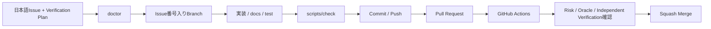
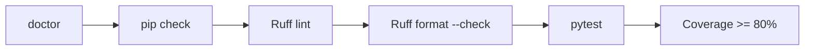
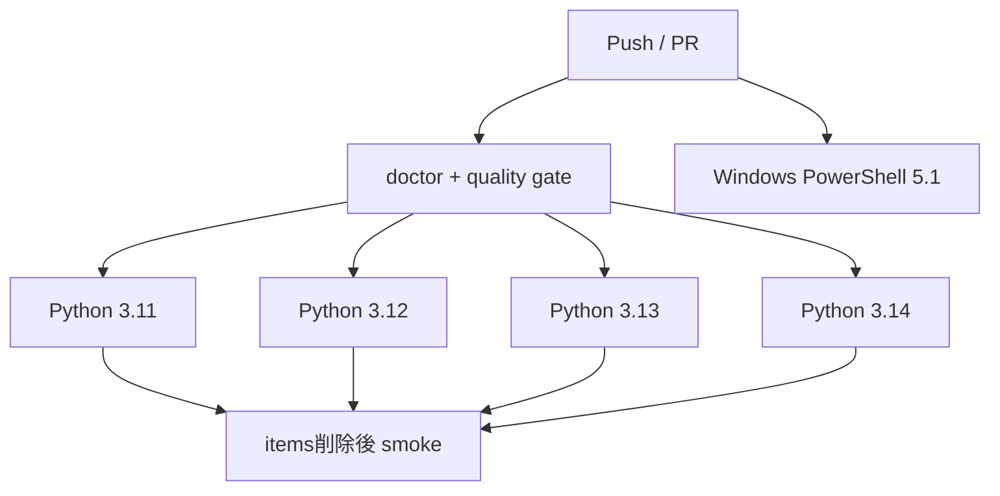
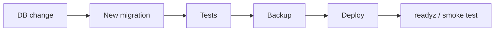

# Development

Git / GitHub / GitHub Desktopの基本用語や、CommitとPushの違い、Pull Request、CI、Squash Mergeの流れがまだ分からない場合は、先に [../BEGINNER-GUIDE.md](../BEGINNER-GUIDE.md) を読んでください。

このドキュメントは、開発開始後の日常的なIssue・Branch・doctor・品質チェック・Pull Request・CI・依存関係更新を扱います。稼働PCへの反映は [DEPLOYMENT.md](DEPLOYMENT.md)、運用は [OPERATIONS.md](OPERATIONS.md) を参照してください。

## 基本フロー



必須ルール:

1. mainへ取り込む変更単位ごとにIssueを作成
2. Issueのタイトル・本文は日本語
3. Branch名にIssue番号を含める
4. mainへ直接Commit / Pushしない
5. Pull Request必須
6. CI成功と差分を確認
7. Squash Merge
8. README / docsへの影響を同じPRで更新
9. 振る舞い・品質契約を変える変更では、Issue / PRにVerification Planを記載

詳細は [../CONTRIBUTING.md](../CONTRIBUTING.md) を参照してください。

## Verification Design

**CIがGreenであることは品質そのものではなく、定義済みの評価条件を満たしたSignalです。**

変更を始める前に、Issueで最低限次を定義します。

- Risk Level: Low / Medium / High
- Important Risk: 何が壊れたら困るか
- Correct State / Test Oracle: 何を正しい状態とするか
- Verification Layer: Static / Unit / Integration / Sampleless / Platform / Manual / Operations
- Blocking Signal: 何が失敗したらMergeを止めるか
- Falsification / Negative Case: 実装が誤っていたら失敗するケース
- Independent Verification: 実装Loopと異なる評価軸

AI / Coding Agentへ実装とテストの両方を任せても構いませんが、AI自身の「テストが通ったので問題ありません」だけを最終Quality Gateにはしません。High Risk変更では、人間のJudgmentまたは実装Loopとは異なる受入観点を残します。

詳細なRisk Level、Test Layer、Coverageの扱い、Mutation Testingを標準必須化しない理由は [QUALITY-VERIFICATION.md](QUALITY-VERIFICATION.md) を参照してください。

## Doctor

依存関係導入前でもsystem Pythonから実行できます。

```powershell
python -m scripts.doctor
```

確認対象:

- Python 3.11〜3.14
- Repository必須ファイル
- `.venv`
- `.env`
- `APP_DATA_DIR`
- Git / GitHub CLI / Tailscale command

`.venv` / `.env` / optional commandが無い場合はWARNです。Python version不適合、必須ファイル欠落、data path異常はFAILとして終了コード1を返します。

Doctorは「アプリが完全に設定済みか」ではなく「次に何が不足しているか」を初心者でも切り分けやすくするための診断です。

## 開発用セットアップ

Windows:

```powershell
python -m scripts.doctor
.\scripts\bootstrap.ps1
```

macOS / Linux:

```bash
python3 -m scripts.doctor
./scripts/bootstrap.sh
```

Python 3.11〜3.14をサポート対象とし、範囲外のVersionはdoctorで拒否します。開発用bootstrapはruntime依存に加えてRuff / pytest / pytest-covを導入します。

## 統一品質チェック

Windows:

```powershell
.\scripts\check.ps1
```

macOS / Linux:

```bash
./scripts/check.sh
```

実行順:



AIへ作業を依頼するときも、doctorにFAILがなく `scripts/check` が成功することをローカル完了条件として扱います。ただし、そのGreenがIssueで定義したRiskを観測していることを別途確認します。

## CI

GitHub ActionsはPush / Pull Requestで次を確認します。

- Python 3.11
- Python 3.12
- Python 3.13
- Python 3.14
- `python -m scripts.doctor`
- `pip check`
- Ruff lint
- Ruff format check
- pytest + Coverage 80%以上
- items feature削除後の共通pytest + Coverage 80%以上
- 全 `.ps1` のPowerShell構文
- 全 `.sh` のshell構文
- `setup-github.ps1` のUTF-8 BOM
- Windows PowerShell 5.1でGitHub設定スモークテスト



Ruleset定義のRequired Status Check名は `test (3.11)`〜`test (3.14)` と `windows-powershell-51` のままです。sampleless smoke testは既存Python job内へ追加するため、Ruleset名の変更は不要です。

CIは重要なBlocking Signalですが、すべてGreenでもVerification PlanのRiskを観測していない場合はMerge判断の根拠として不十分です。

## Ruff

設定は `pyproject.toml` に集約しています。

```bash
python -m ruff check .
python -m ruff format --check .
```

自動整形する場合:

```bash
python -m ruff format .
```

自動整形後も差分を確認してからCommitします。

## Coverage

CIと `scripts/check` は `app` とPython utilityを含む `scripts` 全体をCoverage対象にし、最低80%を要求します。`pyproject.toml` の `[tool.coverage.run]` と実行コマンドで同じ対象を維持します。doctorは専用単体テスト `tests/test_doctor.py` で対応Versionを含む診断条件を確認します。

Coverageは「コードが実行された範囲」のSignalであり、正しいAssertion / Test Oracleの存在そのものは保証しません。100%を目的化せず、重要なRiskに対する意味のある分岐テストを優先します。

## 共通基盤とfeatureの開発境界

共通処理は `app/core/` や `app/db.py` 等へ置き、業務固有処理は `app/features/<feature>/` にまとめます。

初期 `items` は削除可能なサンプルです。

```text
app/features/items/
```

featureは自動検出されるため、独自featureを追加するたびに `app/__init__.py` へ個別importを増やしません。各featureの `register(app)` からBlueprintを登録します。

新しいfeatureの配置、Route / Service、認可、Migration、テストの共通契約は [EXTENDING.md](EXTENDING.md) を参照してください。

## Template smoke test

通常のpytest + Coverage成功後、CIでは一時workspace上で次を削除します。

```text
app/features/items/
```

その状態で共通pytest + Coverageを再実行し、items featureが無くてもcore、認証、Migration、doctor、DB tools等が成立することを確認します。`tests/test_sample_items.py` はitemsが無い場合にskipされます。

テンプレートの大きな構成変更時には、自動CIだけでなく **Use this template → Clone → GitHub設定 → bootstrap → 基準check → items削除 → 独自feature → Pull Request** までを手動で通します。詳細は [TEMPLATE-SMOKE-TEST.md](TEMPLATE-SMOKE-TEST.md) を参照してください。

## SQLite変更

Migrationは用途によって置き場所を分けます。

共通基盤:

```text
app/migrations/*.sql
```

feature固有:

```text
app/features/<feature>/migrations/*.sql
```

Migration runnerは両方を集め、**全体でversion番号が一意になること**を要求します。

初期状態:

```text
app/migrations/001_initial.sql
app/features/items/migrations/002_sample_items.sql
```

itemsサンプルを初回起動前に削除した場合は未適用versionを独自Migrationで利用できます。一方、一度適用したversionはfeature削除後も再利用しません。実データ運用開始後は適用済みMigrationを書き換えません。



詳細は [SQLITE-SETUP.md](SQLITE-SETUP.md) を参照してください。

## テストの分離

共通基盤テストは特定業務featureに依存させません。

```text
tests/test_sample_items.py       itemsサンプル
tests/test_doctor.py             doctor
tests/test_template_lifecycle.py 開発・運用・拡張・smoke契約
```

items featureが存在しない場合、sample testは自動skipされます。そのため `app/features/items/` を削除した状態でも共通基盤の品質チェックとCIを維持できます。

独自featureを追加したら、正常系に加えて不正入力、他利用者データ操作拒否、CSRF、Migration適用 / 再実行、必要なデータ互換性を確認します。振る舞い変更では「実装が誤っていたら失敗する」Falsification観点を最低1つ検討します。

## 依存関係

役割:

```text
requirements.txt       runtimeの直接依存範囲
requirements-dev.txt   開発依存
constraints.txt        CI確認済みの固定バージョン
```

Dependabotは月次でpipとGitHub Actionsを確認します。Dependabot PRも通常のCIを通し、major updateは変更点を確認してから取り込みます。

## Branch命名

```text
feat/25-inventory-search
fix/31-csrf-error
docs/42-update-readme
refactor/50-item-service
test/61-user-isolation
chore/70-update-dependencies
```

## Pull Request

最低限記載する内容:

- 対応Issue
- 変更内容
- Verification Plan
- Greenが保証する範囲 / Greenだけでは保証しない範囲
- テスト
- 影響範囲
- Migration有無
- `.env.example` 変更
- requirements / constraints変更
- 認証・セキュリティ影響
- README / docs更新

GitHub DesktopでBranch作成からPR作成までの具体的な操作を確認したい場合は [../BEGINNER-GUIDE.md](../BEGINNER-GUIDE.md) を参照してください。

## Merge前チェック

- 日本語Issueがある
- BranchにIssue番号がある
- PRとIssueが関連付いている
- Verification Planが変更内容に対応している
- doctorにFAILがない
- `scripts/check` または同等の品質確認が成功
- GitHub Actionsが成功
- sampleless smoke testが成功
- `.env` / `data/` / `backups/` / 秘密情報が含まれていない
- Migration変更のデータ影響を確認した
- 認証・認可を弱めていない
- `127.0.0.1` 制約を壊していない
- High Risk変更でAIの自己確認だけに依存していない
- README / docsが最新
- Squash Mergeを選択している

## 運用への引き渡し

Merge後に稼働PCへ反映する場合は [DEPLOYMENT.md](DEPLOYMENT.md) へ進み、反映後の日常確認・障害切り分け・Backup / Restore・Rollbackは [OPERATIONS.md](OPERATIONS.md) を基準にします。

## CI成功報告

完了報告では次を併記します。

1. 修正ソース
2. 修正ドキュメント
3. 修正・追加テスト
4. CI結果
5. 重要なRiskと、それを確認したVerification Signal
6. Greenだけでは未保証の範囲が残る場合はその内容
