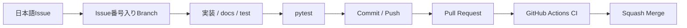
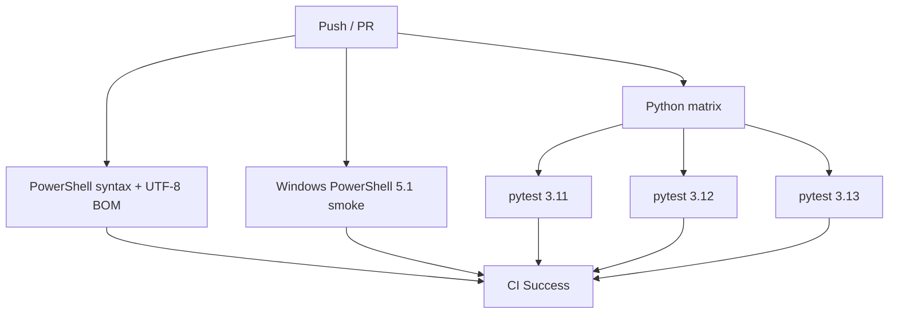
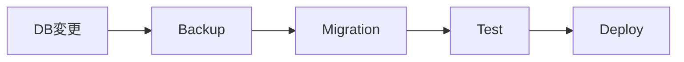
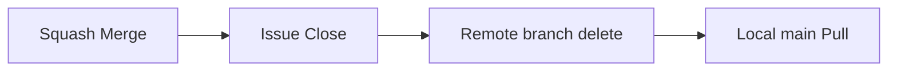

# Development

このドキュメントは、開発開始後の日常的なIssue・Branch・Commit / Push・Pull Request・CI・Merge運用を扱います。稼働PCへの反映は [DEPLOYMENT.md](DEPLOYMENT.md) を参照してください。

## 基本ルール

このテンプレート本体では、mainへの直接Commit / Pushを行いません。



必須ルール:

1. mainへ取り込む変更単位ごとにIssueを作成
2. Issueのタイトル・本文は日本語
3. ブランチ名にIssue番号を含める
4. 作業ブランチで変更・テスト・Commit / Push
5. Pull Request必須
6. PR本文で `Closes #番号`
7. CI成功と差分を確認
8. Squash Merge
9. README / docsへの影響があれば同じPRで更新

詳細な寄稿ルールは [../CONTRIBUTING.md](../CONTRIBUTING.md) を参照してください。

## ローカルテスト

Windows:

```powershell
.\.venv\Scripts\python.exe -m pytest
```

macOS / Linux:

```bash
.venv/bin/python -m pytest
```

特に共通基盤を変更した場合は次を確認します。

- localhost限定
- 利用者識別
- 利用者間データ分離
- CSRF
- セキュリティヘッダー
- SQLite操作

## CI

`.github/workflows/ci.yml` はPush / Pull Requestで実行されます。



Rulesetでは `test (3.11)` / `test (3.12)` / `test (3.13)` を必須Status Checkにしています。

## CI完了報告

CI成功をもって作業完了と報告する場合、最低限以下を併記します。

1. 修正ソース
2. 修正ドキュメント
3. 修正・追加テスト
4. CI結果

## Branch

推奨形式:

```text
feat/25-inventory-search
fix/31-csrf-error
docs/42-update-readme
refactor/50-item-service
test/61-user-isolation
chore/70-update-dependencies
```

- `main`: 安定版
- `feat/`: 機能追加
- `fix/`: 不具合
- `docs/`: ドキュメント
- `refactor/`: 内部整理
- `test/`: テスト
- `chore/`: 保守・設定

## Commit

変更理由が分かる日本語またはConventional Commits形式を推奨します。

```text
feat: 在庫検索APIを追加
fix: CSRFエラー処理を修正
docs: Tailscale設定手順を更新
```

作業ブランチでは複数Commitになって構いません。mainへはPR単位でSquash Mergeします。

## Pull Request

PRには最低限次を記載します。

- 対応Issue
- 変更内容
- テスト
- 影響範囲
- DB変更
- `.env.example` 変更
- requirements変更
- 認証・セキュリティ影響
- README / docs更新

```text
Closes #25
```

## Merge前チェック

- 日本語Issueがある
- BranchにIssue番号がある
- PRとIssueが関連付いている
- CIが成功している
- 意図しない変更がない
- `.env` / `data/` / 秘密情報が含まれていない
- 必要なテストがある
- DB変更のデータ影響を確認した
- 認証・認可を弱めていない
- `127.0.0.1` 制約を壊していない
- README / docsが最新
- Squash Mergeを選択している

## GitHub推奨設定

`setup-github.ps1` でRuleset / Merge設定を適用できます。

```powershell
.\scripts\setup-github.ps1
```

主な設定:

- Pull Request必須
- required status checks
- Conversation resolution
- linear history
- Squash Mergeのみ
- force push禁止
- Default branch削除禁止
- Merge後branch自動削除

詳細は [GITHUB-SETUP.md](GITHUB-SETUP.md) を参照してください。

## SQLite変更

`app/schema.sql` は新規環境の初期構築用です。運用開始後のSchema変更はバックアップと移行手順を用意します。



詳細は [SQLITE-SETUP.md](SQLITE-SETUP.md) を参照してください。

## 依存関係の更新

依存ライブラリを更新する場合は、`requirements.txt` / `requirements-dev.txt` とCIの互換性を同じPRで確認します。major updateは機械的に取り込まず、Flask / Waitress / pytest等の変更点を確認してから取り込みます。

## README / docs更新

次が変わった場合はREADME / docsも同じ変更で更新します。

- セットアップ
- 環境変数
- SQLite Schema
- Tailscale運用
- 開発コマンド
- GitHub Ruleset / CI
- 稼働PCへの反映方法
- セキュリティ方針

## Merge後



稼働PCへ反映する場合は [DEPLOYMENT.md](DEPLOYMENT.md) の手順へ進みます。
