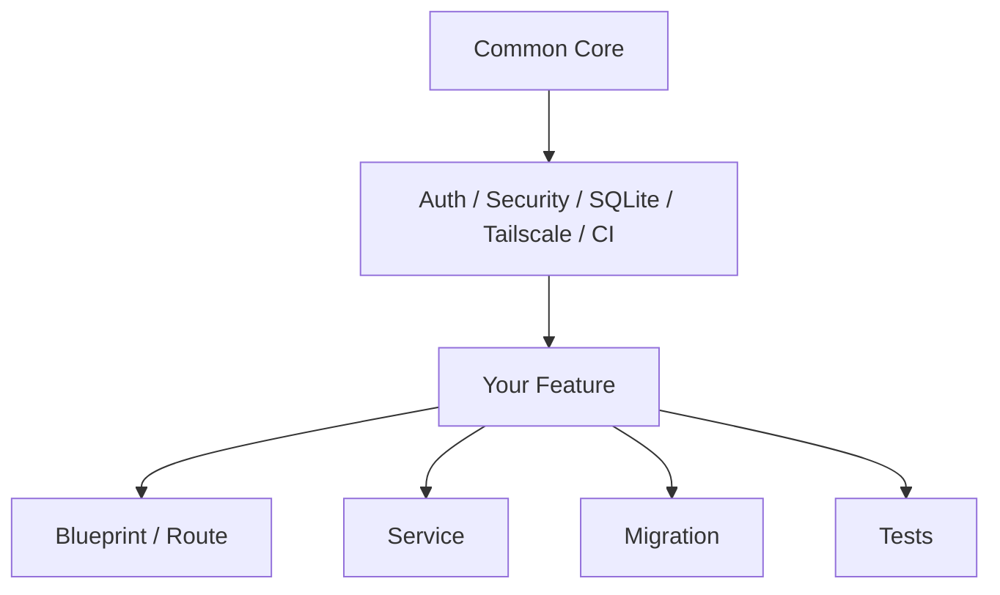
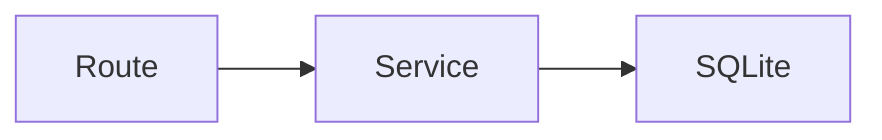
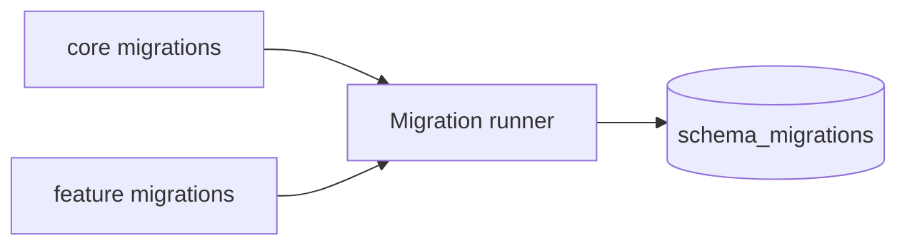
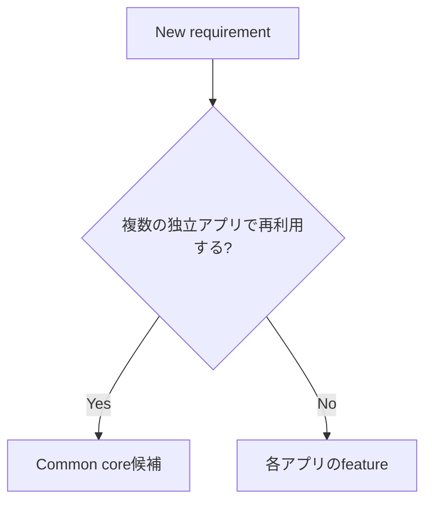

# Extending the Template

このドキュメントは、itemsサンプルをコピーすること自体を目的にせず、共通基盤を維持したまま独自featureを追加するための設計契約です。

## 基本方針



案件固有の画面、table、通知、外部APIを `app/core/` へ直接混ぜず、`app/features/<feature>/` を境界にします。

## 1. 推奨配置

例: 設備管理feature

```text
app/features/equipment/
├─ __init__.py
├─ routes.py
├─ service.py
├─ templates/equipment/
│  └─ index.html
└─ migrations/
   └─ 003_equipment.sql

tests/test_equipment.py
```

## 2. Feature登録契約

各featureの `__init__.py` は `register(app)` を公開します。

```python
def register(app) -> None:
    from .routes import bp

    app.register_blueprint(bp)
```

`app/features/__init__.py` がpackageを自動検出するため、新featureごとに `app/__init__.py` へ個別importを追加しません。

## 3. Blueprint / Route

HTTP入出力は `routes.py` に置き、SQLや複雑な業務ルールをRouteへ詰め込みすぎません。



- URLとHTTP methodを定義
- 入力を取り出す
- Serviceを呼ぶ
- redirect / template / JSON responseを返す

状態変更Routeでは既存CSRF保護を維持します。

## 4. Service

`service.py` は業務処理とDB操作をまとめます。

利用者本人だけが操作できるデータでは、画面でボタンを隠すだけでなくSQLにも所有者条件を入れます。

```sql
WHERE id = ? AND owner_user_id = ?
```

認可失敗時に他利用者データの存在を不用意に漏らさない設計を優先します。

## 5. Migration

feature固有Schemaは次へ置きます。

```text
app/features/<feature>/migrations/*.sql
```

共通coreのSchemaだけが次です。

```text
app/migrations/*.sql
```

Migration versionは両方を合わせてリポジトリ全体で一意にします。



- 初回起動前に未使用sampleを削除した場合、その未適用versionを独自featureで使うことは可能
- 一度適用済みのversionはfeature削除後も再利用しない
- 運用開始後は適用済みMigrationを書き換えない
- destructive変更前にBackupを取得

## 6. Template / Static assets

feature固有Templateはfeature配下へ置きます。

```text
app/features/equipment/templates/equipment/
```

共通レイアウトは `app/templates/base.html` を利用できます。複数featureで共通利用するものだけをcore/static側へ戻します。

## 7. 認証・認可

共通の利用者識別は `app/auth.py` と `app/core/access.py` を利用します。

新featureで確認すること:

- 未認証利用者を許可するRouteか
- current userが必要か
- owner単位か共有データか
- UPDATE / DELETEにも所有者条件があるか
- JSON APIでも同じ認可を行っているか

Tailscale到達制御だけをアプリ内認可の代わりにしません。

## 8. CSRF / Security

- 状態変更は既存CSRF保護を外さない
- HTML escape / CSPを理由なく弱めない
- `0.0.0.0` bindへ変更しない
- Secretや実データをRepositoryへCommitしない
- APIエラーに秘密情報を含めない

## 9. テスト

共通基盤テストは維持し、feature固有テストを別ファイルへ追加します。

最低限の観点:

- 正常登録・取得・更新・削除
- 不正入力
- CSRFなし更新拒否
- 未認証アクセス
- 利用者Aが利用者Bのデータを操作できない
- Migration適用 / 再実行
- 既存データ互換性が必要な場合の移行

itemsサンプルのテスト構成は参考にできますが、独自featureをitemsと同じ画面・Schemaへ無理に寄せる必要はありません。

## 10. 環境変数

featureで環境変数を追加する場合:

1. `.env.example` に名前・用途・安全なサンプル値を追加
2. Secretの実値をCommitしない
3. `app/config.py` 等で読み込み・validationを行う
4. `python -m scripts.doctor` で共通診断対象にすべき項目か判断
5. 運用Runbookにも必要なら追記

## 11. 共通基盤へ戻す判断



特定案件だけで必要なmaster、通知、外部API、管理画面は原則feature側です。

## 12. Feature追加チェックリスト

- featureの責務が1文で説明できる
- `app/features/<feature>/` にまとまっている
- `register(app)` がある
- RouteとServiceの責務が分かれている
- Migration versionが重複していない
- SQLでも認可している
- CSRF / Securityを弱めていない
- `.env.example` が最新
- feature testがある
- `python -m scripts.doctor` に致命的エラーがない
- `scripts/check` 成功
- GitHub Actions 5ジョブ成功
- README / docsを必要に応じて更新

## 13. itemsサンプルとの関係

`app/features/items/` はCRUD・認可・Migrationの参考実装です。独自featureを作る際、設計が合わなければitemsをコピーせずゼロからfeatureを作って構いません。守るべきものはitemsの形ではなく、共通基盤との境界・認可・Migration・品質ゲートです。
