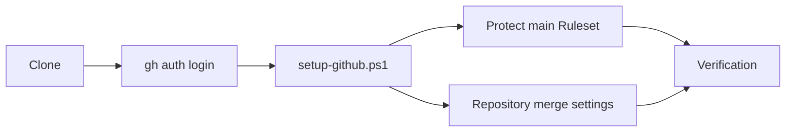
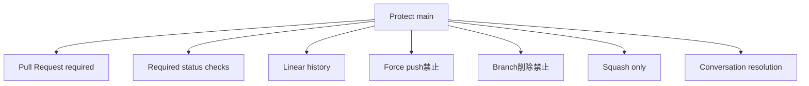
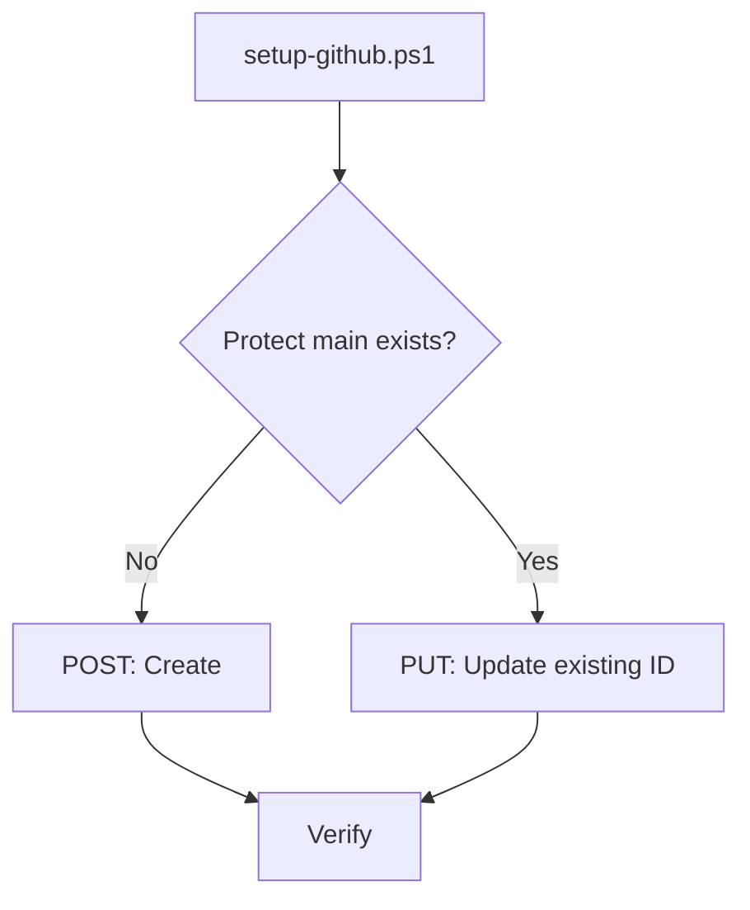
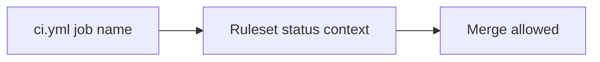
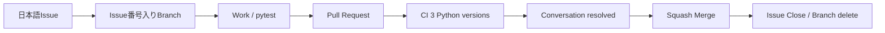

# GitHub Setup

このドキュメントは、このテンプレートから作成したリポジトリへ、推奨するmain保護・Pull Request・CI・Squash Merge設定を適用する方法を説明します。

## 全体像



## 1. 推奨方法

Windows PowerShellで、Cloneしたリポジトリのルートから実行します。

```powershell
.\scripts\setup-github.ps1
```

対象を明示する場合:

```powershell
.\scripts\setup-github.ps1 -Repository owner/repository
```

## 2. GitHub CLI

確認:

```powershell
gh --version
```

未導入で `winget` が使える場合:

```powershell
winget install --id GitHub.cli
```

GitHubへログイン:

```powershell
gh auth login
```

対象リポジトリのRuleset / Repository設定変更には管理権限が必要です。

## 3. 自動設定される内容

### Protect main Ruleset

`github/protect-main.ruleset.json` を使い、Default branchへ次を設定します。



- branch削除禁止
- force push禁止
- linear history必須
- Pull Request経由必須
- Required approvals = 0
- Conversation resolution必須
- Squash Mergeのみ
- `test (3.11)` 必須
- `test (3.12)` 必須
- `test (3.13)` 必須
- Bypassなし

### Repository設定

- Allow squash merging = ON
- Allow merge commits = OFF
- Allow rebase merging = OFF
- Allow auto-merge = OFF
- Automatically delete head branches = ON
- Always suggest updating pull request branches = ON

## 4. 初回実行と再実行

スクリプトは同名の `Protect main` Rulesetを検索します。



そのため、同じスクリプトを再実行してもRulesetを重複作成せず、既存Rulesetを更新します。

## 5. Windows PowerShell 5.1対応

`setup-github.ps1` はWindows PowerShell 5.1での利用を想定し、UTF-8 BOM付きで管理しています。

CIでは次を検査します。

- PowerShell構文
- UTF-8 BOM
- Windows PowerShell 5.1での初回Ruleset作成
- 2回目実行で既存Ruleset更新
- Ruleset重複なし

このスクリプトを変更した場合、上記スモークテストも成功することを確認します。

## 6. 手動Import

GitHub CLIを使わない場合は次のJSONを利用できます。

```text
github/protect-main.ruleset.json
```

GitHub画面の目安:

```text
Settings
  ↓
Rules
  ↓
Rulesets
  ↓
New ruleset
  ↓
Import a ruleset
```

Ruleset JSONだけではリポジトリ全体のMerge設定までは変更されません。手動の場合は `Settings` → `General` → `Pull Requests` も確認します。

```text
Allow merge commits                 OFF
Allow squash merging                ON
Allow rebase merging                OFF
Allow auto-merge                    OFF
Automatically delete head branches  ON
```

## 7. CI名との関係

Rulesetは次のStatus Check名を必須にしています。

```text
test (3.11)
test (3.12)
test (3.13)
```

`.github/workflows/ci.yml` のjob名やPython matrixを変更した場合は、`github/protect-main.ruleset.json` も同じPRで更新します。



名前がずれるとCIが成功していても必須チェックを解決できず、Mergeできなくなる可能性があります。

## 8. 設定後の確認

スクリプトの出力でRepository設定とRulesetを確認します。

例:

```text
Repository settings:
{"allow_merge_commit":false,"allow_rebase_merge":false,"allow_squash_merge":true,...}

Ruleset:
{"id":123456,"name":"Protect main","enforcement":"active"}
```

GitHub側でも `Settings` → `Rules` → `Rulesets` から `Protect main` がActiveであることを確認できます。

## 9. 標準開発フロー



詳細は [DEVELOPMENT.md](DEVELOPMENT.md) を参照してください。

## 10. よくあるエラー

### `gh` が見つからない

GitHub CLIをインストールします。

### GitHubへログインしていない

```powershell
gh auth login
```

### 管理権限がない

対象リポジトリの管理権限が必要です。

### `Resource not accessible by integration`

ChatGPT等のGitHub Appから操作する場合、そのAppのインストール対象へ対象リポジトリが含まれているか確認します。

### Ruleset APIが利用できない

GitHubのプラン・所有者種別・権限等を確認し、必要なら手動Importを利用します。

### CI名変更後にMergeできない

RulesetのRequired Status Check名と `.github/workflows/ci.yml` の実際のJob名を揃えます。

## 11. 関連ドキュメント

- [../GETTING-STARTED.md](../GETTING-STARTED.md)
- [DEVELOPMENT.md](DEVELOPMENT.md)
- [DEPLOYMENT.md](DEPLOYMENT.md)
