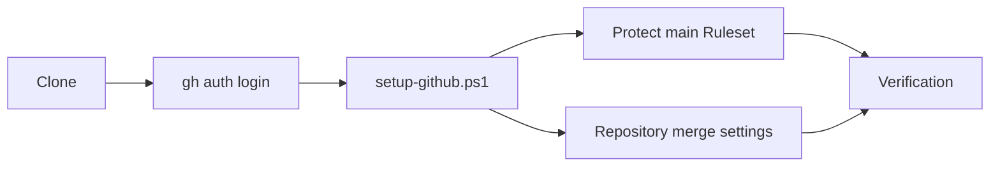
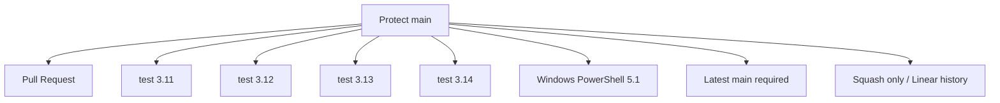
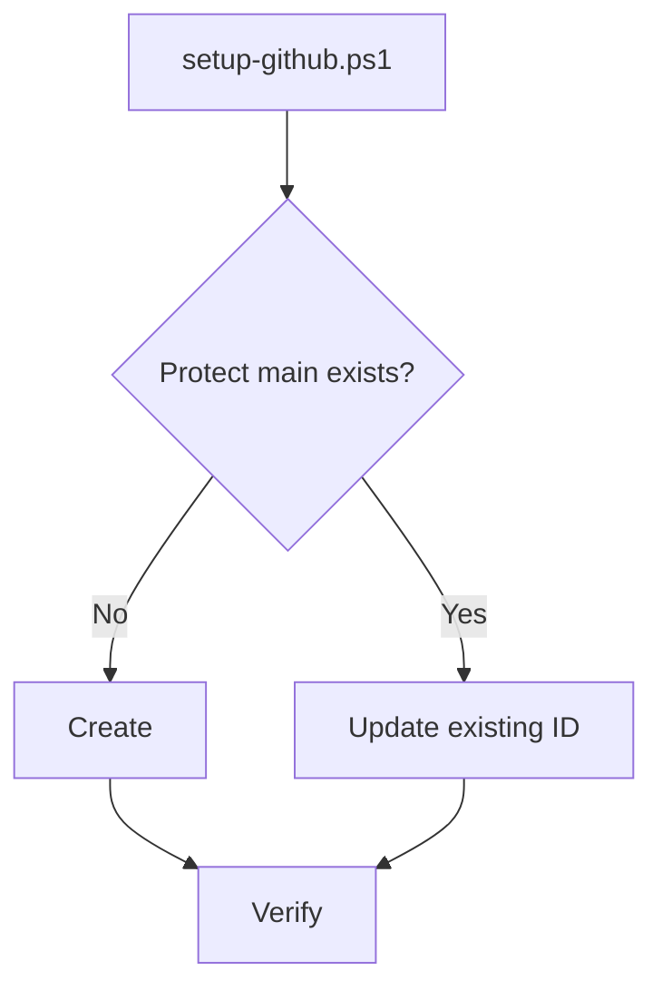
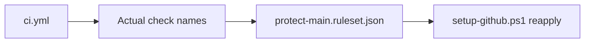
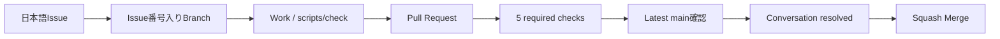

# GitHub Setup

このドキュメントは、このテンプレートから作成したリポジトリへmain保護・Pull Request・CI・Squash Merge設定を適用する方法を説明します。

**Git / GitHubの用語やGitHub Desktopの操作自体がまだ分からない場合は、先に [../BEGINNER-GUIDE.md](../BEGINNER-GUIDE.md) を読んでください。** このドキュメントは「Gitをどう使うか」ではなく、「Repositoryを安全な運用ルールに設定する方法」を扱います。

## 全体像



## 1. 推奨方法

Windows PowerShellでCloneしたリポジトリから実行します。

```powershell
.\scripts\setup-github.ps1
```

対象を明示する場合:

```powershell
.\scripts\setup-github.ps1 -Repository owner/repository
```

## 2. GitHub CLI

```powershell
gh --version
gh auth login
```

GitHub CLIが未導入で `winget` を利用できる場合:

```powershell
winget install --id GitHub.cli
```

Ruleset / Repository設定変更には対象リポジトリの管理権限が必要です。

## 3. Protect main Ruleset

`github/protect-main.ruleset.json` を使い、Default branchへ次を設定します。

- branch削除禁止
- force push禁止
- linear history必須
- Pull Request経由必須
- Required approvals = 0
- Conversation resolution必須
- Squash Mergeのみ
- Bypassなし
- **Required Status ChecksはStrict**

Required Status Check:

```text
test (3.11)
test (3.12)
test (3.13)
test (3.14)
windows-powershell-51
```

Strictでは、PRのCIが一度Greenになっていても、その後mainが更新された場合は最新mainとの組み合わせで再確認してからMergeします。古いbaseでGreenだったPRをそのまま取り込まず、merge直前の互換性を確認するための設定です。



## 4. Repository設定

- Allow squash merging = ON
- Allow merge commits = OFF
- Allow rebase merging = OFF
- Allow auto-merge = OFF
- Automatically delete head branches = ON
- Always suggest updating pull request branches = ON

## 5. 初回実行と再実行



同名Rulesetが存在する場合は既存IDを更新し、重複作成しません。テンプレート側でRequired CheckやStrict条件が変わった場合も、スクリプトを再実行して設定を同期できます。

## 6. CIとRulesetはセットで変更する

`.github/workflows/ci.yml` のjob / matrixを変更した場合は、同じPRで `github/protect-main.ruleset.json` も確認します。



名前が一致しないRequired Checkを設定すると、CIが成功していてもMergeできなくなる可能性があります。

## 7. GitHub Actions Supply Chain

外部GitHub Actionはfloating tagではなく、確認済みの**full commit SHA**へ固定します。

```yaml
uses: actions/checkout@<40-character-commit-sha> # v7
```

- full SHAを実行対象の不変な参照として扱う
- 可読性のため末尾コメントに対応major versionを残す
- `.github/dependabot.yml` の `github-actions` 更新で新しい既知良好SHAを追跡する
- Action更新PRも通常CIを通してから取り込む

lifecycle testはCI内の外部 `uses:` が40文字SHAで固定されていることを確認します。

## 8. 現在のCI内容

Python matrixの各jobでは:

- 全PowerShellスクリプト構文確認
- `setup-github.ps1` UTF-8 BOM確認
- 全shellスクリプト構文確認
- Python依存インストール
- `pip check`
- Ruff lint
- Ruff format check
- pytest + Coverage 80%以上
- Repository内Markdownリンク整合性

`windows-powershell-51` では:

- Windows PowerShell 5.1で全 `.ps1` のParser確認
- `setup-github.ps1` 初回Ruleset作成
- 2回目実行で既存Ruleset更新
- Ruleset重複なし

をモックGitHub CLIで確認します。

## 9. Windows PowerShell 5.1対応

`setup-github.ps1` はUTF-8 BOM付きで管理します。`.editorconfig` でもこのファイルだけ `utf-8-bom` を指定しています。

このスクリプトを編集するときは文字コードをBOMなしUTF-8へ変換しないでください。CIが検出します。

## 10. 手動Import

GitHub CLIを使わない場合は:

```text
github/protect-main.ruleset.json
```

をGitHubのRulesets画面からImportできます。

```text
Settings
  ↓
Rules
  ↓
Rulesets
  ↓
New ruleset
  ↓
Import a ruleset
```

ただしRuleset JSONだけではリポジトリ全体のMerge設定は変更されません。`Settings` → `General` → `Pull Requests` も確認します。

## 11. 設定後の確認

スクリプト出力例:

```text
Repository settings:
{"allow_merge_commit":false,"allow_rebase_merge":false,"allow_squash_merge":true,...}

Ruleset:
{"id":123456,"name":"Protect main","enforcement":"active"}
```

GitHub画面では `Settings` → `Rules` → `Rulesets` から確認できます。Required Status Checksの **Require branches to be up to date before merging** 相当が有効であることも確認します。

## 12. 公開テンプレートの表示設定

テンプレート本体を公開Repositoryとして運用する場合は、次を推奨します。

- Template repository = ON
- Wiki = OFF（正本ドキュメントをREADME / `docs/`へ集約）
- Topics例: `python`, `flask`, `sqlite`, `tailscale`, `webapp-template`, `starter-template`

この表示設定は派生アプリでは用途が変わるため、`setup-github.ps1` から強制しません。テンプレート本体または各Repositoryの管理者が用途に合わせて設定します。

## 13. 標準開発フロー



このフローをGitHub Desktopで実際に一度練習する手順は [../BEGINNER-GUIDE.md](../BEGINNER-GUIDE.md) を参照してください。

## 14. よくあるエラー

### `gh` が見つからない

GitHub CLIを導入します。

### GitHubへログインしていない

```powershell
gh auth login
```

### 管理権限がない

対象リポジトリの管理権限が必要です。

### `Resource not accessible by integration`

ChatGPT等のGitHub Appを使う場合、対象リポジトリがAppのRepository accessへ含まれているか確認します。Ruleset、Topics、Wiki等のRepository管理設定は、接続AppにAdministration writeが無い場合は変更できません。

### CI追加後にMergeできない

実際のCheck名とRuleset JSONを確認し、`setup-github.ps1` を再実行して既存Rulesetを同期します。Strict Rulesetではmain更新後にPR branchの更新が必要になる場合があります。

## 関連ドキュメント

- [../BEGINNER-GUIDE.md](../BEGINNER-GUIDE.md) - Git / GitHub / GitHub Desktopの初心者向け説明
- [../GETTING-STARTED.md](../GETTING-STARTED.md)
- [../.github/SECURITY.md](../.github/SECURITY.md) - 脆弱性報告ポリシー
- [DEVELOPMENT.md](DEVELOPMENT.md)
- [QUALITY-VERIFICATION.md](QUALITY-VERIFICATION.md)
- [DEPLOYMENT.md](DEPLOYMENT.md)
