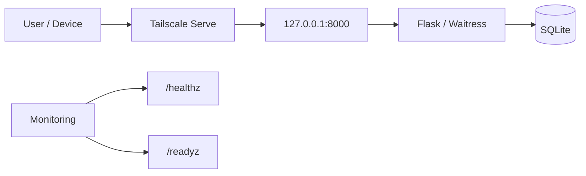
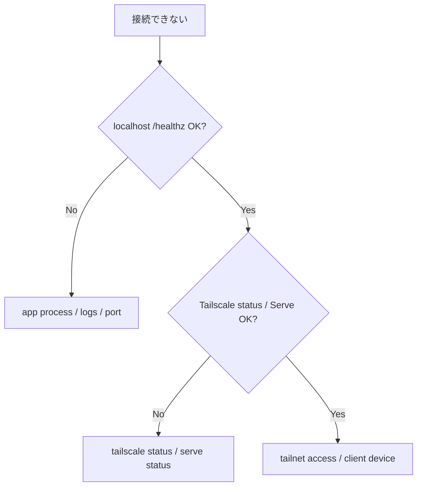
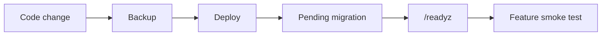

# Operations Runbook

このドキュメントは、このテンプレートから作成したPython / Flask + SQLite + Tailscaleアプリを日常運用するときの共通Runbookです。案件固有の連絡先・監視頻度・業務停止条件は各アプリ側で追記します。

## 全体像



## 1. 日常確認

最低限、次を確認します。

- アプリプロセスが起動している
- `/healthz` がHTTP 200を返す
- `/readyz` がHTTP 200を返す
- Tailscale Serve経由で対象端末から到達できる
- `data/` の空き容量に余裕がある
- Backupが想定どおり取得できている

`/healthz` はWebプロセスの生存確認、`/readyz` はSQLiteへ `SELECT 1` できることの確認です。どちらも業務データや秘密情報を返しません。

## 2. 起動前診断

開発PC・稼働PCで構成を切り分けるときはdoctorを先に実行します。

```powershell
python -m scripts.doctor
```

稼働PCでruntime venvを使用する場合:

```powershell
.\.venv\Scripts\python.exe -m scripts.doctor
```

主な確認対象:

- Python 3.11以上
- Repository必須ファイル
- `.venv`
- `.env`
- `APP_DATA_DIR`
- Git / GitHub CLI / Tailscale command

`.venv`、`.env`、optional commandが無い場合は警告です。Python version不適合、必須ファイル欠落、`APP_DATA_DIR` の異常はFAILです。

## 3. 起動・停止

Windows:

```powershell
.\scripts\start.ps1
```

macOS / Linux:

```bash
./scripts/start.sh
```

アプリは `127.0.0.1` のみにbindします。外部端末からの入口はTailscale Serveです。

停止は、アプリを起動しているconsole / service managerから正常終了させます。SQLite Restoreや大きな保守作業の前はアプリを停止してください。

## 4. Tailscale Serve

Windows:

```powershell
.\scripts\tailscale-serve.ps1
```

macOS / Linux:

```bash
./scripts/tailscale-serve.sh
```

接続できない場合の確認順:



Flask / Waitressを `0.0.0.0` へ変更して回避しません。

## 5. Backup

アプリ稼働中でもSQLite backup APIを使って整合性のあるBackupを作成できます。

```powershell
.\.venv\Scripts\python.exe -m scripts.db_tools backup
```

既定では `backups/` に日時付きDBを作成し、作成後に `PRAGMA quick_check` を確認します。

重要なMigration、データ削除、アプリ更新の前はBackupを取得します。

## 6. Integrity check

```powershell
.\.venv\Scripts\python.exe -m scripts.db_tools check
```

異常時は書き込みを続ける前に、直近Backup、disk状態、アプリログを確認します。

## 7. Restore

Restoreはアプリ停止後に実行します。

```powershell
.\.venv\Scripts\python.exe -m scripts.db_tools restore backups\app-YYYYMMDD-HHMMSS-xxxxxx.db --yes
```

Restore処理は次を行います。

1. Restore元Backupの `quick_check`
2. 現在DBの `pre-restore` safety backup
3. 一時DBへ復元
4. 一時DBの整合性確認
5. stale `-wal` / `-shm` の除去
6. DB置換
7. 復元後DBの整合性確認

Restore後は `/readyz` と対象業務の最小ケースを確認します。

## 8. Migrationを伴う更新



アプリ起動時に未適用Migrationが実行されます。

- 適用済みMigrationを書き換えない
- version番号を再利用しない
- destructive変更前にBackupを取得
- 旧コードへ戻した場合のSchema互換性を確認

## 9. 障害切り分け

### `/healthz` が失敗

- アプリプロセスが起動しているか
- `APP_PORT` が競合していないか
- Python / venvが正しいか
- 起動consoleの例外
- 直近変更

### `/healthz` は成功、`/readyz` が失敗

- `APP_DATA_DIR`
- SQLiteファイルの存在・権限
- disk空き容量
- `scripts.db_tools check`
- Migrationエラー

### localhostは成功、Tailscale経由だけ失敗

- Tailscale daemon / login状態
- `tailscale status`
- Serve設定
- tailnet側のGrants / ACLs
- 利用端末が同じ許可範囲にいるか

### 認証だけ失敗

- Tailscale Serve経由か
- identity headerを受ける接続がloopback経由になっているか
- local owner設定を利用している場合は `.env` の値

## 10. アプリ更新

稼働PCへ反映するときは [DEPLOYMENT.md](DEPLOYMENT.md) を基準にします。

標準確認:

1. merge済みmainを使用
2. `python -m scripts.doctor`
3. 必要ならBackup
4. dependency更新
5. アプリ再起動
6. `/healthz`
7. `/readyz`
8. feature smoke test

## 11. ロールバック

コードだけの変更でDB互換性がある場合は直前の正常Commitへ戻せます。Migrationを伴う場合は、旧コードが新Schemaを扱えるか確認してください。

DB自体を戻す必要がある場合は、アプリ停止後にRestoreを使います。コードRollbackとDB Restoreを無計画に組み合わせず、どの時点へ戻すかを先に決めます。

## 12. 各アプリ側で追記するもの

- 稼働PC名 / 設置場所
- 利用URL / tailnet名
- Backup保存先・保持期間
- 監視頻度
- 障害連絡先
- 許容停止時間
- 外部API / 通知 / batchがある場合の復旧手順
