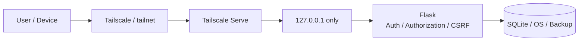
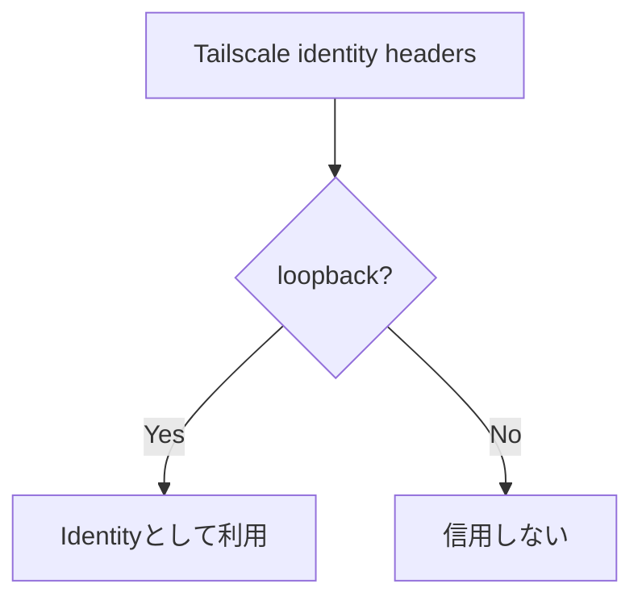
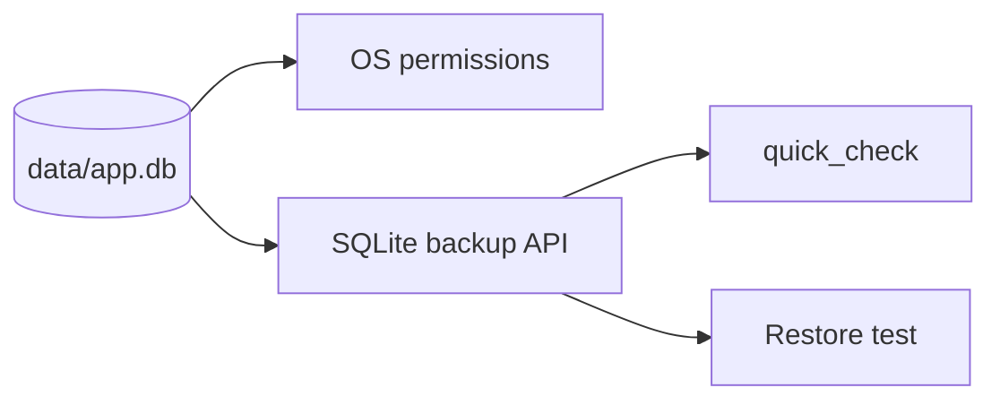
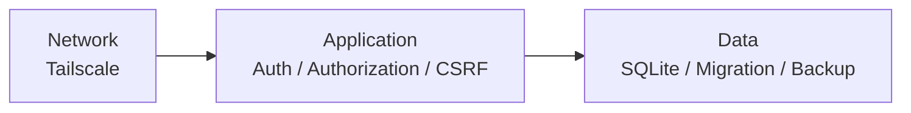

# Security

このテンプレートはインターネット一般公開ではなく、自宅・社内・小規模チーム向けのクローズドWebアプリを想定しています。

Tailscaleだけを唯一の防御にせず、ネットワーク、アプリ、保存データの複数層で守ります。

## セキュリティ境界



## 1. localhost限定

Flask / Waitressは `127.0.0.1` のみにbindします。

```text
127.0.0.1:8000  推奨
0.0.0.0:8000    使用しない
```

外部端末からの入口はTailscale Serveにします。`run.py` は意図しない外部bindを拒否します。

## 2. Tailscale利用者ヘッダーの信頼条件

`Tailscale-User-Login` / `Tailscale-User-Name` は、`request.remote_addr` がloopbackの場合だけ認証情報として利用します。



## 3. 認証と認可

Tailscaleで「誰か」を識別できても、アプリ内の全データを操作できるとは限りません。

```sql
WHERE id = ? AND owner_user_id = ?
```

画面表示だけでなくService / SQLでも所有者・権限を確認します。詳細は [AUTH-CRUD.md](AUTH-CRUD.md) を参照してください。

## 4. CSRF

POST / PUT / PATCH / DELETEなど状態変更リクエストは既存CSRF保護の対象です。独自Route / APIでも理由なく外しません。

## 5. セキュリティヘッダー

初期状態で主に次を設定します。

- Content Security Policy
- iframe埋め込み防止
- MIME sniffing防止
- Referrer抑制
- HTML / JSONの `no-store`
- Session Cookie `HttpOnly`
- Session Cookie `SameSite=Strict`
- Jinja HTML escaping
- 不要なCORSを有効化しない

## 6. 秘密情報・実データ

GitHubへ登録しないもの:

```text
.env
data/
backups/
*.db / *.db-wal / *.db-shm
data/.secret_key
個人・組織固有のtailnet情報
その他の秘密情報
```

Backup DBも本番DBと同じ機密性を持つと考えます。`backups/` が `.gitignore` に入っていても、外部保存先のアクセス権や暗号化は別途管理します。

## 7. SQLiteデータの保護



共通 `scripts.db_tools` でBackup / integrity check / Restoreを行えます。Restore前には既存DBの `pre-restore` safety backupを作成します。

詳細は [SQLITE-SETUP.md](SQLITE-SETUP.md) を参照してください。

## 8. Migrationの安全性

運用開始後は適用済みMigrationを書き換えず、新しい番号付きSQLを追加します。

- Schema変更前にBackup
- Migrationテストを追加
- 既存データを保持できるか確認
- ロールバック方法を確認

Migration SQLと `schema_migrations` への履歴登録は同じSQLite transaction内で行います。

## 9. Health / Readiness

- `/healthz`: Webプロセス生存確認
- `/readyz`: SQLiteへの `SELECT 1`

これらは認証不要ですが、業務データや秘密情報を返しません。監視アクセスでは利用者レコードを作成しません。

## 10. ホストPCも信頼境界

ホストPC上の十分な権限を持つプロセスはlocalhostへアクセスできます。

- OS更新
- PCログイン保護
- 不審なソフトウェアを実行しない
- `.env` / SQLite / Backup /秘密鍵のアクセス権管理
- 不要な共有フォルダーへDBを置かない

## 11. Tailscaleのアクセス範囲

必要に応じてTailscale Grants / ACLsでアプリへ到達できる利用者・端末を絞ります。ネットワーク到達制御とアプリ内認可は両方維持します。

## 12. 避ける構成

- `0.0.0.0` へのbind
- ルーターのポート開放
- DMZへの配置
- クローズド用途でのTailscale Funnel
- Tailscale Identity Headerを外部接続から信用
- `.env` / `data/` / `backups/` のGitHub登録
- SQLiteファイルをネットワーク共有し複数サーバーから同時利用
- 認可を画面表示だけで実装
- CSRF / CSPを理由なく無効化

## 13. カスタマイズ時のチェック

- 他利用者のIDを指定して参照・更新・削除できない
- 未認証アクセスを拒否する
- 更新APIにCSRFがある
- `.env` / `data/` / `backups/` がGit管理対象外
- Flaskが `127.0.0.1` のみ
- Tailscale側の公開範囲が広すぎない
- Migration前にBackupがある
- Backupの `quick_check` が成功する
- セキュリティ変更を自動テストしている

## 防御の考え方


