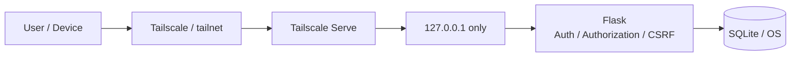
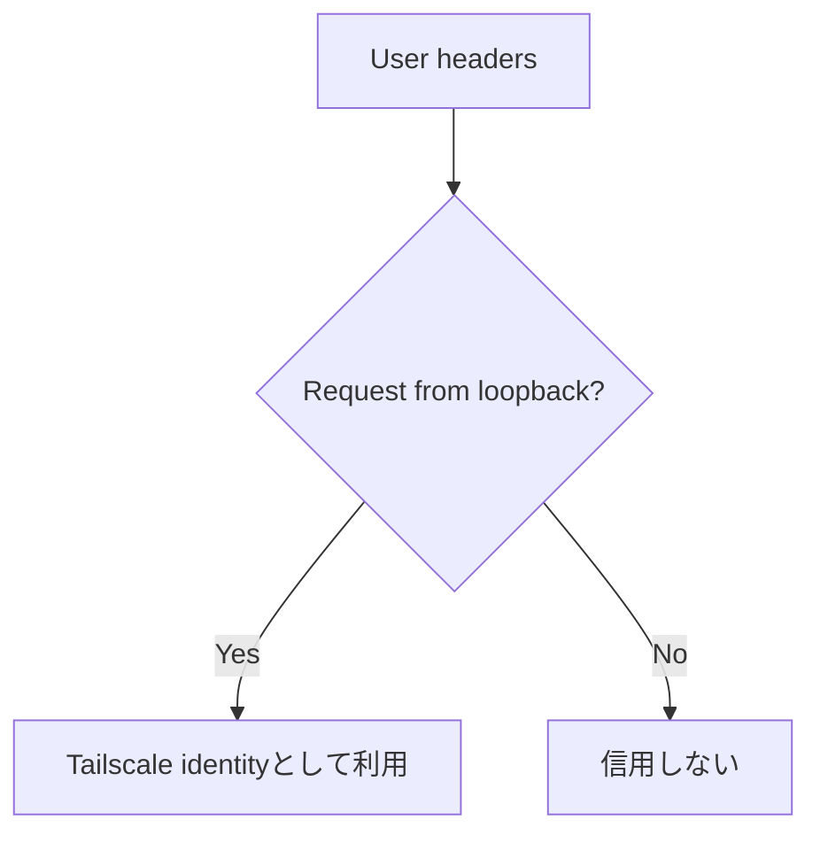
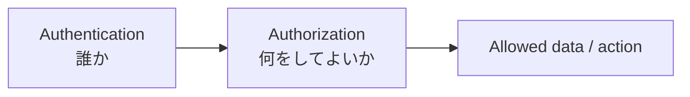
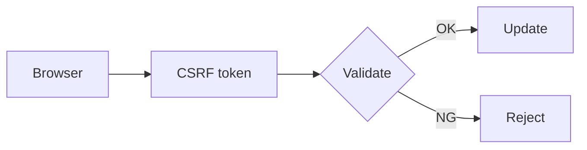
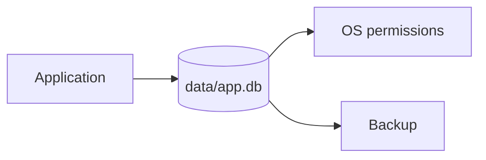
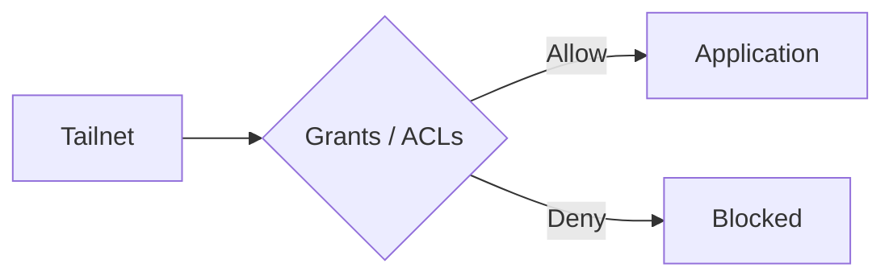
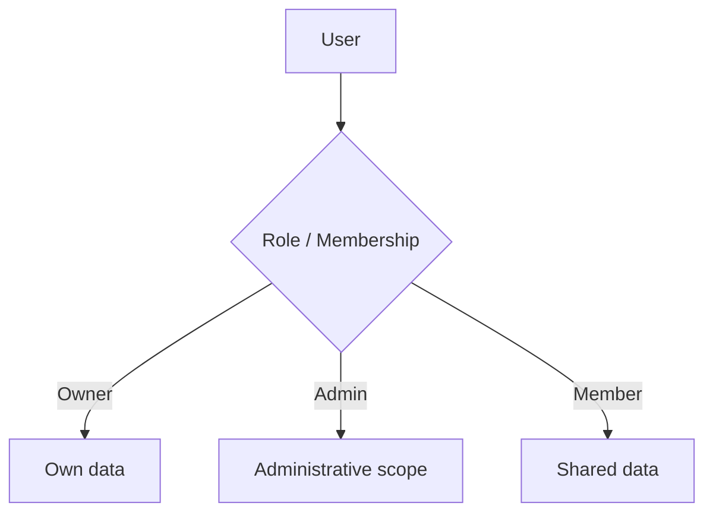
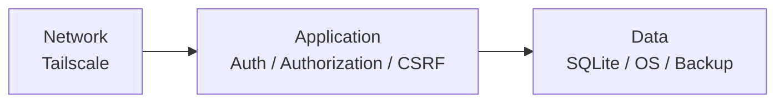

# Security

このテンプレートはインターネット一般公開ではなく、自宅・社内・小規模チーム向けのクローズドWebアプリを想定しています。

ただし、Tailscaleだけを唯一の防御にしません。ネットワーク、アプリ、保存データの複数層で守ります。

## セキュリティ境界



## 1. localhost限定

Flask / Waitressは `127.0.0.1` のみにbindします。

```text
127.0.0.1:8000  推奨
0.0.0.0:8000    使用しない
```

外部端末からの入口はTailscale Serveにします。`run.py` は意図しない外部bindを防ぐ設計です。

## 2. Tailscale利用者ヘッダーの信頼条件

Tailscale Serveは次の利用者情報をバックエンドへ渡せます。

```text
Tailscale-User-Login
Tailscale-User-Name
```

`app/auth.py` は `request.remote_addr` がloopbackの場合だけこれらを信用します。



これにより、外部クライアントが同名ヘッダーを勝手に付けてなりすますことを防ぎます。

## 3. 認証と認可を分ける



Tailscaleで利用者を識別できても、アプリ内のすべてのデータを操作してよいとは限りません。

サンプル `items` はSQLで `owner_user_id` を条件に含め、本人のデータだけを操作します。

```sql
WHERE id = ? AND owner_user_id = ?
```

画面上でボタンを隠すだけでは認可になりません。Service / SQL側でも必ず判定します。

詳細は [AUTH-CRUD.md](AUTH-CRUD.md) を参照してください。

## 4. CSRF

POST / PUT / PATCH / DELETEなど状態変更リクエストはCSRF対策の対象です。



独自Route / APIを追加するときも既存のCSRF保護を外さないでください。

## 5. セキュリティヘッダー

初期状態ではCSP等のセキュリティヘッダーを設定します。用途上必要な変更を行う場合も、単に無効化するのではなく必要最小限の許可へ調整します。

主な方針:

- Content Security Policy
- iframe等への埋め込み防止
- MIME sniffing防止
- Referrer情報の抑制
- HTML / JSONの `no-store`
- セッションCookie `HttpOnly`
- セッションCookie `SameSite=Strict`
- JinjaのHTMLエスケープ
- 不要なCORSを有効化しない

## 6. 秘密情報

GitHubへ登録しないもの:

```text
.env
data/
data/app.db
data/.secret_key
個人・組織固有の秘密情報
```

`APP_SECRET_KEY` が未設定の場合、テンプレートは秘密鍵を `data/.secret_key` へ生成します。`data/` はGit管理対象外です。

本格運用で環境変数へ秘密鍵を設定する場合も、値を `.env.example`、README、Issue、PRへ記載しません。

## 7. SQLiteデータの保護



セキュリティには機密性だけでなく、データを失わないことも含まれます。

- DBファイルのOSアクセス権を適切に管理
- 定期バックアップ
- Schema変更前バックアップ
- 復元テスト

詳細は [SQLITE-SETUP.md](SQLITE-SETUP.md) を参照してください。

## 8. ホストPCも信頼境界

ホストPC上の十分な権限を持つプロセスはlocalhostへアクセスできる可能性があります。

したがって次も必要です。

- OS更新
- PCログイン保護
- 不審なソフトウェアを実行しない
- `.env` / SQLite /秘密鍵のアクセス権管理
- 不要な共有フォルダーへデータを置かない

## 9. Tailscaleのアクセス範囲

必要に応じてTailscale Grants / ACLsでアプリへ到達できる利用者・端末を絞ります。



ネットワーク到達制御とアプリ内認可は両方維持します。

## 10. 避ける構成

- `0.0.0.0` へのbind
- ルーターのポート開放
- DMZへの配置
- クローズド用途でのTailscale Funnel
- Tailscale利用者ヘッダーを外部接続から信用
- `.env` / `data/` のGitHub登録
- SQLiteファイルをネットワーク共有し複数サーバーから同時利用
- 認可を画面表示だけで実装
- CSRF / CSPを理由なく無効化

## 11. 管理者・共有データを追加する場合

単純な `owner_user_id` だけでは表現できない場合、Roleや共有関係を明示的に設計します。



Tailscale所属だけを管理者判定の代わりにしません。

## 12. カスタマイズ時のチェック

- 他利用者のIDを指定して参照・更新・削除できない
- 未認証アクセスを拒否する
- 更新APIにCSRFがある
- 入力文字列が意図せずHTML / scriptとして実行されない
- `.env` / `data/` がGit管理対象外
- Flaskが `127.0.0.1` のみ
- Tailscale Serve経由の利用者が正しい
- Tailscale側で公開範囲が広すぎない
- DBバックアップがある
- セキュリティ変更をpytestで確認した

## 13. 防御の考え方



どれか1層だけに依存せず、複数層を組み合わせることがこのテンプレートの基本方針です。
