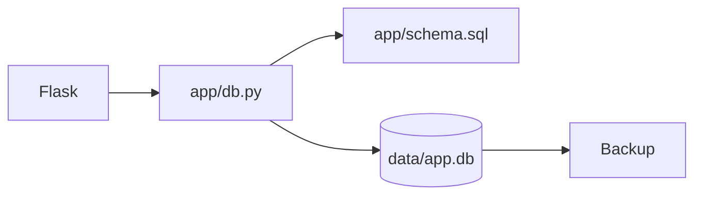
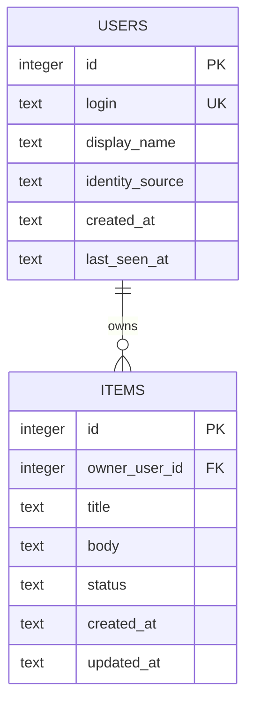
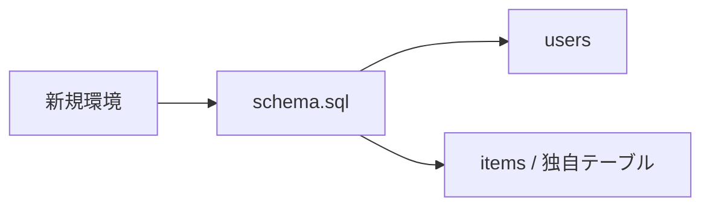
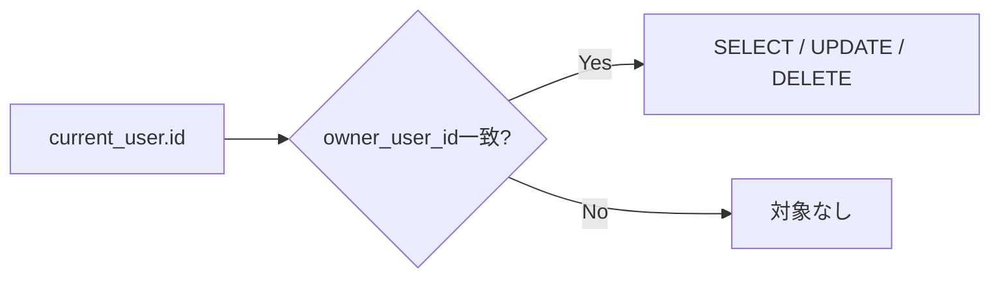
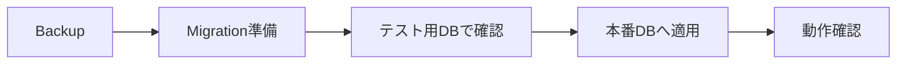
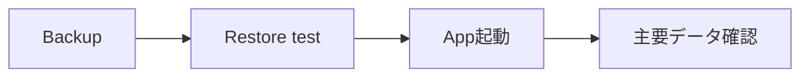

# SQLite Setup

このテンプレートのデータは、別途DBサーバーを用意せず、ホストPC上のSQLiteへ保存します。

## 全体像



## 1. 初回作成

アプリ起動時に `app/schema.sql` が実行され、既定では `data/app.db` が作成されます。

```text
data/app.db
```

`data/` はGit管理対象外です。実データをGitHubへコミットしません。

## 2. サンプルSchema

初期状態では `users` と `items` を持ちます。



`items.owner_user_id` は `users.id` を参照し、利用者ごとのデータ分離に使います。

## 3. 接続設定

`app/db.py` はリクエスト単位でSQLite接続を管理し、次を有効にします。

- `PRAGMA foreign_keys = ON`
- `PRAGMA journal_mode = WAL`
- `sqlite3.Row`

Routeや画面から直接DB接続を乱立させず、既存の `get_db()` を利用します。

## 4. `schema.sql` の役割

`app/schema.sql` は新規環境の初期構築用です。



開発初期で実データがなければ、Schemaを大きく変更して構いません。運用開始後は既存DBを作り直すのではなく、移行手順を用意します。

## 5. 独自テーブルへ変更する

サンプル `items` を独自テーブルへ置き換える場合は、データ所有関係も同時に設計します。

```sql
CREATE TABLE equipment (
    id INTEGER PRIMARY KEY AUTOINCREMENT,
    owner_user_id INTEGER NOT NULL,
    name TEXT NOT NULL,
    FOREIGN KEY(owner_user_id) REFERENCES users(id) ON DELETE CASCADE
);
```

本人だけが扱うデータなら、ServiceのSQLで `owner_user_id` を条件に含めます。

## 6. 認可はSQLでも行う

画面で他人のデータを非表示にするだけでは不十分です。



サンプル実装は `app/services/items.py` で所有者条件を付けています。詳細は [AUTH-CRUD.md](AUTH-CRUD.md) を参照してください。

## 7. 開発中のリセット

実データをまだ扱っていない開発初期なら、アプリ停止後に `data/app.db` を削除し、再起動して `schema.sql` から作り直す方法を使えます。

**運用開始後のDBではこの方法を使わないでください。** データを失います。

## 8. 運用開始後のSchema変更

実データがある場合は次の流れを推奨します。



小規模なら番号付きSQLと `schema_migrations` テーブルでも管理できます。変更が複雑になった場合はSQLAlchemy / Alembic等への移行を検討できます。

## 9. バックアップ

SQLiteの正本はホストPCです。GitHubはバックアップではありません。

最低限、次を決めます。

- 保存先
- 頻度
- 世代数
- 暗号化やアクセス権
- 復元テスト

書き込み中のDBファイルを単純コピーするより、SQLiteのbackup APIや整合性を保てる方法を利用することを推奨します。

## 10. 復元確認

バックアップは「取得した」だけでは不十分です。定期的に別ファイルへ復元し、アプリから読み取れることを確認します。



## 11. SQLiteが向いている範囲

このテンプレートは1台のホストPCで動く個人・家庭・小規模チーム向けです。

次の要件が出てきたらPostgreSQL等のクライアント/サーバー型DBを検討します。

- 複数サーバーから同一DBへ接続
- 高頻度な同時書き込み
- 大規模公開サービス
- 高可用性 / DB冗長化

SQLiteファイルをネットワーク共有へ置いて複数サーバーから直接扱う構成にはしません。

## 12. チェックリスト

- `data/` がGit管理対象外である
- `foreign_keys` が有効である
- 独自テーブルの所有・共有ルールが決まっている
- SQLで認可している
- Schema変更前にバックアップしている
- 復元手順を確認している
