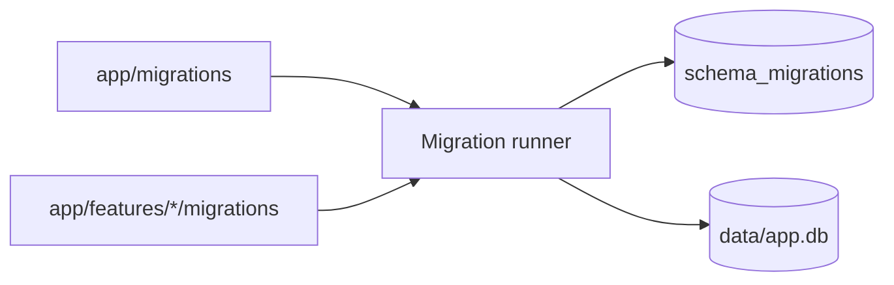
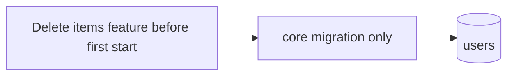
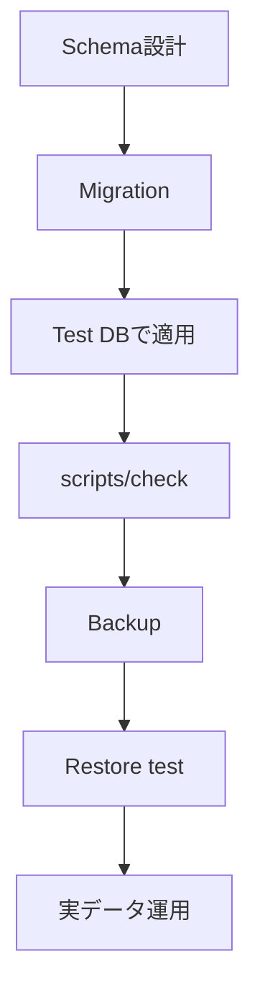

# SQLite Setup / Migration / Backup

このテンプレートではSQLite接続・Migration runner・Backup / Restoreを**共通基盤**として持ち、業務Schemaはcoreまたは各featureのMigrationへ分けます。

## 全体像



## Migrationの場所

共通core:

```text
app/migrations/*.sql
```

feature固有:

```text
app/features/*/migrations/*.sql
```

Migration runnerは両方を検出し、version番号順に適用します。versionはリポジトリ全体で重複させません。

初期状態:

```text
app/migrations/001_initial.sql
└─ users                     共通利用者

app/features/items/migrations/002_sample_items.sql
└─ items                     削除可能なサンプル
```

## itemsサンプルを使わない新規アプリ

**初回起動前**なら次だけで構いません。

```text
app/features/items/ を削除
```

items Migrationもfeature folder内にあるため、初回起動時には検出されず `items` テーブルは作成されません。



## 既にversion 1を適用したDBとの互換性

Issue #21より前のテンプレートでは、version 1の `001_initial.sql` が `users` と `items` の両方を作成していました。

分離後は:

- version 1: core `users`
- version 2: sample `items`

です。

既存DBでは `schema_migrations` にversion 1 `initial` が記録済みなのでversion 1を再実行しません。version 2は `CREATE TABLE IF NOT EXISTS` / `CREATE INDEX IF NOT EXISTS` で適用されるため、既存itemsデータを削除せずsample Migrationの適用履歴だけ追加できます。この互換動作は自動テストしています。

## 適用済みMigrationは書き換えない

通常のアプリ開発では、一度適用したMigrationを後から変更しません。

例:

```text
001_initial.sql
002_sample_items.sql
003_equipment.sql
004_add_equipment_category.sql
```

実運用後のSchema変更は新しい番号を追加します。

> version 1のcore/sample分離はテンプレート自身の構造変更に伴う互換移行です。独自アプリ運用では同じ方法で適用済みMigrationを書き換えず、新Migrationを追加してください。

## SQLite接続設定

`app/db.py` は接続ごとに次を有効化します。

```sql
PRAGMA foreign_keys = ON;
PRAGMA journal_mode = WAL;
```

- Foreign Keyを有効化
- WALで通常利用時の読み書きを扱いやすくする

## `schema_migrations`

適用履歴は次の共通テーブルで管理します。

```text
version
name
applied_at
```

同じversionは2回適用しません。version重複やname変更はエラーにします。

## featureを追加するとき

設備管理featureの例:

```text
app/features/equipment/
└─ migrations/
   └─ 003_equipment.sql
```

feature packageとSchemaを同じ境界に置くことで、どのテーブルがどの機能に属するかを初心者でも追いやすくします。

## Backup

Windows:

```powershell
.\.venv\Scripts\python.exe -m scripts.db_tools backup
```

macOS / Linux:

```bash
.venv/bin/python -m scripts.db_tools backup
```

SQLite backup APIを利用し、既定では `backups/` へ日時付きDBを作成します。

## Integrity check

```powershell
.\.venv\Scripts\python.exe -m scripts.db_tools check
```

内部で `PRAGMA quick_check` を確認します。

## Restore

アプリを停止してから明示実行します。

```powershell
.\.venv\Scripts\python.exe -m scripts.db_tools restore backups\app-YYYYMMDD-HHMMSS-xxxxxx.db --yes
```

Restore前には現在DBの `pre-restore` Backupを作成します。古い `-wal` / `-shm` も安全に処理します。

## 実データ運用前の確認



MigrationとBackupは別物です。GitHubへSQLを保存していてもSQLite実データのBackupにはなりません。
