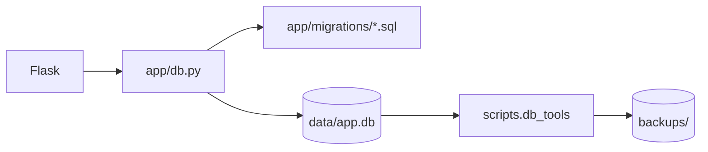
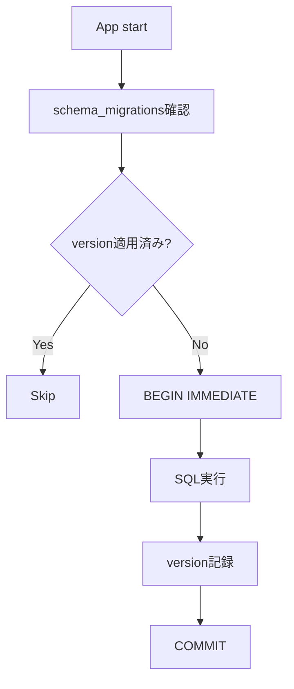
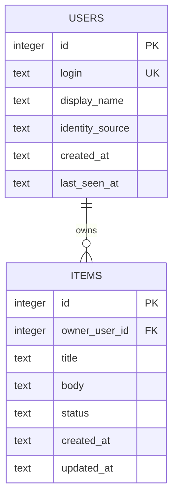
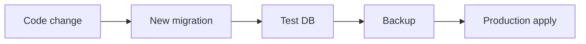
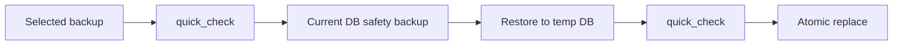

# SQLite Setup

このテンプレートのデータはホストPC上のSQLiteへ保存します。DBサーバーは不要です。Schema変更は番号付きMigration、保全は共通Backup / Restoreツールで扱います。

## 全体像



## 1. 初回作成

アプリ起動時に `app/db.py` が `app/migrations/` のSQLを番号順に確認し、未適用分だけ実行します。

初期状態:

```text
app/migrations/
└─ 001_initial.sql
```

既定DB:

```text
data/app.db
```

適用履歴:

```text
schema_migrations
  version
  name
  applied_at
```

`data/` はGit管理対象外です。

## 2. Migrationの命名

形式:

```text
NNN_name.sql
```

例:

```text
001_initial.sql
002_add_category.sql
003_add_audit_log.sql
```

Version番号は重複させません。Migration名を適用後に変更すると、コード側が不整合として検出します。

## 3. Migrationの実行



Migration SQLと履歴登録は同じSQLite transaction内で処理します。途中で失敗した場合はMigrationを適用済みとして記録しません。

## 4. 既存テンプレートDBからの移行

旧版では `schema.sql` により `users` / `items` が既に作成されていました。現在の `001_initial.sql` は `CREATE TABLE IF NOT EXISTS` を使うため、旧Schemaを持つDBでも既存データを消さずに初回Migration履歴を登録できます。

Migrationテストでは、この既存Schemaからのbaselineも確認しています。

## 5. サンプルSchema



`items.owner_user_id` により利用者別データ分離を行います。

## 6. SQLite接続設定

`app/db.py` はリクエスト単位に接続し、次を有効にします。

- `PRAGMA foreign_keys = ON`
- `PRAGMA journal_mode = WAL`
- `sqlite3.Row`

RouteやTemplateから独自に接続を作らず、共通 `get_db()` を使います。

## 7. 新しいテーブル・列を追加する

運用開始前でまだデータを持たない独自アプリ化の初期段階なら、`001_initial.sql` を自分の初期Schemaへ作り替えて構いません。

実データを保存し始めた後は、既存Migrationを書き換えず追加します。

```sql
-- 002_add_category.sql
ALTER TABLE items ADD COLUMN category TEXT NOT NULL DEFAULT '';
CREATE INDEX idx_items_category ON items(category);
```



SQLiteのALTER TABLE制約で複雑な変更が必要な場合は、新テーブル作成 → データコピー → rename等のMigrationを用意します。

## 8. 認可はSQLでも行う

利用者本人だけが扱うデータなら、所有者列を持たせます。

```sql
CREATE TABLE equipment (
    id INTEGER PRIMARY KEY AUTOINCREMENT,
    owner_user_id INTEGER NOT NULL,
    name TEXT NOT NULL,
    FOREIGN KEY(owner_user_id) REFERENCES users(id) ON DELETE CASCADE
);
```

取得・更新・削除では `owner_user_id` を条件に含めます。画面上の非表示だけを認可として使いません。

## 9. Backup

共通ツールはSQLiteのbackup APIを使うため、単純なファイルコピーより整合性を保ちやすい方法です。

Windows:

```powershell
.\.venv\Scripts\python.exe -m scripts.db_tools backup
```

macOS / Linux:

```bash
.venv/bin/python -m scripts.db_tools backup
```

既定保存先:

```text
backups/app-YYYYMMDD-HHMMSS-ffffff.db
```

Backup作成後は自動で `PRAGMA quick_check` を実行します。`backups/` はGit管理対象外です。

保存先を変更する場合:

```powershell
.\.venv\Scripts\python.exe -m scripts.db_tools backup --backup-dir D:\SQLiteBackup
```

## 10. Integrity check

現在DB:

```powershell
.\.venv\Scripts\python.exe -m scripts.db_tools check
```

任意DB:

```powershell
.\.venv\Scripts\python.exe -m scripts.db_tools check --database backups\app-....db
```

正常時は `SQLite quick_check: ok` を表示します。

## 11. Restore

**アプリを停止してから実行します。**

```powershell
.\.venv\Scripts\python.exe -m scripts.db_tools restore backups\app-....db --yes
```

既存 `data/app.db` がある場合は、置換前に自動で `pre-restore` Backupを作成します。



`--yes` を付けないRestoreは拒否されます。

## 12. Backup運用で決めること

- 外部保存先
- 頻度
- 保存世代数
- 暗号化 / OSアクセス権
- 端末故障時に残る場所か
- Restoreテスト頻度

GitHubはSQLite実データのバックアップ先ではありません。

## 13. SQLiteが向いている範囲

このテンプレートは1台のホストPCで動く個人・家庭・小規模チーム向けです。

構成見直しを検討する条件:

- 複数サーバーから同じDBへ接続
- 高頻度な同時書き込み
- インターネット一般公開
- 高可用性 / DB冗長化

その場合はSQLiteファイルを共有フォルダーへ置くのではなく、PostgreSQL等への移行を検討します。

## 14. チェックリスト

- `data/` / `backups/` がGit管理対象外
- 新Migrationは新しいversion番号
- 適用済みMigrationを書き換えていない
- DB変更テストがある
- SQLで認可している
- 本番反映前にBackupしている
- `quick_check` が成功する
- Restore手順を実際に確認している
