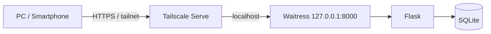
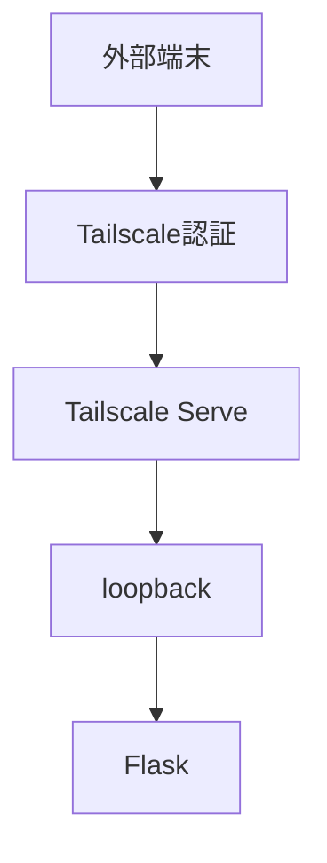
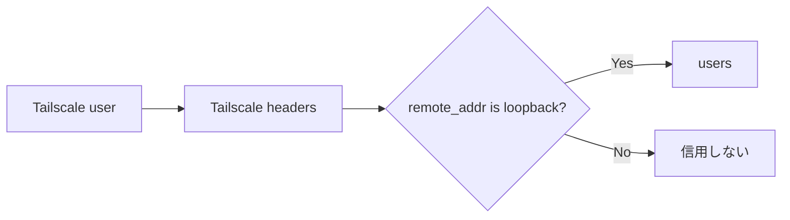
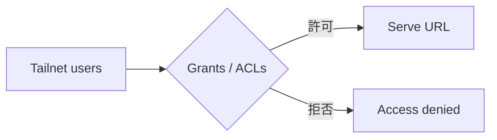

# Tailscale Setup

このテンプレートでは、別PCやスマートフォンからアクセスするときの入口としてTailscale Serveを使います。ルーターのポート開放や `0.0.0.0` へのbindは行いません。

## 全体構成



## 1. 事前条件

- ホストPCにTailscaleをインストール済み
- ホストPCがtailnetへログイン済み
- 利用端末も必要なtailnetへ参加済み
- Flaskアプリが `127.0.0.1:8000` で起動している

確認:

```powershell
tailscale status
```

## 2. まずlocalhostで確認する

Tailscaleを設定する前に、ホストPC自身で以下が開けることを確認します。

```text
http://127.0.0.1:8000
http://127.0.0.1:8000/healthz
```

localhostで動かない状態のままTailscaleを設定すると、問題箇所を切り分けにくくなります。

## 3. Tailscale Serveを有効にする

Windows:

```powershell
.\scripts\tailscale-serve.ps1
```

macOS / Linux:

```bash
./scripts/tailscale-serve.sh
```

直接実行する場合:

```text
tailscale serve --bg 8000
tailscale serve status
```

`tailscale serve status` に表示されるHTTPS URLを同じtailnetの端末から開きます。

## 4. なぜ `127.0.0.1` のままなのか

Tailscale Serveはlocalhostのアプリへリバースプロキシします。



このテンプレートは、Tailscaleが付与する利用者ヘッダーを **バックエンドへの接続元がloopbackの場合だけ** 信用します。そのためFlaskを外部IPへ直接公開しないことが重要です。

## 5. 利用者識別

Tailscale Serve経由では、次のヘッダーを利用できます。

```text
Tailscale-User-Login
Tailscale-User-Name
```

`app/auth.py` は接続元がloopbackであることを確認してからこれらを利用し、`users` テーブルへ対応付けます。



詳細は [AUTH-CRUD.md](AUTH-CRUD.md) と [SECURITY.md](SECURITY.md) を参照してください。

## 6. localhost利用との違い

ホストPC自身から直接アクセスする場合は、`.env` のローカルオーナーを利用します。

```env
LOCAL_OWNER_EMAIL=owner@example.local
LOCAL_OWNER_NAME=Local Owner
```

Tailscale利用者とローカルオーナーはどちらも `users` テーブルへ登録されますが、`identity_source` が異なります。

## 7. アクセス範囲を絞る

tailnetへ参加している全員へアプリを公開する必要がない場合は、TailscaleのGrants / ACLs等で必要な利用者・端末だけに制限します。



Tailscale側の到達制御とアプリ側の認可は別です。到達できる利用者全員へ全データ操作を許可しないでください。

## 8. Serve設定を解除する

Windows:

```powershell
.\scripts\tailscale-reset.ps1
```

macOS / Linux:

```bash
./scripts/tailscale-reset.sh
```

設定確認:

```text
tailscale serve status
```

## 9. 避ける設定

- Flask / Waitressを `0.0.0.0` へbindする
- ルーターで8000番等を直接ポート開放する
- クローズド用途でTailscale Funnelを使う
- Tailscale利用者ヘッダーを外部接続から無条件に信用する
- SQLiteファイルをtailnet上の共有フォルダーへ置いて複数サーバーから開く

## 10. よくある切り分け

### localhostでは開けるがTailscale URLで開けない

1. `tailscale status`
2. `tailscale serve status`
3. 利用端末が同じtailnetか
4. Grants / ACLsで拒否されていないか
5. OS側でTailscaleが正常動作しているか

### 401になる

Tailscale Serveを経由せず別経路からアクセスしていないか確認します。バックエンドはTailscale利用者ヘッダーをloopback経由でのみ信用します。

### Tailscale URLは開くが利用者が想定と違う

`/api/me` で現在の利用者情報を確認します。

```text
/api/me
```

## 11. 本番利用前チェック

- Flaskは `127.0.0.1` のみ
- `tailscale serve status` が意図したPortを指している
- `/healthz` が正常
- `/api/me` が正しい利用者
- 利用者Aから利用者Bのデータが見えない
- 不要な利用者・端末がTailscale側で許可されていない
- Funnelを有効にしていない
